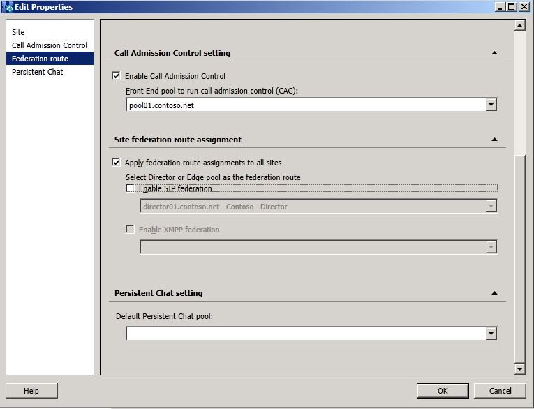
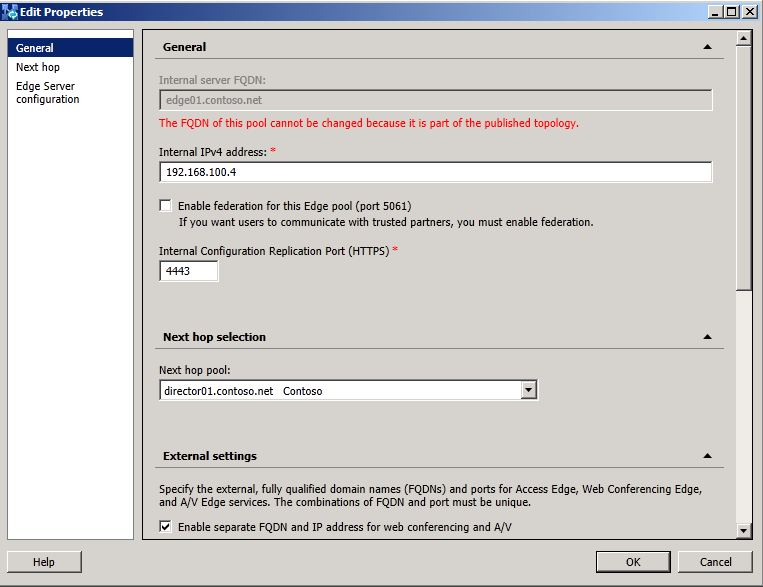
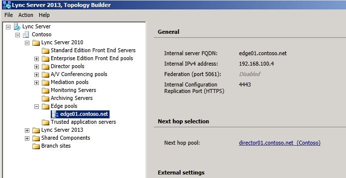
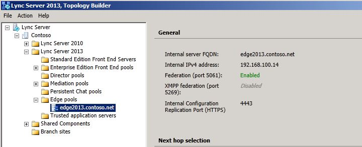
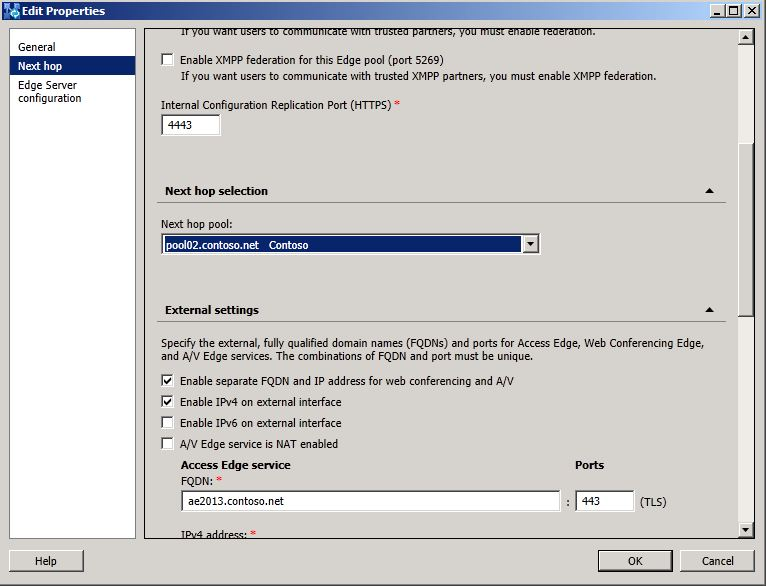
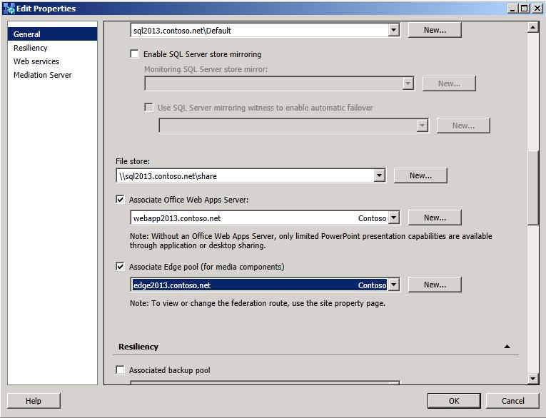
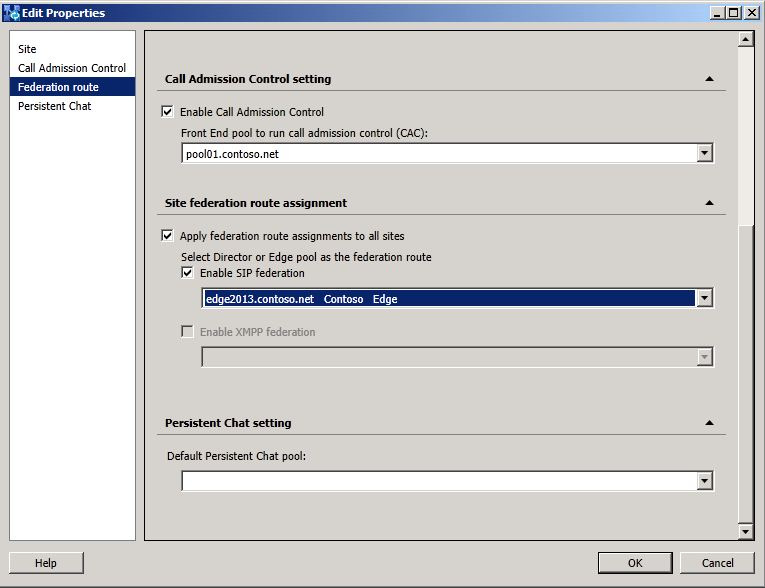

# Configure federation routes and media traffic

Federation is a trust relationship between two or more SIP domains that permits users in separate organizations to communicate across network boundaries. After you migrate to your pilot pool, you need to transition from the federation route of your previous versions Edge Servers to the federation route of your Skype for Business Server 2019 Edge Servers.
  
Use the following procedures to transition the federation route and the media traffic route from your previous versions Edge Server and Director to your Skype for Business Server 2019 Edge Server, for a single-site deployment.
  
> [!IMPORTANT]
> Changing the federation route and media traffic route requires that you schedule maintenance downtime for the Skype for Business Server 2019 and previous version Edge Servers. This entire transition process also means that federated access will be unavailable for the duration of the outage. You should schedule the downtime for a time when you expect minimal user activity. You should also provide sufficient notification to your end users. Plan accordingly for this outage and set appropriate expectations within your organization. 
  
> [!IMPORTANT]
> If your legacy Edge Server is configured to use the same FQDN for the Access Edge service, Web Conferencing Edge service, and the A/V Edge service, the procedures in this section are not supported. If the legacy Edge services are configured to use the same FQDN, you must first migrate all your users, then decommission the previous versions Edge Server before enabling federation on the Skype for Business Server 2019 Edge Server. 
  
> [!IMPORTANT]
> If your XMPP federation is routed through a Skype for Business Server 2019 Edge Server, users on the previous version will not be able to communicate with the XMPP federated partner until all users have been moved to Skype for Business Server 2019, XMPP policies and certificates have been configured, the XMPP federated partner has been configured on Skype for Business Server 2019, and lastly the DNS entries have been updated. 
  
### To remove the legacy federation association from Skype for Business Server 2019 sites

1. On the Skype for Business Server 2019 Front End server, open the existing topology in Topology Builder. 
    
2. In the left pane, navigate to the site node, which is located directly below **Skype for Business Server**.
    
3. Right-click the site and then click **Edit Properties**.
    
4. In the left pane, select **Federation route**. 
    
5. Under **Site federation route assignment**, clear the **Enable SIP federation** check box to disable the federation route through the legacy environment. 
    
     
  
6. Click **OK** to close the Edit Properties page. 
    
7. From **Topology Builder**, select the top node **Skype for Business Server**.
    
8. From the **Action** menu, click **Publish Topology**.
    
9. Click **Next** to complete the publishing process and then click **Finish** when the publishing process has completed. 
    
### To configure the legacy Edge Server as a non-federating Edge Server

1. In the left pane, navigate to the legacy install node and then to the **Edge pools** node. 
    
2. Right-click the Edge server, and then click **Edit Properties**.
    
3. Select **General** in the left pane. 
    
4. Clear the **Enable federation for this Edge pool (port 5061)** check box entry and select **OK** to close the page. 
    
     
  
5. From the **Action** menu, select **Publish Topology**, and then click **Next**.
    
6. When the **Publishing wizard** completes, click **Finish** to close the wizard. 
    
7. Verify federation for the legacy Edge server is disabled.
    
     
  
### To configure certificates on the legacy Edge Server

1. Export the external Access Proxy certificate, with the private key, from the legacy Edge Server. 
    
2. On the Skype for Business Server 2019 Edge Server, import the Access Proxy external certificate from the previous step.
    
3. Assign the Access Proxy external certificate to the Skype for Business Server 2019 external interface of the Edge Server.
    
4. The internal interface certificate of the Skype for Business Server 2019 Edge Server should be requested from a trusted CA and assigned. 
    
### To change the previous versions federation route to use Skype for Business Server 2019 Edge Server

1. From Topology Builder, in the left pane, navigate to the **Skype for Business Server 2019** node and then to the **Edge pools** node. 
    
2. Right-click the Edge server, and then click **Edit Properties**.
    
3. Select **General** in the left pane. 
    
4. Select the check box entry for **Enable federation for this Edge pool (port 5061)** and then click **OK** to close the page. 
    
     
  
5. From the **Action** menu, select **Publish Topology**, and then click **Next**.
    
6. When the **Publishing wizard** completes, click **Finish** to close the wizard. 
    
7. Verify **Federation (port 5061)** is set to **Enabled**.
    
     
  
### To update Skype for Business Server 2019 Edge Server federation next hop

1. From Topology Builder, in the left pane, navigate to the **Skype for Business Server 2019** node and then to the **Edge pools** node. 
    
2. Expand the node, right-click the Edge Server listed, and then click **Edit Properties**. 
    
3. On the **General** page, under **Next hop selection**, select from the drop-down list the Skype for Business Server 2019 pool.
    
     
  
4. Click **OK** to close the Edit Properties page. 
    
5. From **Topology Builder**, select the top node **Skype for Business Server**. 
    
6. From the **Action** menu, click **Publish Topology** and complete the wizard. 
    
### To configure Skype for Business Server 2019 Edge Server outbound media path

1. From Topology Builder, in the left pane, navigate to the **Skype for Business Server 2019** node and then to the pool below **Standard Edition Front End Servers** or **Enterprise Edition Front End pools**.
    
2. Right-click the pool, and then click **Edit Properties**.
    
3. In the **Associations** section, select the **Associate Edge pool (for media components)** check box. 
    
     
  
4. From the drop down box, select the Skype for Business Server 2019 Edge Server.
    
5. Click **OK** to close the **Edit Properties** page. 
    
### To turn on Skype for Business Server 2019 Edge Server federation

1. From Topology Builder, in the left pane, navigate to the **Skype for Business Server 2019** node and then to the **Edge pools** node. 
    
2. Expand the node, right-click the Edge Server listed, and then click **Edit Properties**. 
    
    > [!NOTE]
    > Federation can only be enabled for a single Edge pool. If you have multiple Edge pools, select one to use as the federating Edge pool. 
  
3. On the **General** page, verify the **Enable federation for this Edge pool (Port 5061)** setting is checked. 
    
     
  
4. Click **OK** to close the Edit Properties page. 
    
5. Next, navigate to the site node. 
    
6. Right-click the site, and then click **Edit Properties**.
    
7. In the left pane, click **Federation route**.
    
8. Under **Site federation route assignment**, select **Enable SIP federation**, and then from the list select the Skype for Business Server 2019 Edge Server listed. 
    
     
  
9. Click **OK** to close the **Edit Properties** page. 
    
     For multi-site deployments, complete this procedure at each site. 
    
### To publish Edge Server configuration changes

1. From **Topology Builder**, select the top node **Skype for Business Server**. 
    
2. From the **Action** menu, select **Publish Topology** and complete the wizard. 
    
3. Wait for Active Directory replication to occur to all pools in the deployment.
    
    > [!NOTE]
    > You may see the following message: **Warning: The topology contains more than one Federated Edge Server. This can occur during migration to a more recent version of the product. In that case, only one Edge Server would be actively used for federation. Verify that the external DNS SRV record points to the correct Edge Server. If you want to deploy multiple federation Edge Server to be active concurrently (that is, not a migration scenario), verify that all federated partners are using Skype for Business Server. Verify that the external DNS SRV record lists all federation enabled Edge Servers.** 
    > This warning is expected and can be safely ignored. 
  
### To configure Skype for Business Server 2019 Edge Server

1. Bring all of the Skype for Business Server 2019 Edge Servers online. 
    
2. Update the external firewall routing rules or the hardware load balancer settings to send SIP traffic for external access (usually port 443) and federation (usually port 5061) to the Skype for Business Server 2019 Edge Server, instead of the legacy Edge Server.
    
    > [!NOTE]
    > If you do not have a hardware load balancer, you need to update the DNS A record for federation to resolve to the new Skype for Business Server Access Edge server. To accomplish this with minimum disruption, reduce the TLL value for the external Skype for Business Server Access Edge FQDN so that when DNS is updated to point to the new Skype for Business Server Access Edge, federation and remote access will be updated quickly. 
  
3. Next, stop the **Skype for Business Server Access Edge** from each Edge Server computer. 
    
4. From each legacy Edge Server computer, open the **Services** applet from the **Administrative Tools**.
    
5. In the services list, find **Skype for Business Server Access Edge**.
    
6. Right-click the services name, and then select **Stop** to stop the service. 
    
7. Set the Startup type to **Disabled**. 
    
8. Click **OK** to close the **Properties** window. 
    

