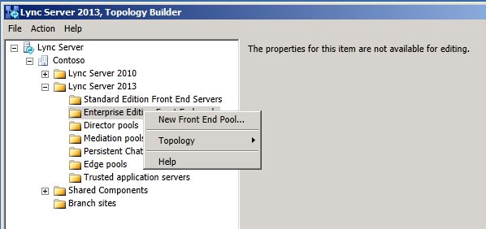
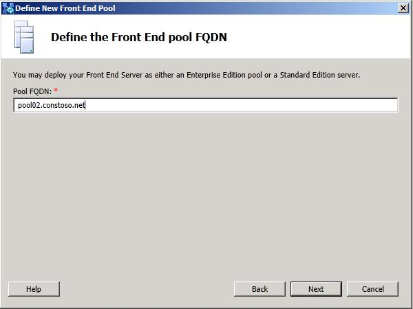
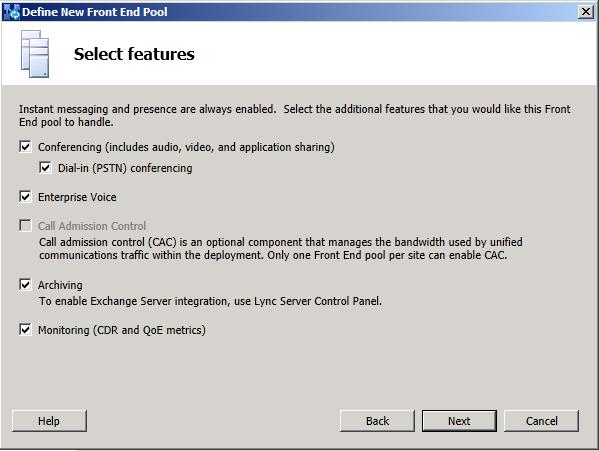
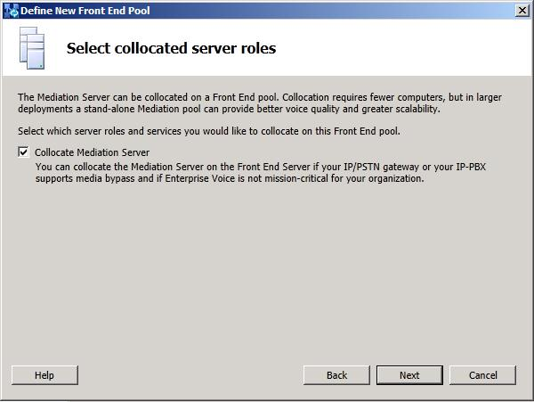
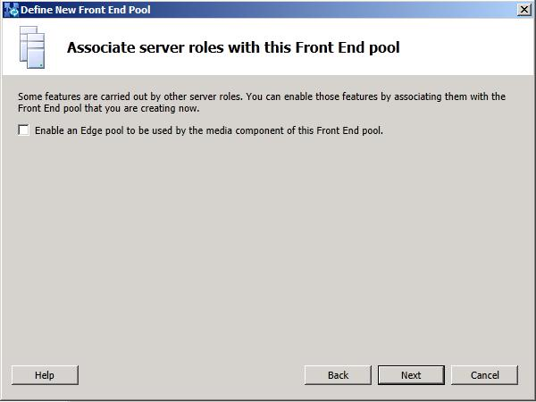
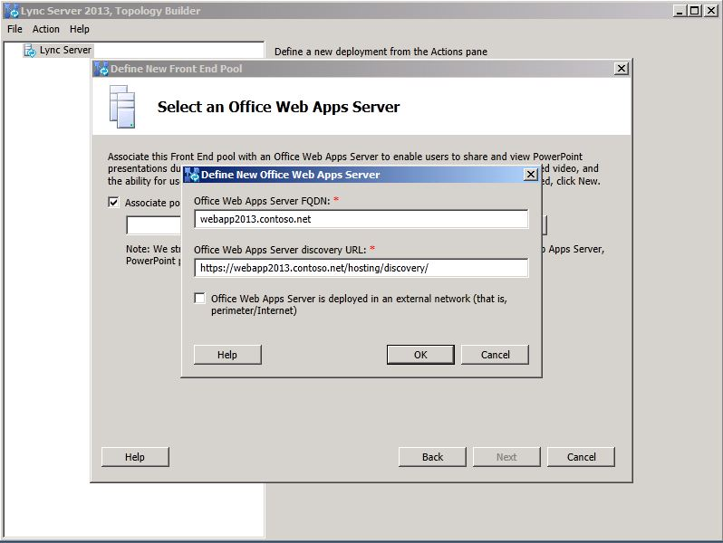
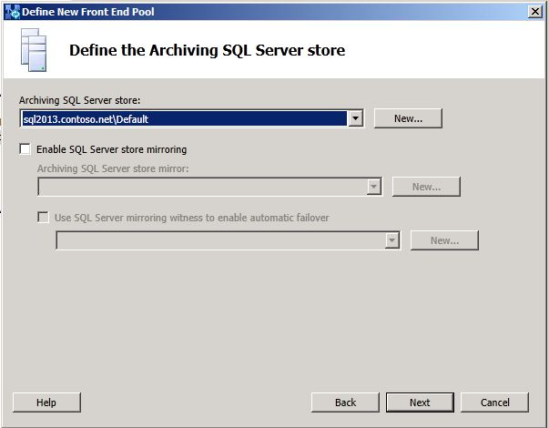
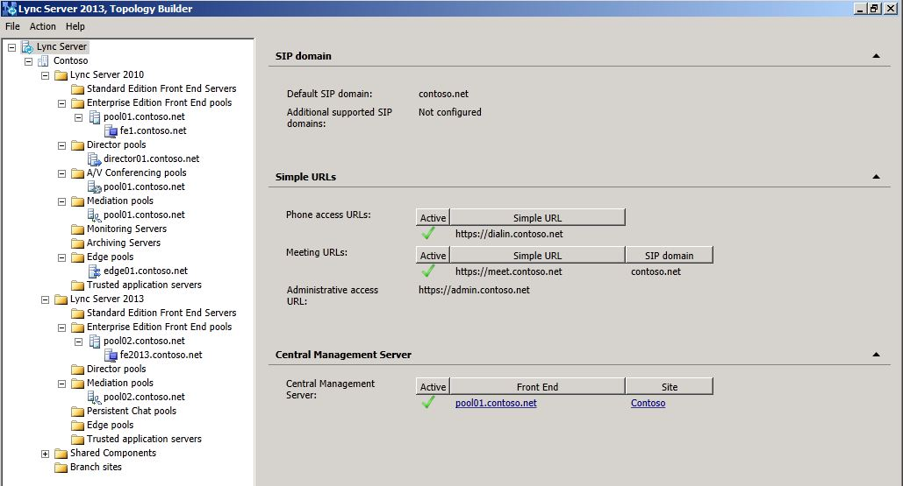

# Deploy Skype for Business Server 2019 pilot pool

One of the first steps required for migration to Skype for Business Server 2019 is to deploy a pilot pool. The pilot pool is where you test coexistence of Skype for Business Server 2019 with your legacy deployment. Coexistence is a temporary state that lasts until you have moved all users and pools to Skype for Business Server 2019. 
  
When you deploy a pilot pool, you use the Define New Front End Pool wizard. You should deploy the same features and workloads in your Skype for Business Server 2019 pilot pool that you have in your legacy pool. If you deployed Archiving Server, Monitoring Server, or System Center Operations Manager for archiving or monitoring your legacy environment, and you want to continue archiving or monitoring throughout the migration, you need to also deploy these features in your pilot environment. The version you deployed to archive or monitor your legacy environment will not capture data in your Skype for Business Server 2019 environment. 
  
> [!NOTE]
> The following procedure discusses features and settings you should consider as part of your overall pilot pool deployment process. This section only highlights key points you should consider as part of your pilot pool deployment. For detailed steps, refer to the 
<!-- [Deploying Skype for Business Server 2019](../deployment/deploying-lync-server-2013/deploying-lync-server-2013.md) deployment guide.  -->
  
### To deploy a Skype for Business Server 2019 pilot pool

1. Log on to the computer where Topology Builder is installed as a member of the Domain Admins group and the RTCUniversalServerAdmins group.
    
2. Expand the tree until you reach **Skype for Business Server 2019** **Enterprise Edition Front End pools**.
    
3. Right click **Enterprise Edition Front End pools**, and select **New Front End Pool**.
    
     
  
4. Enter the pool FQDN. When you define your pilot pool, you can choose to deploy an Enterprise Edition Front End pool or a Standard Edition server. Skype for Business Server 2019 does not require that your pilot pool features match what was deployed in your legacy pool.
    
    > [!CAUTION]
    > The pool or server fully qualified domain name (FQDN) that you define for the pilot pool must be unique. It cannot match the name of the currently deployed legacy pool, or any other servers currently deployed. 
  
     
  
5. On the **Select features** page, select the check boxes for the features that you want on this Front End pool. For example, if you are deploying only instant messaging (IM) and presence features, you would select the Conferencing check box to allow multiparty IM, but would not select the Dial-in (PSTN) conferencing, Enterprise Voice, or Call Admission Control check boxes, because they represent voice, video, and collaborative conferencing features. For additional information on selecting features, see 
<!-- [Define and configure a Front End pool or Standard Edition server in Skype for Business Server 2019](../deployment/deploying-lync-server-2013/define-and-configure-a-front-end-pool-or-standard-edition-server.md) in the Deployment documentation.  -->
    
     
  
6. On the **Select collocated server roles** page, we recommend you collocate the Mediation Server in Skype for Business Server 2019. When merging a legacy topology with Skype for Business Server 2019, we require that you first collocate the legacy Mediation Server. After merging the topologies and configuring the Skype for Business Server 2019 Mediation Server, you can decide whether to keep the collocated Mediation Server, or change it to a stand-alone server when you move the Mediation Server role to Skype for Business Server 2019 later in the deployment process. 
    
     
  
7. On the **Associate server roles with this Front End pool** page, during pilot pool deployment, do not choose the **Enable an Edge pool to be used by the media component of this Front End pool** option. This is a feature you will enable and bring online in a later phase of migration. Keep this setting cleared for now. 
    
     
  
8. On the **Select an Office Web Apps Server** page, click **New**, and specify the FQDN of the application server.
    
     
  
9. On the **Define the Archiving SQL Server store** page, when defining the SQL Server store for both Skype for Business Server Archiving and Monitoring, select the SQL Server instance created earlier for Skype for Business Server 2019. 
    
     
  
10. To publish your topology, right-click the **Skype for Business Server** node, and then click **Publish Topology**.
    
     
  
11. When the publish process has completed, click **Finish**.
    
To install a local copy of the configuration store and start the required services, see 
<!-- [Setting up Front End Servers and Front End pools for Skype for Business Server 2019](../deployment/deploying-lync-server-2013/setting-up-front-end-servers-and-front-end-pools.md) in the Deployment documentation.  -->
  

