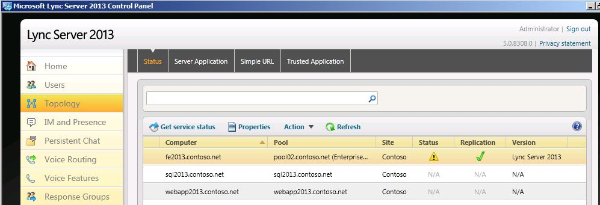
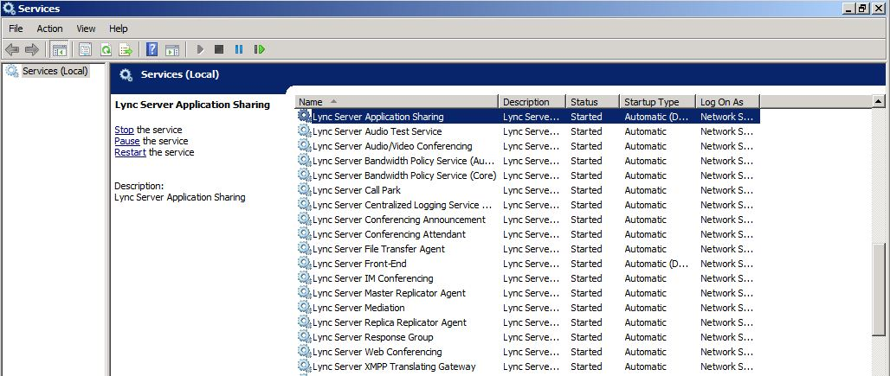

# Verify pilot pool coexistence with legacy pool [OCS 2007 R2 to W15]
[]
 **In this article**
  
[Verify the Pool in Office Communications Server 2007 R2 Administrative Tool](#sectionSection0)
  
[Verify the Pilot Pool in Lync Server 2013 Control Panel](#sectionSection1)
  
[Verify Lync Server 2013 services have started](#sectionSection2)
  
## Verify the Pool in Office Communications Server 2007 R2 Administrative Tool

1. Open the Office Communications Server 2007 R2 administrative tool.
    
2. Expand the **Forest** node, expand the **Standard Edition Servers** or **Enterprise pools** node, and then expand the pool or server name. 
    
3. Ensure that the Office Communications Server 2007 R2 services are running on the pool.
    
     
  
## Verify the Pilot Pool in Lync Server 2013 Control Panel

1. From a user account that is a member of the CsAdministrator role, log on to the Lync Server 2013 Front End server. 
    
2. Open a browser window, and then enter the Admin URL to open the Lync Server Control Panel. For details about the different methods you can use to start Lync Server Control Panel, see [Open Lync Server 2013 administrative tools](../../operations/lync-server-administrative-tools/open-lync-server-administrative-tools.md).
    
3. Click **Topology**.
    
4. Verify that the servers you deployed are present in your pilot pool. 
    
     
  
## Verify Lync Server 2013 services have started

1. On the Lync Server 2013 Front End Server, open the **Services** applet from the **Administrative Tools** group. 
    
2. Verify that the services listed match the list in the following figure.
    
     
  

