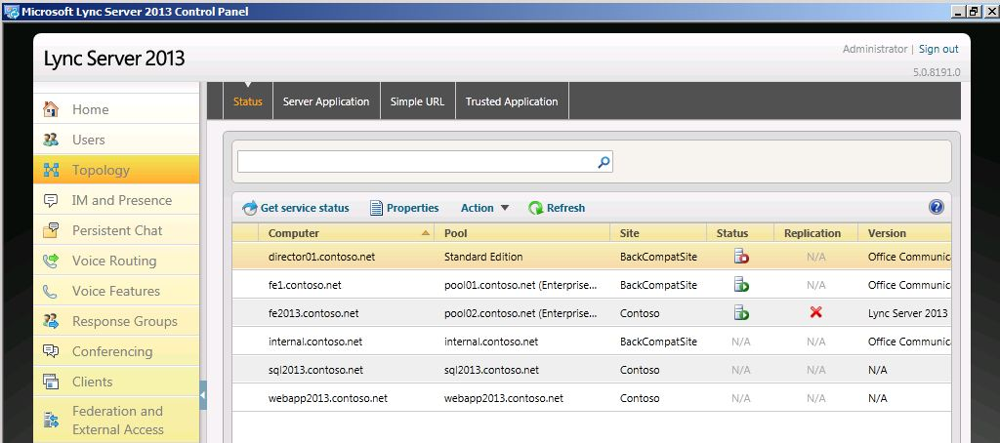

# Verify topology information [OCS 2007 R2 to W15]
[]
 **In this article**
  
[To view BackCompatSite in Topology Builder](#sectionSection0)
  
[To view the merged topology in Lync Server 2013 Control Panel](#sectionSection1)
  
[To view services on a merged pool](#sectionSection2)
  
[To verify conference directories merged](#sectionSection3)
  
The first step in verifying the merge completed successfully is to view the Office Communications Server 2007 R2 topology information that you merged with Lync Server 2013. In Topology Builder, the **BackCompatSite** node displays the fully qualified domain name (FQDN) of each Office Communications Server 2007 R2 pool and server that you merged. 
  
## To view BackCompatSite in Topology Builder
<a name="sectionSection0"> </a>

1. In your Office Communications Server 2007 R2 environment, open the Office Communications Server 2007 R2 administrative tool and note the FQDNs of the legacy pools and servers.
    
2. In your Lync Server 2013 environment, open Topology Builder and then expand the **BackCompatSite** node. 
    
3. Verify that the FQDNs for the pools and servers that you merge are displayed.
    
    > [!NOTE]
    > You do not see any information in **BackCompatSite** for server roles that are collocated on a Front End Server or Standard Edition server. Only server roles that are required for interoperability between Office Communications Server 2007 R2 and Lync Server 2013 are shown. 
  

  
You can also use Lync Server 2013 Control Panel to view your merged topology. In Lync Server 2013 Control Panel, you can see each server FQDN, pool FQDN, and site name for your merged topology. Merged servers have a **Site** name of **BackCompatSite**.
  
## To view the merged topology in Lync Server 2013 Control Panel
<a name="sectionSection1"> </a>

1. Open Lync Server 2013 Control Panel.
    
2. Click **Topology**.
    
3. On the **Status** tab, verify that servers and pools you merged appear by looking for **BackCompatSite** in the **Site** column. 
    

  
To see more detail about a merged pool, use the **Get-CsPool** cmdlet. In addition to the information that is available in Topology Builder and Lync Server 2013 Control Panel, this cmdlet displays the services that run on the Lync Server 2013 pool. 
  
> [!NOTE]
> When you publish the topology after running the Merge wizard in Topology Builder, conference directories are merged to Lync Server 2013. Conference directories can be verified by running the **Get-CsConferenceDirectory** cmdlet. 
  
## To view services on a merged pool
<a name="sectionSection2"> </a>

1. Open the Lync Server 2013 Management Shell. 
    
2. At the command line, type the following:
    
  ```
  Get-CsPool [-Identity <FQDN of the pool>]
  ```

    For example:
    
  ```
  Get-CsPool -Identity pool02.contoso.net
  ```

## To verify conference directories merged
<a name="sectionSection3"> </a>

1. Open the Lync Server 2013 Management Shell.
    
2. At the command line, type the following:
    
  ```
  Get-CsConferenceDirectory
  ```

3. Verify that all the conference directories for the pool or server you are merging are now in Lync Server 2013.
    

