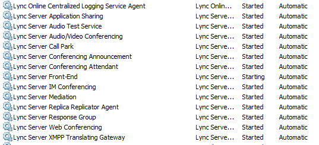
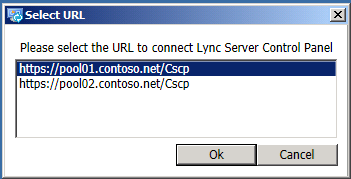
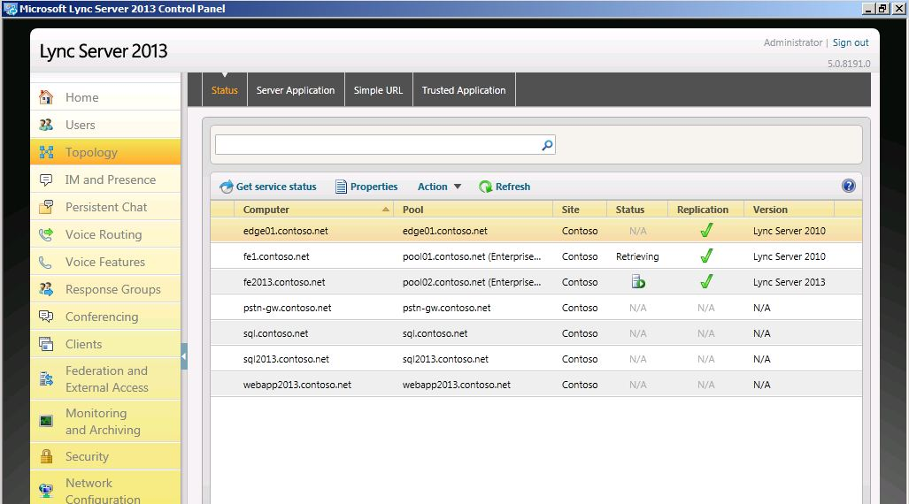
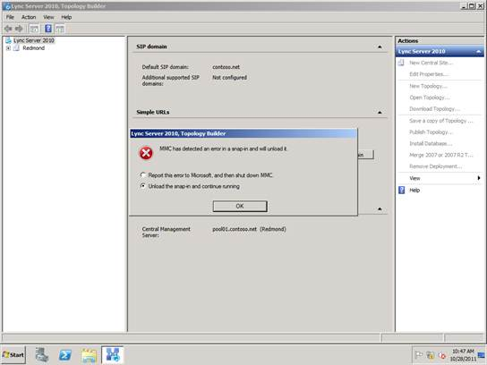

# Verify pilot pool coexistence with legacy pool [W14 to W15]
[]
 **In this article**
  
[Verify that Lync Server 2013 services have started](#sectionSection0)
  
[Open the Lync Server 2013 Control Panel](#sectionSection1)
  
[Don't attempt to open the topology in Lync Server 2010 Topology Builder](#sectionSection2)
  
After you deploy the pilot pool, you need to verify the coexistence of the two pools by using the administrative tools to view the pool information. For the Lync Server 2013 pools and legacy pools, you must use the Lync Server 2013 Control Panel and Topology Builder tools. 
  
## Verify that Lync Server 2013 services have started

1. From the Lync Server 2013 Front End Server, navigate to the Administrative Tools\Services applet.
    
2. Verify that the following services are running on the Front End Server:
    
**Lync Server 2013 services**

  
## Open the Lync Server 2013 Control Panel

From the Front End Server in your Lync Server 2013 deployment, open the Lync Server 2013 Control Panel and select the Lync Server 2010 pool. Repeat the procedure to open the Lync Server 2013 pool.
  
**Open Lync Server 2013 Control Panel**

  
> [!IMPORTANT]
> On Lync Server 2013, you must upgrade Silverlight to Silverlight version 5 prior to using the Lync Server Control Panel. 
  
This topology now includes Lync Server 2010 and Lync Server 2013 server roles. 
  
**Lync Server 2013 Control Panel Topology page**

  
## Don't attempt to open the topology in Lync Server 2010 Topology Builder

If you attempt to open the topology using Lync Server 2010 Topology Builder, you will encounter the error below. The topology can only be viewed using Lync Server 2013 Topology Builder. The Lync Server 2013 Topology Builder must be used to create pools for both Lync Server 2013 and Lync Server 2010.
  
**Lync Server 2010 Topology Builder error message**

  

