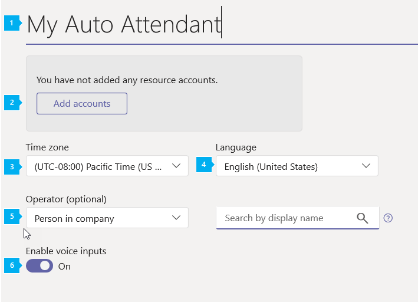
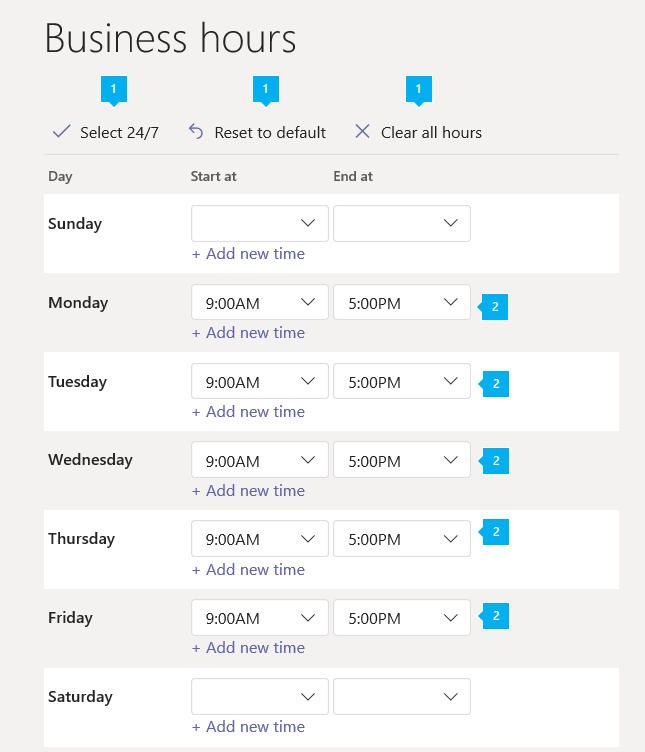
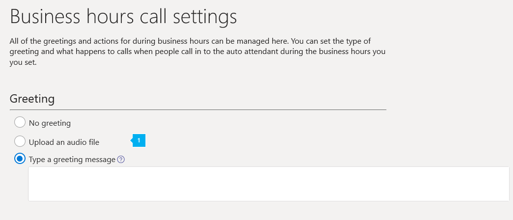
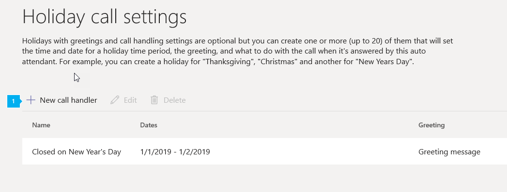
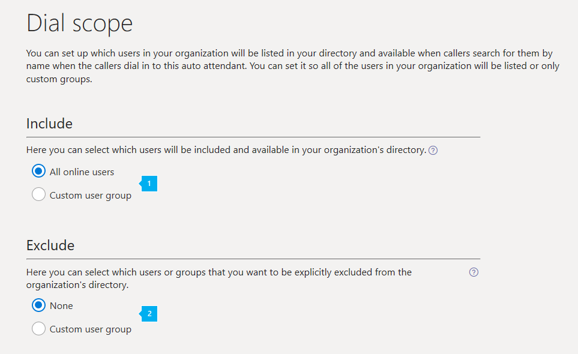

# Set up a Phone System auto attendant

Auto attendants let people that call in to your organization and navigate a menu system to get them to the right department, call queue, person, or the operator. You can create an auto attendant for your organization by using the Skype for Business admin center. To create a new auto attendant, go to **Call routing** in the left navigation, and then select **Auto attendants** > **Add new**.
  
If you want to learn more about auto attendants, see [What are Phone System auto attendants?](/microsoftteams/what-are-phone-system-auto-attendants)
  
## Step 1 - Getting started

- Before you can create and set up your auto attendants, you will need to get or transfer your existing toll or toll-free service numbers. After you get the toll or toll-free service numbers, they will show up on the **Skype for Business admin center** > **Voice** > **Phone numbers** page. To get your service numbers, see [Getting service phone numbers for Skype for Business and Microsoft Teams](getting-service-phone-numbers.md), or if you want to transfer and existing service number, see [Transfer phone numbers to Office 365](../what-are-calling-plans-in-office-365/transfer-phone-numbers-to-office-365.md). **User (subscriber)** numbers can't be assigned to auto attendants. If you are outside the United States, you can't use the Skype for Business admin center to get service numbers; go [here](/microsoftteams/manage-phone-numbers-for-your-organization/manage-phone-numbers-for-your-organization.md) instead.
    
    > [!CAUTION]
    > To get and use toll-free phone numbers, you need to set up Communications Credits. To do this see [What are Communications Credits?](/microsoftteams/what-are-communications-credits) and [Set up Communications Credits for your organization](/microsoftteams/set-up-communications-credits-for-your-organization). 
  
- Your organization must have (at a minimum) an Enterprise E3 plus **Phone System** license or an Enterprise E5 license. The number of **Phone System** user licenses that are assigned affects the number of service numbers that are available to be used for auto attendants. The numbers of auto attendants you can have is dependent on the number **Phone System** and **Audio Conferencing** licenses that are assigned in your organization. To learn more about licensing, go [here](../skype-for-business-and-microsoft-teams-add-on-licensing/skype-for-business-and-microsoft-teams-add-on-licensing.md).
    
    > [!TIP]
    > To redirect calls to an operator or a menu option that is an Online user with a **Phone System** license, you will need to enable them for Enterprise Voice or assign Calling Plans in Office 365 to them. See [Assign Skype for Business and Microsoft Teams licenses](../skype-for-business-and-microsoft-teams-add-on-licensing/assign-skype-for-business-and-microsoft-teams-licenses.md). You can also use Windows PowerShell. For example, run:  `Set-CsUser -identity "Amos Marble" -EnterpriseVoiceEnabled $true` 
  
## Step 2 - Create a new auto attendant

 **Using the Skype for Business admin center**

In the **Skype for Business admin center**, click **Call routing** > **Auto attendants**, then click **Add new**:
  
### Edit general info page
  

  
***
 **Name** Enter a descriptive display name for your auto attendant. The name is required and can contain up to 64 characters, including spaces. It will be listed in the **Name** column on the **Auto attendants** tab.
***

 **Phone number** This setting is optional. If you like, select a phone number for your auto attendant. You can pick any available service toll or toll-free phone number that you have for your organization. If there are no phone numbers listed, you will need to get a service toll or toll-free phone number. Go [here](getting-service-phone-numbers.md) to get them.    

> [!NOTE]
> **User (subscriber)** numbers can't be assigned to auto attendants.
    
***
 **Time zone** You must set the time zone for your auto attendant, but it doesn't need to correspond to the time zone of the main address listed for your organization. Each auto attendant can have a different time zone, and the business hours set for the auto attendant will be set based on the time zone that you select here.
***
 **Language** Select the language that you want to use for your auto attendant from any of the available languages listed. The language you set here is the language that the auto attendant will use to interact with people that call in to this auto attendant, and all the system prompts will be played in this language.
***
 **Speech recognition** Speech recognition is available and if this option is selected. People that call in can use voice input in the language you set. You can disable speech recognition by clearing it if you want to only let people use their phone keypad.
***
 **Operator** This is optional and doesn't need to be set for the auto attendant. However, you can set the **Operator** option for people that call in to be able to break out of the menus to speak to a person to help them.     The key 0 is automatically assigned to Operator.     If you set this up, you will also need to tell people who call in that this is an available option in the **Edit menu options** on the **Business hours call handling** page. If you set an operator on your auto attendant, you will need to enter the corresponding prompt text in the **Callers will hear** box or change your audio file to include this option. For example, "For the Operator, press zero."     You can set one of the following as Operator: 
*    **Person in your company** with a **Phone System** license that is enabled for Enterprise Voice or assigned Calling Plans in Office 365.  

        > [!Note] 
        > **Person in your company** can be an Online user or a user hosted on-premises using Skype for Business Server 2015 or Lync Server 2013. Lync Server 2010 isn't supported.   

*    A **Call Queue** that you have set up. 
*    You can set it up so the person calling will be sent to voicemail. To do this, select **Person in your company** and set this person's calls to be forwarded directly to voicemail. 
   
### Select hours of operation page

By default, business hours are set to 24 hours a day, 7 days a week, so all hours are considered business hours. All of the hours that aren't included in business hours are considered after business hours. If you select the **Custom** option and set your business hours, then a new page called **After hours call handling** will be added where you can configure the call handling for after business hours for the auto attendant.
  

***
 Select the **Custom** option to select specific business hours in the calendar. When you select **Custom**, business hours will be set to Monday to Friday, 9:00 am-5:00 pm by default.
***
 To change business hours, highlight the business hours you want to set using the calendar. The calendar allows you to select business hours in 30-minute intervals, and the business hours you select here will be set based on the time zone that you set on the **General info** page. To set up a break (a lunch break, for example), deselect or drag to deselect the time on the calendar. You can set multiple breaks within business hours. 
   
### Select business hours call handling page

> [!TIP]
> If you use a custom business hours schedule, you will also need to set up call handing for after business hours. An **After hours call handling** page will be added so you can configure those options, and it will give you the same options as **Business hours call handling**. 
  
You can set up greetings, prompts, and menus that people who call in to your organization's auto attendant phone number will hear during the business hours.
  

  
***
 **Company greeting** Business hours greeting is optional and can be set to **None**. In this case, the caller will hear no message or greeting before the call is handled by one of the options you select. You can also upload an audio file (in .wav, mp3 or .wma formats), or create a custom greeting using Text-to-Speech.
*    **None** No greeting will be played when people call in to the auto attendant phone number.
*    **Create a custom greeting** If you choose this option, enter the text you want the system to read (up to 1000 characters). For example, you might enter "Welcome to Contoso. Your call is important to us." in the **Callers will hear** box.
*    **Upload an audio file** If you choose this, record the greeting and then upload your audio file (in a .wav, .mp3 or .wma format).
***
 You can select what happens to calls that arrive during business hours. You can chose from the following options:
*    **Disconnect** If you select it, the person calling in will be disconnected after hearing a business hours greeting.
*    **Redirect call** This can be used to automatically send the call to:
     *    **Person in your company** with a **Phone System** license that is enabled for Enterprise Voice or assigned Calling Plans in Office 365. You can set it up so the person calling in can be sent to voicemail. To do this, select **Person in your company** and set this person to have their calls forwarded directly to voicemail.      
        > [!Note]
        > **Person in your company** can be an Online user or a user hosted on-premises using Skype for Business Server 2015 or Lync Server 2013. Lync Server 2010 is not supported.   

     *    A **Call Queue** Using a Call Queue allows the call to be transferred to an existing Call Queue that you have set up.
     *    Another **Auto attendant** You can use an existing auto attendant to create a second level of menu options containing a submenu. These are called nested auto attendants.
*    **Play menu options prompt** These can also be used to let you set up a prompt you want played.
***
 **Menu prompt** To create main menu prompt, you can either use Text-to-Speech or upload an audio file (.wav, .mp3 or .wma). You can type the prompt in the **Callers will hear** box or record an audio file and say, for example: "For Sales, say or press or say 1. For Services, press or say 2. For Customer Support, press or say 3. For the operator, press or say 0. To hear this menu again, press the star key or say repeat." **Create a custom prompt** If you chose this, you should enter the text you want the system to read (up to 1000 characters). **Upload an audio file** If you chose this, you will need to record the greeting and then upload your audio file (in a .wav, mp3 or .wma format).
***
 **Dial by name** If you choose this option, this will enable people who call in to search for people in your organization using Directory Search. You can select which people will be listed as available or not available for Dial by Name by setting up those options on the **Dial scope** page. Any online user with a **Phone System** license, or any user hosted on-premises using Skype for Business Server 2015 or Lync Server 2013, can be found with Dial by Name.    

> [!WARNING]
> Users hosted on-premises using Lync 2010 **can't be reached** with Dial by Name.
***

 **Edit menu options** Menu options can be added or removed by using key buttons on the keypad. To add a menu option, press the corresponding key on the keypad. The keys in use will change in color and the corresponding row of options will appear below. To delete a menu option, simply click on the corresponding key on the keypad control to deselect this key. The key mapping row will be removed.    **Tip:** You will have to update menu prompts text or re-record the audio separately when adding to removing options because it won't be automatically done for the existing menu prompt.      Any menu option can be added and removed in any order, and the key mappings don't have to be continuous. It is possible, for example, to create a menu with keys 0, 1, and 3 mapped to options, while the key 2 isn't used.   

> [!NOTE]
> The keys * (Repeat) and # (Back) are reserved by the system and can't be reassigned. If speech recognition is enabled, pressing * will correspond with "Repeat" and # will correspond with the "Back" voice commands.

To set up your menu options, after you select the key(s), you will need to: 
- **Enter the Name of the option** This can be up to 64 characters long, and can contain multiple words like "Customer Service" or "Operations and Grounds." If speech recognition is enabled, the name will automatically be recognized, and the person calling in will be able to either press 3, say "three," or say "Customer Service" to select the option mapped to key 3. 
- The next step is to select where the call is to be sent if the corresponding key is pressed, or the option is selected using speech recognition. The call can be sent to: 
    - **Operator** If operator is already set up, it is automatically mapped to key 0, but it can also be deleted or reassigned to a different key. If operator isn't set to any key, then the voice command "Operator" will be disabled too. 
    - A **Person in your company** with a **Phone System** license that is enabled for Enterprise Voice or assigned an Calling Plan in Office 365. You can set it up so the person calling in can be sent to voicemail. To do this, select **Person in your company** and set this person to have their calls forwarded directly to voicemail.   
    
        > [!Note] 
        > **Person in your company** can be an Online user or a user hosted on-premises using Skype for Business Server 2015 or Lync Server 2013. Lync Server 2010 is not supported.   

    - **Call Queue** Using a call queue option allows the call to be transferred to an existing call queue that you have set up. 
    - **Auto Attendant** You can use an existing auto attendant to create a second level of menu options containing a submenu. These are called nested auto attendants.  
    
        > [!Note]
        > The **Business Hours** of nested (or second-level) auto attendants will also be used, including for the calls sent from other auto attendants that have been set up.         
   
### Select holidays page 

You can add up to 20 scheduled holidays to each auto attendant.
  

  
***
 **Add a holiday** Enter a name for your new holiday in the **Holiday name** field.   Holiday names may consist of up to 64 characters and must be unique for the same auto attendant. For example, you cannot have two holidays named "Thanksgiving" in the same auto attendant.  
***
 **Holiday Greeting** The Holiday Greeting is optional and can be set to **None**. In this case, the caller will hear no message or greeting before the call is handled by one of the options you select. You can also upload an audio file (in .wav, mp3 or .wma formats), or create a custom greeting using Text-to-Speech.
*    **None** No greeting will be played when people call in to the auto attendant phone number.
*    **Create a custom greeting** If you choose this option, enter the text you want the system to read (up to 1000 characters). For example, you might enter "Happy New Year! Our offices are currently closed." in the **Callers will hear** box.
*    **Upload an audio file** If you choose this, record the holiday greeting and then upload your audio file (in a .wav, .mp3 or .wma format).  
***
 **What happens to the calls after the greeting?** You can select what happens to the calls that arrive during this holiday. You can chose from the following options:
*    **Disconnect** The person calling in will be disconnected after hearing the holiday greeting.
*    **Redirect call** This can be used to automatically send the call to:
     *    A **Person in your company** with a **Phone System** license that is enabled for Enterprise Voice or assigned Calling Plans in Office 365. You can set it up so the person calling in can be sent to voicemail. To do this, select **Person in your company**, and set this person to have their calls forwarded directly to voicemail.    
     
         > [!Note] 
         > **Person in your company** can be an Online user or a user hosted on-premises using Skype for Business Server 2015 or Lync Server 2013. Lync Server 2010 is not supported.  

     *    A **Call Queue** to transfer the call to an existing Call Queue that you have set up.
     *    Another **Auto attendant**, to create a second level of menu options containing a submenu. These are called nested auto attendants.   
     
         > [!Note]
         > By default, all calls arriving during a holiday period are set to disconnect after the greeting (if any), so you must specify a redirect if a different behavior is desired.

***
 **When do you want the holiday to start and end?** Enter your holiday start date in dd/mm/yyyy format, and then select a start time, end date, and end time, as prompted in the date range table.  You can specify up to 10 different date ranges for a holiday. For example, you could add date ranges for New Year's Eve holidays for up to 10 years. A holiday can span multiple days.  To add additional holiday date ranges (for example, for the next year), click **Add another**, and then enter a new set of start and end dates for the holiday.  Nested holidays are also supported. For example, you could nest multiple holidays within one "holiday break" time frame: 
*    **December 24 through January 3:** "Happy Holidays! Our offices are currently closed. We will reopen on January 4th."
*    **December 25:** "Merry Christmas! Our offices are currently closed. We will reopen on January 4th."
*    **January 1:** "Happy New Year! Our offices are currently closed. We will reopen on January 4th."
   
After you save your auto attendant, your holidays appear on the **Holidays** tab, where you can edit, add, or modify holiday settings.
  
### Select dial scope page

On this page, you can set up which users in your organization will be listed in your directory and available for Dial by Name when a person that calls in to your organization.
  

  
***
 Using the **Include** option, you have two options:
*    **All Online users** Using this option allows all of the people in your organization to be included in directory search. All Online users with a **Phone System** license, as well as users hosted on-premises using Skype for Business Server 2015 or Lync Server 2013 who have Calling Plans in Office 365, will be listed. 
*    **Custom** If you use this option, you can search for an Office 365 Group, distribution list, or security group that has been created in your organization, and the people added to this Office 365 Group, distribution list, or security group who are either **Online users with a Phone System license** or hosted on-premises using Skype for Business Server 2015 or Lync Server 2013. You can add multiple Office 365 Groups, distribution lists, and security groups.    

    > [!Caution]
    > On-premises users from deployments of Lync Server 2010 won't be listed when someone searches the directory using Dial by Name. 
***
 Using the **Exclude** option, you have two options:
*    **None** Using this option will indicate that no Online users will be excluded from directory search. 
*    **Custom** If you use this option, you can search for an Office 365 Group, distribution list, or security group that has been created in your organization, and all people added to this Office 365 Group, distribution list, or security groups will be excluded from directory search. You can add multiple Office 365 Groups, distribution lists, and security groups.    

    > [!Caution]
    > On-premises users from deployments of Lync Server 2010 won't be listed when someone searches the directory using Dial by Name.          
   
> [!NOTE]
> It might take up to 36 hours for a new user to have their name listed in the directory when someone uses Dial by Name with speech recognition. 
  
After you enter all the required fields and set up call handling menus and options, click **Save**.
  
## Editing and testing auto attendants

After you have saved your auto attendant, it will be listed on the **Auto attendants** page. This will allow you to quickly see some of the options that you have set up, including the name, phone number, language, and status.
  
If you want to make changes to an auto attendant, select the auto attendant, and then in the Action pane click **Edit**.
  
You can also quickly place a test call to your auto attendant by using the **Test** button in the Action pane.
  
## Want to know more?

You can also use Windows PowerShell to create and set up auto attendants.
  
### Auto attendant cmdlets

Here are the cmdlets that you need to manage an auto attendant.
  
||| 
|---|---|
[New-CsOrganizationalAutoAttendant](https://technet.microsoft.com/library/mt796493.aspx)                                                                      | [New-CsOrganizationalAutoAttendantPrompt](https://technet.microsoft.com/library/mt796484.aspx)                                                              |
| [Set-CsOrganizationalAutoAttendant](https://technet.microsoft.com/library/mt796486.aspx)                                                                      | [New-CsOrganizationalAutoAttendantMenuOption](https://technet.microsoft.com/library/mt796485.aspx)                                                           |
| [Get-CsOrganizationalAutoAttendant](https://technet.microsoft.com/library/mt796482.aspx)                                                                      | [Get-CsOrganizationalAutoAttendantHolidays](https://docs.microsoft.com/powershell/module/skype/get-csorganizationalautoattendantholidays?view=skype-ps)       |
| [Remove-CsOrganizationalAutoAttendant](https://technet.microsoft.com/library/mt796492.aspx)                                                                   | [New-CsOrganizationalAutoAttendantMenu](https://technet.microsoft.com/library/mt796488.aspx)                                                                  |
| [New- CsOnlineAudioFile](https://technet.microsoft.com/library/mt796479.aspx)                                                                                 | [New-CsOrganizationalAutoAttendantCallFlow](https://technet.microsoft.com/library/mt796489.aspx)                                                              |
| [Export-CsOrganizationalAutoAttendantHolidays](https://docs.microsoft.com/powershell/module/skype/export-csorganizationalautoattendantholidays?view=skype-ps) | [New-CsOnlineTimeRange](https://technet.microsoft.com/library/mt796491.aspx)                                                                                  |
| [New-CsOnlineDateTimeRange](https://docs.microsoft.com/powershell/module/skype/new-csonlinedatetimerange?view=skype-ps)                                       | [New-CsOnlineSchedule](https://technet.microsoft.com/library/mt796490.aspx)                                                                                   |
| [Get-CsOrganizationalAutoAttendantSupportedTimeZone](https://technet.microsoft.com/library/mt796483.aspx)                                                     | [New-CsOrganizationalAutoAttendantCallHandlingAssociation](https://technet.microsoft.com/library/mt796487.aspx)                                               |
| [Get-CsOrganizationalAutoAttendantSupportedLanguage](https://technet.microsoft.com/library/mt796481.aspx)                                                     | [Import-CsOrganizationalAutoAttendantHolidays](https://docs.microsoft.com/powershell/module/skype/import-csorganizationalautoattendantholidays?view=skype-ps) |
| [New-CsOrganizationalAutoAttendantCallableEntity](https://technet.microsoft.com/library/mt796480.aspx)                                                      |  |   |
   
### More about Windows PowerShell

- Windows PowerShell is all about managing users and what users are allowed or not allowed to do. With Windows PowerShell, you can manage Office 365 and Skype for Business Online using a single point of administration that can simplify your daily work, when you have multiple tasks to do. To get started with Windows PowerShell, see these topics:
    
  - [An introduction to Windows PowerShell and Skype for Business Online](https://go.microsoft.com/fwlink/?LinkId=525039)
    
  - [Why you need to use Office 365 PowerShell](https://go.microsoft.com/fwlink/?LinkId=525041)
    
- Windows PowerShell has many advantages in speed, simplicity, and productivity over only using the Office 365 admin center such as when you are making setting changes for many users at one time. Learn about these advantages in the following topics:
    
  - [Best ways to manage Office 365 with Windows PowerShell](https://go.microsoft.com/fwlink/?LinkId=525142)
    
  - [Using Windows PowerShell to manage Skype for Business Online](https://go.microsoft.com/fwlink/?LinkId=525453)
    
  - [Using Windows PowerShell to do common Skype for Business Online management tasks](https://go.microsoft.com/fwlink/?LinkId=525038)

## Related topics
[Here's what you get with Phone System in Office 365](/MicrosoftTeams/here-s-what-you-get-with-phone-system)

[Getting service phone numbers for Skype for Business and Microsoft Teams](getting-service-phone-numbers.md)

[Country and region availability for Audio Conferencing and Calling Plans](/microsoftteams/country-and-region-availability-for-audio-conferencing-and-calling-plans/country-and-region-availability-for-audio-conferencing-and-calling-plans)
    
  
 
