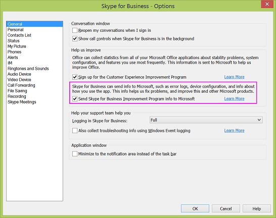

# Skype for Business and Microsoft Teams data collection practices

Skype for Business Server 2015, Skype for Business Online, along with Skype for Business and Microsoft Teams apps collect data to help Microsoft understand how these products are being used and what kinds of errors, such as sign-in errors, have occurred. This information helps us understand usage patterns, plan new features, and troubleshoot and fix problem areas.
  
While some usage data is collected automatically, other data can only be collected when the admin and/or user chooses to allow it. Data collection falls into these three categories:
  
- Census data
    
- Usage data
    
- Error reporting data
    
## Census data

Census data is acquired solely to provide, support, and improve Skype for Business. Microsoft Teams and Skype for Business Online. It includes environmental information such as device and operating system versions, and regional and language settings. It also includes counters for sign-in attempts and failures. Here are some specific examples of the census data that's collected:

|**Data type**|**Example**|**Notes**|
|:-----|:-----|:-----|
|AppName    |iPhoneSkype    ||
|DeviceModel    |iPhone    ||
|OSName    |iPhoneiOS    ||
|OSVersion    |8.3    ||
|UserLanguage    |EN-US    ||
|UserID    |E296D735-4F36-4E18-7C3B-52E1A02A0164    |The ID is hashed twice: once on the client and again on the telemetry service. The hashing ensures the ID cannot be linked to a specific user.    |
|DeviceID    |5E872200-F546-4CCD-8F23-AF5F507AA2DD    |The device ID is a GUID that's randomly generated once on the device and sent to the telemetry service.    |
   
Census data DOES NOT contain any information that identifies your organization or users. See the [Skype for Business Privacy Statement](https://www.microsoft.com/privacystatement/en-us/SkypeforBusiness/Default.aspx) for more information.
  
Census data is on by default and cannot be turned off by admins or end users.
  
## Usage data

Usage data includes information such as number of calls made, number of IMs sent or received, number of meetings joined, frequency of features used, and stability issues.
  
Usage data might contain information that identifies your organization, such as contoso.com. Here are some specific examples of the usage data that's collected:
  
|**Data type**|**Example**|**Notes**|
|:-----|:-----|:-----|
|IM Sent    |12    ||
|IM Received    |5    ||
|Join a meeting (attempts)    |5    ||
|Join a meeting (success)    |4    ||
|Call/meeting minutes    |30 mins    ||
|FederationPartner    |Microsoft.com    |This is the name of the organization registered in Office 365 and is transmitted in cleartext, which means it's not obfuscated.    |
   
Usage data DOES NOT contain any information that identifies users.
  
Usage data collection is on by default, but on-premises admins can turn it off using the DisableAutomaticSendTracing Group Policy setting on Skype for Business Server 2015. Turning this setting off affects all users in the organization. See [Configure client bootstrapping policies in Skype for Business Server 2015](https://technet.microsoft.com/EN-US/library/gg425941.aspx) for more information.
  
End users cannot turn usage data collection on or off.
  
For Skype Meetings App and the join launcher web pages, the way to control telemetry is through this policy:
  
Set-CsWebServiceConfiguration -MeetingUxEnableTelemetry $True
  
This policy defaults to false, so telemetry collection is off by default. This setting is per-pool and controls all users who connect with Skype Meetings App to a meeting hosted on that server.
  
## Error reporting data

Error reporting data can include information about performance and reliability, device configuration, network connection quality, error codes, error logs, and exceptions. Here are some specific examples of error reporting data that's collected:

|**Data type**|**Example**|**Notes**|
|:-----|:-----|:-----|
|Message direction    |Incoming    ||
|Conversation state    |Idle    ||
|Conversation thread ID    |AdDO8hsJqilU93hQHC3OZaPR2saEA==    ||
|UserID    |amosmarble   |The ID is sent in cleartext , which the telemetry service hashes before storing it    |
   
Error reporting data may also contain personally identifiable information such as the user's IP address and Session Initiation Protocol Uniform Resource Identifier (SIP URI). See the [Skype for Business Privacy Statement](https://www.microsoft.com/privacystatement/en-us/SkypeforBusiness/Default.aspx) for a detailed explanation of what's collected.
  
Error reporting requires two things:
  
- The DisableAutomaticSendTracing Group Policy setting be set to False on the server or in the tenant admin center (this is the default state). See [Configure client bootstrapping policies in Skype for Business Server 2015](https://technet.microsoft.com/EN-US/library/gg425941.aspx) for more information.
    
- End users individually opt in from the General tab (click the gear icon and the Option dialog opens with the General tab displayed) in the Skype for Business client.
    
     
  

  
For Skype Meetings App, the MeetingUxEnableTelemetry also controls error reporting, although for crashes on Windows, the Watson settings control uploading crash info. There is no user setting for Skype Meetings App like you see in the desktop client dialog box.
  
See [Set General options in Skype for Business](http://support.office.com/article/e1a46d3e-dcea-437a-ba7b-6d442a40f439) for more information.
  
You can see [Set up your network for Skype for Business Online](http://support.office.com/article/81fa5e16-418d-4698-a5f0-e666211c5c66) to set up your network.
  
If you are using Office 365 operated by 21Vianet in China, see [Set up your network for Skype for Business Online operated by 21Vianet](http://support.office.com/article/d21f89b0-3afc-432e-b735-036b2432fdbf).
  
## Related topics
[Customer Experience Improvement Program](https://www.microsoft.com/products/ceip/en-US/default.mspx)

[Country and region availability for Audio Conferencing and Calling Plans](../country-and-region-availability-for-audio-conferencing-and-calling-plans/country-and-region-availability-for-audio-conferencing-and-calling-plans.md)
