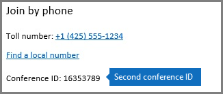

# Using Audio Conferencing dynamic IDs in your organization

The Audio Conferencing service is being updated to provide each Skype for Business and Microsoft Teams meeting with different conference IDs. Dynamic conference IDs are a significant improvement over static conference IDs, because they provide:
  
- **Enhanced security** The conference IDs are unique for each Skype for Business or Microsoft Teams meeting and are generated when the meeting is being scheduled.
    
- **A better experience for back-to-back and side-to-side meetings** Meetings for a single organizer are given specific dial-in information that prevents phone participants of one meeting from being mixed with participants of another one when they're scheduled next to each other.
    
- **A seamless transition** When your organization is enabled for dynamic conference IDs, all the meetings that have been already scheduled in your organization with static conference IDs will continue to work.
    
> [!TIP]
> Dynamic IDs are only available to users who are enabled for ** Audio Conferencing** and have Microsoft set as their audio conferencing provider. You can[Assign Microsoft as the audio conferencing provider](assign-microsoft-as-the-audio-conferencing-provider.md) for your users.
  
## What changes will the users in my organization see?

After dynamic conference IDs have been enabled for your organization, any new Skype for Business or Microsoft Teams meeting that is scheduled by users in your organization who are enabled for Audio Conferencing will have conference IDs that will be different from the static conference ID they had before. Organizers who had static conference IDs before need to remind the users joining their meetings that they now need to use a new conference ID in the meeting's invite before they can join it.
  
> [!NOTE]
> Meetings that were scheduled by a user with static conference IDs before the organization was enabled for dynamic conference IDs will continue to have the static conference IDs, so they'll continue to schedule meetings without any impact. 
  
These examples show you the new experience for two Skype for Business meetings that have been organized by the same user but will both now have two different conference IDs: 
  
 **Meeting #1** has been scheduled from 9:00 AM to 10:00 AM and it has 93907123 as its conference ID:
  

  
 **Meeting #2** has been scheduled by the same user from 10:00 AM to 11:00 AM and it has 16353789 as its conference ID:
  

  
## Related topics

- [Set up Skype for Business Online](../set-up-skype-for-business-online/set-up-skype-for-business-online.md)
    
- [Set up Audio Conferencing for Skype for Business and Microsoft Teams](set-up-audio-conferencing-for-skype-for-business-and-microsoft-teams.md)
    
- [Skype for Business and Microsoft Teams add-on licensing](../skype-for-business-and-microsoft-teams-add-on-licensing/skype-for-business-and-microsoft-teams-add-on-licensing.md)
    

