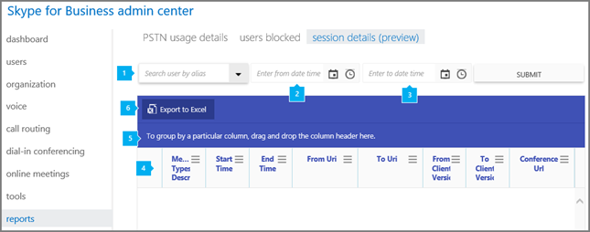

# Skype for Business session details report

The new Office 365 **Reports** dashboard shows you the activity overview across the Office 365 products in your organization. It enables you to drill in to individual product level reports to give you more granular insight about the activities within each product. For example, you can use the **Skype for Business Session details** report to see <insert>.
  
Check out [Activity Reports in the Office 365 admin center](http://technet.microsoft.com/library/0d6dfb17-8582-4172-a9a9-aed798150263%28Office.14%29.aspx) for more reports that are available.
  
This report along with the other Skype for Business reports give you details on activity including session details across your organization. These details are very helpful when you investigating, planning, and making other business decisions for your organization and for setting up [What are Communications Credits?](../skype-for-business-and-microsoft-teams-add-on-licensing/what-are-communications-credits.md).
  
> [!NOTE]
> You can see all of the Skype for Business reports when you log on as an administrator to the Office 365 admin center. 
  
## How to get to the Skype for Business Session details report

1. Go to the Office 365 admin center > **Reports**
    
2. Select **Reports** from the left menu then click **Usage**.
    
3. From the drop down under **Select a report**, click **Skype for Business Session details**.
    
    > [!TIP]
    > If you don't see this report listed, use the **Skype for Business admin center** > **Reports** > **Session details**. 
  
    > [!IMPORTANT]
    > Depending on the Office 365 subscription you have, you might not see all the products and reports that are shown here. 
  
## Interpret the Skype for Business Session details report

You can get a view into your user's Skype for Business session details by looking at each of the columns that are displayed.
  
This is what the report looks like.
  

  
## 

|||
|:-----|:-----|
|**1**   |**Search user by alias** lets you search for a single user and displays all of the user's session details in the table below.   |
|**2**   |**Enter from date time** lets you put in the start date. You can use the calendar to select the date or enter the date manually.   |
|**3**   |**Enter to date time** lets you put in the ending date. You can use the calendar to select the date or enter the date manually.   |
|**4**   | The table shows you a breakdown of the all session details per user. This shows all users that have Skype for Business assigned to them and their session information. You can add/remove columns to the table.   **Dialog ID** is the ID for   **Media types description** is the   **Start time** is   **End time** is   **From URI** is   **To URI** tells you   **From client version** tells you   **To client version** tells you   **Conference URL** tells you   **From Tel number**   |
|**5**   |Click to drag a column to **To group by a particular column, drag and drop the column header here** if you want to create a view that groups all of the data in one or more columns.   |
|**6**   |You can also export the report data into an Excel .csv file, by clicking or tapping the **Export to Excel** button.   This exports data of all users and enables you to do simple sorting and filtering for further analysis. If you have less than 2000 users, you can sort and filter within the table in the report itself. If you have more than 2000 users, in order to filter and sort, you will need to export the data.    |
   
## Want to see other Skype for Business reports?

- [Skype for Business activity report](skype-for-business-activity-report.md) You can see how much your users are using peer-to-peer, organized, and participated in conferencing sessions.
    
- [Skype for Business device usage report](skype-for-business-device-usage-report.md) You can to see the devices including Windows-based operating systems and mobile devices that have the Skype for Business app installed and are using it for IM and meetings.
    
- [Skype for Business conference organizer activity report](skype-for-business-conference-organizer-activity-report.md) You can see how much your users are organizing conferences that use IM, audio/video, application sharing, Web, dial-in/out - 3rd party, and dial-in/out - Microsoft.
    
- [Skype for Business conference participant activity report](skype-for-business-conference-participant-activity-report.md) You can see how many IM, audio/video, application sharing, Web and and dial-in/out conferencing conferences are being participated in.
    
- [Skype for Business peer-to-peer activity report](skype-for-business-peer-to-peer-activity-report.md) You can see how much your users are using IM, audio/video, application sharing and transferring files.
    
- [Skype for Business users blocked report](skype-for-business-users-blocked-report.md) You can see the users in your organization that have been blocked from making PSTN calls.
    
- [Skype for Business PSTN usage report](skype-for-business-pstn-usage-report.md) You can see the number of minutes spent in inbound/outbound calls and cost for these calls.
    
## See also

#### Other Resources

[Activity Reports in the Office 365 admin center](http://technet.microsoft.com/library/0d6dfb17-8582-4172-a9a9-aed798150263%28Office.14%29.aspx)

