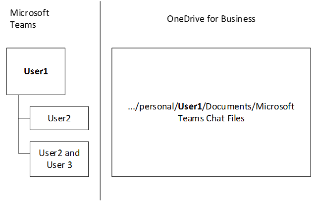

How SharePoint Online and OneDrive for Business interact with Microsoft Teams
=============================================================================

> [!Tip]
> Watch the following session to learn how Teams interacts with Azure Active Directory (AAD), Office 365 Groups, Exchange, SharePoint and OneDrive for Business: [Foundations of Microsoft Teams](https://aka.ms/teams-foundations)

Each team in Microsoft Teams has a team site in SharePoint Online, and each channel in a team gets a folder within the default team site document library. Files shared within a conversation are automatically added to the document library, and permissions and file security options set in SharePoint are automatically reflected within Teams.

Private chat files are stored in the sender’s OneDrive for Business folder, and permissions are automatically granted to all participants as part of the file sharing process.

If users aren't assigned and enabled with SharePoint Online licenses, they don't have OneDrive for Business storage in Office 365. File sharing will continue to work in channels, but users won't be able to share files in chats without OneDrive for Business storage in Office 365.

By storing the files in the SharePoint Online document library and OneDrive for Business, all compliance rules configured at the tenant level will be followed. 

> [!NOTE]
> Integration with Sharepoint On-premises is not supported for Microsoft Teams at this time.

The following is the example of relationships between team, channel, and document library.

For every team, a SharePoint site is created, and the **Shared Documents** folder is the default folder created for the team. Each channel, including the **General** channel (the default channel for each team) has a folder in **Shared Documents**.

> [!NOTE]
> It's not currently possible to replace the default SharePoint site and document library with another one. We've heard from you that you want it, and we're considering it. Check the [Teams Roadmap](https://aka.ms/teamsroadmap) or [Teams UserVoice](https://aka.ms/TeamsUserVoice) to stay on top of upcoming features.

> [!TIP]
> To add a tab to your team that links to an existing SharePoint site page or to your existing SharePoint document library:
> 1. Select the  plus sign next to the tabs.
> 2. Select either **SharePoint** for an existing SharePoint site page or **Document Library** for an existing document library.
> 3. Select the appropriate page or document library.

For every user, the OneDrive folder **Microsoft Teams Chat Files** is used to store all files shared within private chats with other users (1:1 or 1:many), with permissions configured automatically to restrict access to the intended user only.

