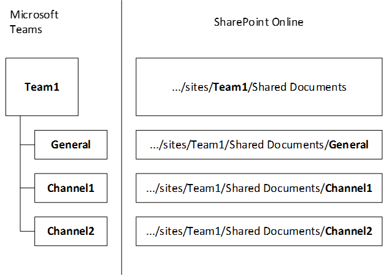

How SharePoint Online and OneDrive for Business interact with Microsoft Teams
=============================================================================

Each team in Microsoft Teams has a team site in SharePoint Online, and each channel in a team gets a folder within the default team site document library. Files shared within a conversation are automatically added to the document library, and permissions and file security options set in SharePoint are automatically reflected within Teams.

Private chat files are stored in the **sender’s** OneDrive for Business folder, and permissions are automatically granted to all participants as part of the file sharing process.

If you don't have SharePoint Online enabled in your tenant, Microsoft Teams’ users cannot always share files in teams. Users in private chat also cannot share files because OneDrive for Business (which is tied to the SharePoint license) is required for that functionality.

By storing the files in the SharePoint Online document library and OneDrive for Business, all compliance rules configured at the tenant level will be followed.

The following is the example of relationships between team, channel, and document library.

For every team, a SharePoint site is created, and the *Shared Documents* folder is the default folder created for the team. Each channel, including the **General** channel, the default channel for each team, has a folder under the *Shared Documents* folder.

For every user, the OneDrive folder *Microsoft Teams Chat Files* is used to store all files shared within private chats with other users (1:1 or 1:many), with permissions configured automatically to restrict access to the intended user only.

