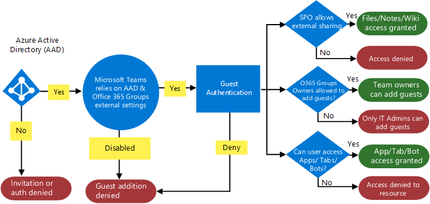
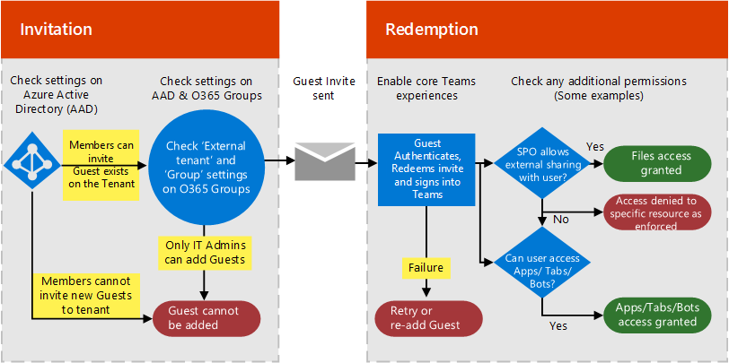

Authorize guest access in Microsoft Teams
===========================================

To satisfy your organization’s requirements, you can manage Microsoft Teams guest access features and capabilities through four different levels of authorization. All the authorization levels apply to your Microsoft 365 or Office 365 organization. Each authorization level controls the guest experience as shown below:

- **Azure Active Directory**: Guest access in Microsoft Teams relies on the Azure AD business-to-business (B2B) platform. This authorization level controls the guest experience at the directory, tenant, and application level.
- **Microsoft Teams**: Controls the guest experience in Microsoft Teams only.
- **Microsoft 365 Groups**: Controls the guest experience in Microsoft 365 Groups and Microsoft Teams.
- **SharePoint Online and OneDrive for Business**: Controls the guest experience in SharePoint Online, OneDrive for Business, Microsoft 365 Groups, and Microsoft Teams.

These different authorization levels provide you with flexibility in how you set up guest access for your organization. For example, if you don’t want to allow guest users in your Microsoft Teams but want to allow it overall in your organization, just turn off guest access in Microsoft Teams. Another example: You could enable guest access at the Azure AD, Teams, and Groups levels, but then disable the addition of guest users on selected teams that match one or more criteria such as data classification equals confidential. SharePoint Online and OneDrive for Business have their own guest access settings that don't rely on Microsoft 365 Groups.

> [!NOTE]
> Guests are subject to the service limits described in [Microsoft 365 and Office 365 service descriptions](https://go.microsoft.com/fwlink/p/?linkid=282347) and [Limitations of Azure AD B2B collaboration](https://go.microsoft.com/fwlink/p/?linkid=853019). 

The following diagram shows how guest access authorization dependency is granted and integrated between Azure Active Directory, Microsoft Teams, and Microsoft 365 or Office 365.

The next diagram shows, at a high level, how the user experience works with the permission model through a typical guest access invitation and redemption flow.

It’s important to note here that apps, bots, and connectors might require their own set of permissions and/or consent specific to the user account. These might need to be granted separately. Similarly, SharePoint might impose extra external sharing boundaries for a specific user, groups of users, or even at the site level.

The previous two diagrams are also available in [Visio](https://github.com/MicrosoftDocs/OfficeDocs-SkypeForBusiness/blob/live/Teams/media/teams_dependencies.vsdx?raw=true).

## Control guest access in Azure Active Directory

Use Azure AD to determine whether external collaborators can be invited into your tenant as guests, and in what ways. For more information about Azure B2B guest access, see [What is guest user access in Azure Active Directory B2B](https://docs.microsoft.com/azure/active-directory/b2b/what-is-b2b). For information about Azure AD roles, see [Grant permissions to users from partner organizations in your Azure Active Directory tenant](https://docs.microsoft.com/azure/active-directory/b2b/add-guest-to-role).

The settings for invitations apply at the tenant level and control the guest experience at the directory, tenant, and application level. To configure these settings in the Azure portal, go to **Azure Active Directory** > **Users** > **User settings**, and under **External users**, select **Manage external collaboration settings**.

Azure AD includes the following settings to configure external users:

- **Guest users permissions are limited**: **Yes** means that guests don't have permission to Microsoft Graph. Additionally, guests can't be assigned to administrative roles in your directory. To learn more see, [What are the default user permissions in Azure Active Directory?](https://go.microsoft.com/fwlink/?linkid=2135493) **No** means that guests have the same access to directory data that regular users have in your directory.
- **Admins and users in the guest inviter role can invite**: **Yes** means that admins and users in the guest inviter role will be able to invite guests to the tenant. **No** means admins and users can't invite guests to the tenant.
- **Members can invite**: To allow non-admin members of your directory to invite guests, set this policy to **Yes** (recommended). If you prefer that only admins be able to add guests, you can set this policy to **No**. Keep in mind that setting **No** will limit the guest experience for non-admin teams owners; they'll only be able to add guests in Teams that have already been added in AAD by the admin.
- **Guests can invite**: **Yes** means that guests in your directory can invite other guests to collaborate on resources secured by your Azure AD, such as SharePoint sites or Azure resources. **No** means that guests can't invite other guests to collaborate with your organization.
    > [!IMPORTANT]
    > Currently, Teams doesn't support the guest inviter role, so even if you set **Guests can invite** to **Yes**, guests can't invite other guests in Teams.
 
For more information about controlling who can invite guests, see [Delegate invitations for Azure Active Directory B2B collaboration](https://docs.microsoft.com/azure/active-directory/b2b/delegate-invitations).

> [!NOTE]
> You can also manage which domains can be invited into your tenant as guests. See [Allow/Block guest access to Microsoft 365 Groups](https://docs.microsoft.com/exchange/recipients-in-exchange-online/manage-group-access-to-office-365-groups).

Adding the user guest account manually to Azure AD B2B is not required, as the account will be added to the directory automatically when you add the guest to Teams.

### Licensing for guest access
Guest access licensing is part of Azure AD licensing. Guest access is included with all Microsoft 365 Business Standard and Office 365 Enterprise subscriptions. For more information about licensing, see [Azure Active Directory B2B collaboration licensing guidance](https://docs.microsoft.com/azure/active-directory/b2b/licensing-guidance).

> [!NOTE]
> Users in your organization who have standalone Office 365 subscription plans only, such as Exchange Online Plan 2, cannot be invited as guests to your organization because Teams considers these users to belong to the same organization. For these users to use Teams, they must be assigned an Microsoft 365 Business Standard, Office 365 Enterprise, or Office 365 Education subscription. 

## Control guest access in Teams

Guest access is turned off by default in Teams. To turn on guest access, see [Turn on or off guest access to Microsoft Teams](set-up-guests.md). 

## Control guest access in Microsoft 365 Groups

From Microsoft 365 Groups, you can control adding guest users and guest access to all Microsoft 365 Groups and Microsoft Teams teams in your organization.

1. Sign in with your global admin account at [https://portal.office.com/adminportal/home](https://portal.office.com/adminportal/home).

2. On the left, choose **Settings** and then select **Services &amp; add-ins**.

3. Select **Microsoft 365 Groups**.

     
  
4. On the Microsoft 365 Groups page, set the toggle to **On** or **Off**, depending on whether you want to let team and group owners outside your organization access Microsoft 365 Groups. Click or tap the toggle to **On** next to **Let group owners add people outside the organization to groups**. If you turn this toggle to **On**, you'll see another option to control whether you want to let group and team owners add people outside your organization to Microsoft 365 Groups and Microsoft Teams. Set this toggle to **On** if you want to let group and team owners add guest users. 
 
   

These settings apply at the tenant level and control the guest experience in Microsoft 365 Groups and Teams.

See [Manage guest access in Microsoft 365 groups](https://docs.microsoft.com/microsoft-365/admin/create-groups/manage-guest-access-in-groups?view=o365-worldwide#manage-groups-guest-access) and [Guest access in Microsoft 365 Groups](https://support.office.com/article/Guest-access-in-Office-365-Groups-bfc7a840-868f-4fd6-a390-f347bf51aff6) for more information about guest access in groups, including how guest access works, how to manage guest access, and answers to frequently asked questions.

## Control guest access to SharePoint Online and OneDrive for Business

Teams relies on SharePoint Online and OneDrive for Business to store files and documents for channels and chat conversations.  

For the full Teams guest access experience, Microsoft 365 and Office 365 admins need to configure the following settings:

- In SharePoint Online: Select **Existing guests**, **New and existing guests**, or **Anyone**.

    For more information, see [Turn external sharing on or off](https://docs.microsoft.com/sharepoint/turn-external-sharing-on-or-off).

- In Microsoft 365 Groups: Turn on **Let group owners add people outside the organization to groups**

    For more information, see [Control guest access in Microsoft 365 Groups](#control-guest-access-in-microsoft-365-groups), above.
  
These settings apply at the tenant level and control the guest experience in SharePoint Online, OneDrive for Business, Microsoft 365 Groups, and Teams.

You can manage SharePoint Online external user settings for the team sites connected to Teams. To learn more, see  [Manage your SharePoint team site settings](https://support.office.com/article/Manage-your-SharePoint-team-site-settings-8376034d-d0c7-446e-9178-6ab51c58df42).

## External access (federation) vs. guest access

[!INCLUDE [guest-vs-external-access](includes/guest-vs-external-access.md)]

## Related topics

- [Microsoft 365 guest sharing settings reference](https://docs.microsoft.com/Office365/Enterprise/microsoft-365-guest-settings)
