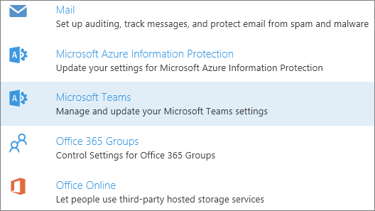
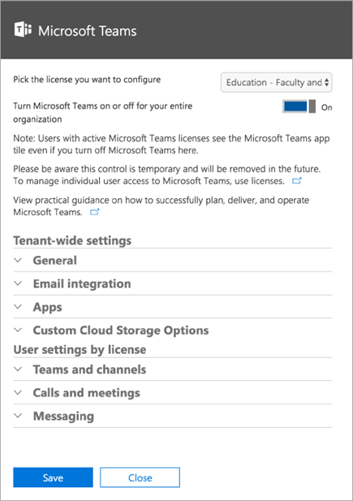
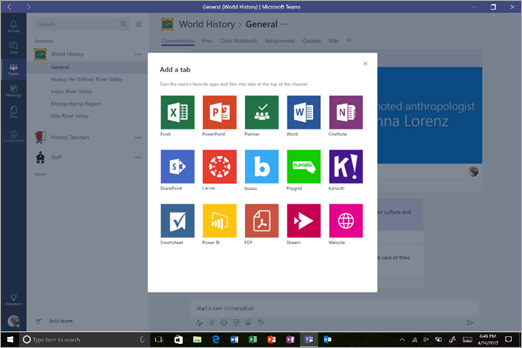

Deploy Microsoft Teams for Education Quick Start
=====================================

Roll out Microsoft Teams to faculty, staff, and students by following the steps outlined in this guide. 
    
Microsoft Teams is available to education customers as part of the Office 365 for Education suite licensing – Education, Education Plus and Education E5, as well as existing Education E3 suites. To learn more about Teams, see [Overview of Microsoft Teams](Teams-overview.md).

# Before you begin
Make sure your network is ready for Microsoft Teams. To do so, follow the steps in [Prepare your organization's network for Microsoft Teams](prepare-network.md).

# Enable Teams for your school
You use the Office 365 admin center to set up Microsoft Teams for your school.

1. [Sign in to Office 365](https://portal.office.com/) with your work or school account.
2. Select **Admin** to go to the Office 365 admin center.
3. Go to **Settings** > **Services & add-ins**.
4. On the **Services & add-ins** page, select **Microsoft Teams**.

5. The Microsoft Teams settings screen will open, select the education license you want to configure – **Faculty and Staff** or **Student**.

6. After you select the license type you want to enable, set the toggle to **On**, and then select **Save**.

You can control which users in your institution can use Microsoft Teams. By default, Office 365 Groups creation is enabled in Exchange Online. But, there are a couple of ways an IT Admin can limit the creation of new groups to specific users.

Every Exchange Online user has an OWA mailbox policy that governs what they can and can't do with their mailbox. By using the **Set-OwaMailboxPolicy** cmdlet, you can configure the *GroupCreationEnabled* parameter to be **$true** for users who are allowed to create groups and **$false** for users who are not authorized to create groups. At this time, the only way to update the mailbox policy is through Windows PowerShell. For more information, see [Use PowerShell to manage Office 365 Groups - Admin help](https://support.office.com/en-us/article/Manage-Office-365-Groups-with-PowerShell-aeb669aa-1770-4537-9de2-a82ac11b0540).

> [!NOTE]
> These commands turn off group creation only for OWA and Outlook.

If you want to turn off group creation in your institution, use Azure Active Directory settings. Or, the [Microsoft Planner for Office 365](https://blogs.office.com/en-us/2016/06/06/microsoft-planner-ready-for-showtime/) provides the opportunity to change the control mechanism to a policy stored in Azure Active Directory. 

The advantage of this approach is that Azure Active Directory provides a central point that all Office 365 applications can check. After a suitable policy is created, control over the creation of new Office 365 Groups is consistent everywhere.

# Configure tenant-wide settings
## General
The General section lets you configure the following settings for your institution.

- Show organizational chart in personal profile.
- Use Skype for Business for recipients who don’t have Microsoft Teams.
- Allow T-bot proactive help measures.

To disable or enable the setting, toggle the switch to **Off** or **On**, and then choose **Save**.

## Email integration
You can enable email integration with channels, as well create a restricted senders list.  To disable or enable the email integration, toggle the switch to **Off** or **On**, and then select **Save**. 

To restrict a senders list, enter a domain, and then select **Save**.

## Apps
You can enable external apps, new external apps and sideloading for apps in Microsoft Teams. To disable or enable the setting, toggle the switch to **Off** or **On**, and then choose **Save**.

Once external apps in Teams is enabled, the teachers can customize apps to make them available for their students through tabs. Tabs let you customize a channel to include content and capabilities your team needs every day. They provide quick access to frequently used documents and cloud services. There are several built-in tabs such as Files.

In the Microsoft Teams client, at the top of the channel, users can add tabs for Word documents, PowerPoint presentations, Excel spreadsheets, OneNote notebooks, plans from Planner, and more.

Over time, more tabs will be added, both from Microsoft and from partners.

## Custom cloud storage
You can enable various forms of cloud storage within Microsoft Teams. Currently, Box, Dropbox, Google Drive, and ShareFile are supported. To disable or enable the setting, toggle the switch to **Off** or **On**, and then choose **Save**.

# Configure user settings by license
## Teams and channels
A *team* is designed to bring together a group of people who work closely to get things done. Teams can be dynamic for project-based work (for example, curriculum development or planning school events), as well as ongoing, to reflect the internal structure of your institution (for example, schools, departments, and classes).

A *channel* is a subcategory of a team. You might create a channel for an activity or for a topic. Conversations, files, and notes are specific to each channel, but all members of the team can see them.

As an administrator, you can create and manage team owners and members by using the **Groups** control panel in the Office 365 admin center.

For more information about creating Office 365 Groups in the admin center, see [Create an Office 365 group in the admin center](https://support.office.com/en-us/article/Create-an-Office-365-group-in-the-admin-center-74a1ef8b-3844-4d08-9980-9f8f7a36000f).

## Calls and meetings
Some schools might want to restrict the amount of network traffic in their institution. For example, you might want to disable video in low bandwidth institutions. The **Calls and Meetings** section lets you choose if users will be allowed to use video or screen sharing during meetings.
    

## Messaging
As a tenant admin, you can turn on or turn off media content such as GIFs, memes, and stickers in the **Messaging** section of the Microsoft Teams settings screen.  You can also enable Faculty and Staff to delete all messages so teachers moderate class conversations and enable or disable private chat for Students.

To disable or enable Giphy's to allow users to add gifs to conversations, select **Off** or **On**, and then select **Save**.

When GIFs are enabled, you can apply a content rating to restrict the type of GIFs that are allowed within the Microsoft Teams in your institution. Content ratings include the following.

- Strict 
- Moderate
- Allow all content

Additionally, you can enable or allow the following.

- Memes that users can edit to add to conversations
- Stickers that users can edit to add to conversations
- Owners to delete all messages
- Users to delete their own messages
- Users to chat privately

## Bots
You can complete tasks such as querying information and performing commands by using bots. Currently, there are more than 20 native and third-party bots available in Teams with additional bots coming soon. 
     
> [!NOTE]
> T-Bot is a part of the product’s help system and cannot be disabled.

If you’re interested in building a bot, review the [Microsoft Teams Bots Platform](https://msdn.microsoft.com/en-us/microsoft-teams/bots), which has step-by-step instructions for getting started with writing bots for Microsoft Teams. 

## Connectors
Connectors allows users to receive updates from popular services such as Twitter, Trello, Wunderlist, GitHub, and Visual Studio Team Services.

For more information, see [Connect apps to your groups](https://support.office.com/en-us/article/Connect-apps-to-your-groups-in-Outlook-ed0ce547-038f-4902-b9b3-9e518ae6fbab) and [Office Connectors Platform](https://msdn.microsoft.com/en-us/microsoft-teams/connectors).

# Distribute to clients
The setup file for the Microsoft Teams client is an executable file that can be downloaded by administrators and end users from the [Microsoft Teams downloads page](https://teams.microsoft.com/downloads). End users on desktops can install the application provided they have the appropriate privileges. IT Admins can also distribute the installer and distribute it through client distribution tools.

End users with mobile devices can download the Microsoft Teams app from the mobile platform’s app store. 

Microsoft Teams is available on Windows (Windows 7 and later) and Mac desktop (Mac 10.10 and later). It is also available on iOS v9 and later (iPhone and iPad), Android 4.4 and later, and Windows Phone 10.0.10586 and later.  Support for Windows 10S will be coming at a later date.

Microsoft Teams supports the web client on Edge 12 or later, Internet Explorer 11 or later, Firefox 47.0 or later, and Chrome 51.0 or later. Users trying to open the Microsoft Teams web client on Safari will be directed to download the desktop client. Support for Safari will be coming at a later date.

# Enable or disable Microsoft Teams licenses
Administrators manage Microsoft Teams licenses by using the Office 365 admin center. You need to be an Office 365 global administrator or user management administrator to manage Microsoft Teams licenses.

If you want to limit the users who have access to Microsoft Teams in your institution or remove a user you want to restrict, you can do so by disabling the Microsoft Teams license for that person or persons. Once the license is disabled, the user will no longer be able to see Microsoft Teams in the Office 365 app launcher and homepage.

You assign or unassign the Microsoft Teams license to users in the same way you assign any other Office 365 Business or Enterprise license. Sign in to Office 365,go to the Office 365 admin center, and on the **Users** > **Active Users** page, assign or unassign the Microsoft Teams license for users.

# Launch
Before you roll out Microsoft Teams to your entire institution, we recommend that you begin with a few pilot teams of teachers, students, and staff. This helps you refine your launch plan and ensure you are ready for an institution-wide deployment. Successful pilots help generate excitement throughout the institution for the next wave of launch. To get started, follow the steps in [Pilot Microsoft Teams](https://docs.microsoft.com/en-us/MicrosoftTeams/pilot-essentials).
    
## Feedback and support
[Send a suggestion](https://aka.ms/eduuservoice)

[Contact support](https://aka.ms/o365portal)

[Ask the community](https://aka.ms/msteamscommunity)

[Explore the Office 365 for Education help center](https://support.office.com/en-us/education)

