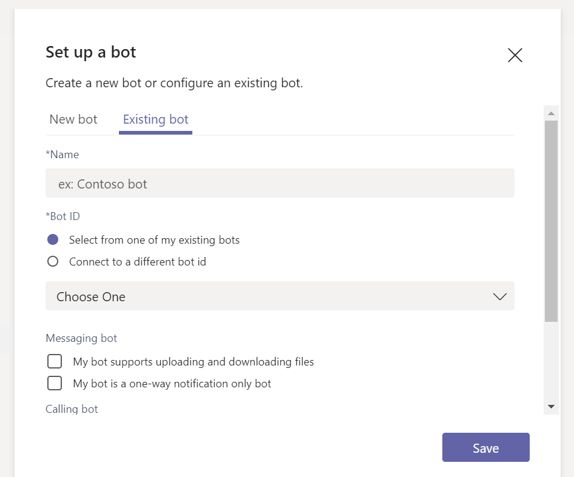

Add bots for private chats and channels in Microsoft Teams
==========================================================
> [!IMPORTANT]
> [!INCLUDE [new-teams-sfb-admin-center-notice](includes/new-teams-sfb-admin-center-notice.md)]

Bots are automated programs that respond to queries or give updates and notifications about details users find interesting or want to stay informed about. Bots allow users to interact with cloud services like task management, scheduling, and polling, through chat conversations in Microsoft Teams. Bots for Microsoft Teams are built on the [Microsoft Bot Framework](https://go.microsoft.com/fwlink/?linkid=854370). The bots that are developed using this framework can be enabled easily for Microsoft Teams. For more information, see [Manage Microsoft Teams features in your Office 365 organization](enable-features-office-365.md).

Currently, Microsoft Teams support bots in private chats and channels within a team. Administrators can control whether the use of bots is allowed or prohibited within the Office 365 tenant.

Bots developed by the community can be leveraged within Microsoft Teams. The bot’s functionality and bot’s side loading must be enabled on the tenant level for custom bots to be functional. Bots can be used in private chats or in channels. For channels, team owners or members can add bots.

For more information, see the section "Using bots" in [Apps and services](https://support.office.com/article/Apps-and-services-cc1fba57-9900-4634-8306-2360a40c665b). 

Create custom bots for Microsoft Teams
--------------------------------------

You can easily create a bot that integrates in to your LOB applications, using the Microsoft Bot Framework. Please refer to [Creating and Testing a bot for Microsoft Teams](https://go.microsoft.com/fwlink/?linkid=854371) guidance to learn how you can develop and publish your own bots.

When you create a bot and register it with the Bot Framework, you can choose to publish it. If you don't publish it, the bot remains private. You can also require your users to log in before using the bot. Requiring login makes sure only employees of your organization can access the bot, even if the bot's application ID becomes known. See [*AuthBot*](https://go.microsoft.com/fwlink/?linkid=854372) on GitHub for a code example of how to authenticate users against your Active Directory using bots.

Bots can be tested using the [Bot Framework Emulator](https://go.microsoft.com/fwlink/?linkid=854373) before they are deployed into your Teams.

Side load your own bot for private chat
---------------------------------------

1. After you have created your bot, go to the **Application Settings** for the bot you developed, then under **App settings**, copy the value of the **MicrosoftAppId** setting.

2.  From within Microsoft Teams, on the **Chat** pane, select the **Add chat icon**. For **To**, paste your bot's **Microsoft app ID**. 

3.  The app ID will resolve to your **bot name,** and then you can initiate a chat conversation with that bot.

Side load your bot for channels
-----------------------------------

If you want to share your bot with your colleagues, here's how to add it to channels of different teams:

1. After you have [created an app package for your bot](https://docs.microsoft.com/en-us/microsoftteams/platform/concepts/apps/apps-upload), open Teams and browse to the team in which you'll be side-loading the bot.
2. Add **[App Studio](https://docs.microsoft.com/en-us/microsoftteams/platform/get-started/get-started-app-studio)**, app to Microsoft Teams.
3. In App Studio, select the **Manifest Editor** Tab. 

4. To add your bot, In capabilities, select bot and chose to add an existing bot, then you will have the option 
to chose an existing bot from a drop or enter the Id of one of your existing bots.

5. Browse to the location of your app package, select it, and then click **Open**.
6. Select your bot's name (Don't forget to check the "Team" checkbox under the scope section)
7. Select the Test and distribute option.
8. Select the team where you wish to connect your bot to in the dialog which pops up.

With this, your bot will be available in your Microsoft Team's team.
