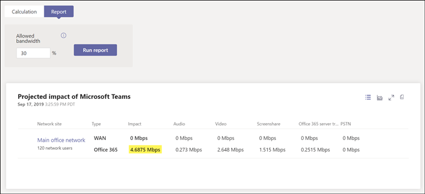

# Check your Internet connection

Business Voice is located in the cloud with Microsoft 365. Every computer and device that uses Microsoft Teams and Business Voice needs a connection to the Internet. To get the best experience with Business Voice, you need a broadband Internet connection that can support the expected number of phone calls that will be made at any one time. You also need to make sure that computers on your network can reach Microsoft 365 servers.

To follow these steps, you need to have a tenant with one of the following subscriptions:

* Office 365 Business Essentials
* Office 365 Business Premium
* Office 365 E1
* Office 365 E3
* Office 365 F1
* Microsoft 365 A1
* Microsoft 365 A3
* Microsoft 365 E3
* Microsoft 365 Business

You don't need a Business Voice license to follow these steps.

## Check your Internet connection speed

This article helps you determine whether your Internet connection is fast enough for the number of people who need to make phone calls, host video conferences, and so on. You'll enter some information about your organization and get back a report with how much of your Internet connection will be used by Teams and Business Voice.

### Get information about your Internet connection and users

Before you start, you need to know the following information:

* The speed of your Internet connection.
* How many people will use Business Voice mainly from your office.
* How many people will use Business Voice mainly from a remote location, such as a home office.

### Enter your information into the network planner

Here's what you need to do:

1. Open a browser and go to https://admin.teams.microsoft.com and sign in with an account that has Global Administrator permissions. The account you used to sign up for Office 365 has these permissions.
1. Open **Org-wide settings** and then select **Network planner**.
1. Under **Network plans**, select **Add**. Give your plan a name, and then select **Apply**. Your network plan should look like this:

    
1. Click on your network plan's name (**Main office** in the picture above).
1. On the next page, select **Add a network site** under the **Network sites** tab.
1. Fill out the following information and then select **Save**.

    
1. Under the **Report** tab, select **Start a report**.
1. Fill out the following information and then select **Generate report**

    

### Find your minimum Internet connection speed

When you select **Generate report**, Office 365 creates a report that looks like this:

The highlighted number shows how much of your Internet connection Teams and Business Voice will use. We recommend that this number be no more than 30% of your total Internet connection speed. For example, if your Internet connection is 60Mbps, Teams and Business Voice should take up no more than 18Mbps.

You can find your minimum Internet connection speed by doing this calculation: `<highlighted number> / .3`. Using the highlighted number in the picture above, the calculation would be `4.6875 / .3 = 15.6`. This means your minimum Internet connection speed needs to be at least 15.6Mbps.

If Teams and Business Voice will use more than 30% of your total Internet connection speed, the highlighted number will show up as red. If this happens, you might need to upgrade your Internet connection.

## Make sure computers and devices on your network can reach Microsoft 365

To work correctly, computers and devices you want to use with Business Voice need to communicate with Microsoft 365 servers using specific network ports. Network ports are essentially doors through which computers and devices can talk to each other over a network or the Internet. Your firewall needs to allow computers and devices on your network to reach Microsoft 365 using the following outbound network ports:

* **TCP ports** 80 and 443
* **UDP ports** 3478, 3479, 3480, and 3481

The easiest way to check whether your firewall allows communication on these network ports is to make a test call using Teams. To make a test call, do the following:

1. Go to https://aka.ms/getteams on a computer on your network to install Teams. Make sure speakers and a microphone are connected to this computer/
2. Open Teams and sign in using a Microsoft 365 account
3. In Teams, select your profile picture, then **Settings** > **Devices**
4. Choose **Make a test call** under **Audio devices**
5. Follow the prompts to leave a message and have it played back to you

* If the call connects and you can hear your message played back to you, your firewall is set up correctly.
* If the call connects but you can't hear the prompts or your message played back to you, make sure your speakers and microphone are set up correctly and detected by the computer. Try again.
* If the call doesn't connect or if it does but you can't hear your message played back to you, you might need to update your firewall to allow the network ports listed above. Check your firewall's documentation on how to allow network ports to reach the Internet, or contact an IT specialist to help you.

If you're an IT professional and want more information about how to prepare larger or more complex networks to support Business Voice, take a look at [Evaluate my environment](../3-envision-evaluate-my-environment.md). The [Evaluate my environment](../3-envision-evaluate-my-environment.md) article gives additional information about bandwidth, proxy, and firewall requirements and also how to test your network using the [Network Assessment Tool](../3-envision-evaluate-my-environment.md#test-the-network).
