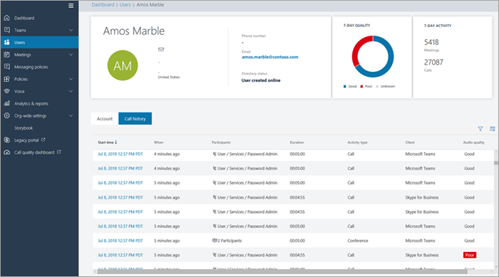
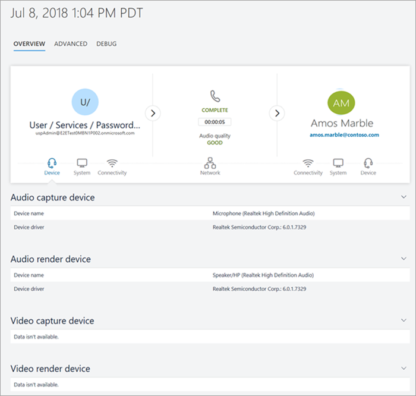

# Call Analytics and Call Quality Dashboard

Microsoft Teams and Skype for Business give you two ways to monitor and troubleshoot call-quality problems: Call Analytics and Call Quality Dashboard. This article describes both and tells you when to use each one.
  
**Call Analytics is now available in the Microsoft Teams admin center.** To see all of the call information and data for a user, use the **Call History** tab. You can do this by looking on the user's profile page by either searching for the user from the dashboard or finding the user from **Users** in the left navigation.

> [!IMPORTANT]
> Helpdesk agent permissions and network topology upload will be available in the new admin portal in the coming months. In the meantime, you can continue to use  https://adminportal.services.skypeforbusiness.com for Tier 1 and Tier 2 helpdesk access.
  
## What's Call Analytics, and when should I use it?

Call Analytics shows detailed information about the devices, networks, and connectivity related to the specific calls and meetings for each user in a Microsoft Teams or Skype for Business account. If you're an Office 365 admin, you can use Call Analytics to troubleshoot call quality and connection problems in Microsoft Teams and Skype for Business.

To see this information for a user in the Microsoft Teams & Skype for Business Admin Center, click the **Call History** tab for that user in the user detail page, showing all the calls and meetings that user has participated in for the last 30 days.

To get additional information about a given session including detailed media and networking statistics, click on a session to see the details.

If you want non-admins, such as helpdesk agents from an external vendor, to use Call Analytics, you can assign permissions so that they can use Call Analytics, but they can't access the rest of the Microsoft Teams & Skype for Business Admin Center: 
  
- **Helpdesk agents with communications support specialist permissions**: Agents see a limited set of data and personally identifiable information (PII) in Call Analytics. They can troubleshoot calls, but they will hand off problems with meetings to a communications support engineer.
    
- **Helpdesk agents with communications support engineer permissions**: Agents see all available data in Call Analytics and troubleshoot both calls and meetings. They have full access to call logs and customer information.

> [!NOTE]
> The communications support specialist role is equivalent to tier 1 support and the communications support engineer role is equivalent to tier 2 support.

For more information about the communications support specialist and communications support engineer roles, see [Use Microsoft Teams admin roles to manage teams](using-admin-roles.md).

> [!IMPORTANT]
> Helpdesk agent permissions and network topology upload are available in the Microsoft Teams & Skype for Business Admin Center. Communications Support Specialists and Communications Support Engineers can use this portal to access Call Analytics and the Call Quality Dashboard.
    
For details about setting up Call Analytics, see [Set up Skype for Business Call Analytics](set-up-call-analytics.md). For more information about how Helpdesk agents can work with Call Analytics, see [Use Call Analytics to troubleshoot poor call quality](use-call-analytics-to-troubleshoot-poor-call-quality.md).
  
## What's the Call Quality Dashboard, and when should I use it?

Call Analytics gives you detailed, specific information about the call quality experienced by users. Why did user Tony Smith have a poor call this afternoon? Using Call Analytics, a Microsoft Teams or Skype for Business admin or trained helpdesk agent can investigate the device, network, connectivity, and other factors related to Tony's call.
  
Where CA is designed to help admins and helpdesk agents troubleshoot call quality problems with specific calls, the Call Quality Dashboard (CQD) is designed to help Skype for Business admins and network engineers optimize a network. CQD shifts focus from specific users and instead looks at aggregate information for an entire Skype for Business organization. 
  
Maybe Tony's poor call quality is due to a network issue that's also affecting many other users. Tony's individual call experience isn't visible in CQD, but the overall quality of calls made using Skype for Business is captured. With the CQD, overall patterns may become apparent, allowing network engineers to make informed assessments of call quality. CQD provides reports of call quality metrics that give you insights into overall call quality, server-client and client-client streams, and voice quality [SLA](https://go.microsoft.com/fwlink/p/?linkid=846252). 
  

  
For more details, see [Features of the Call Quality Dashboard for Skype for Business Online](turning-on-and-using-call-quality-dashboard.md#BKMKFeaturesOfTheCQD).
  
Call Analytics and CQD run in parallel and can be used independently or together. For example, say a communications support specialist determines that they need more help troubleshooting a call problem. The communications support specialist passes the call to a communications support engineer, who has access to more information in Call Analytics than the communications support specialist. In turn, the communications support engineer can alert a network engineer to an issue. The network engineer might check CQD to see if an overall site-related issue could be a contributing cause of call problems.
  
For more information about CQD, see [Turning on and using Call Quality Dashboard for Microsoft Teams and Skype for Business Online](turning-on-and-using-call-quality-dashboard.md) and [Dimensions and measures available in Call Quality Dashboard for Microsoft Teams and Skype for Business Online](dimensions-and-measures-available-in-call-quality-dashboard.md).
  
## Related topics

[Set up Call Analytics](set-up-call-analytics.md)

[Use Call Analytics to troubleshoot poor call quality](use-call-analytics-to-troubleshoot-poor-call-quality.md)

[Turning on and using Call Quality Dashboard for Microsoft Teams and Skype for Business Online](turning-on-and-using-call-quality-dashboard.md)