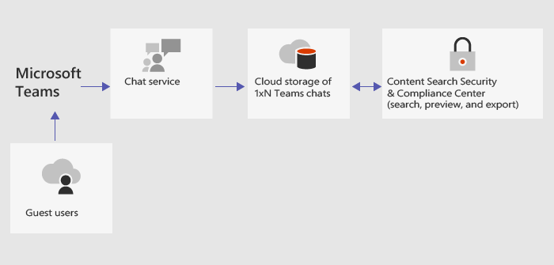

Conduct an eDiscovery investigation of content in Microsoft Teams
============================

Large Enterprises are often exposed to high penalty legal proceedings that demand submission of all Electronically Stored Information (ESI).

All Teams 1:1 or group chats are journaled through to the respective users’ mailboxes, and all standard channel messages are journaled through to the group mailbox representing the team. Files uploaded in standard channels are covered under the eDiscovery functionality for SharePoint Online and OneDrive for Business.

> [!NOTE]
> eDiscovery of messages and files in [private channels](private-channels.md) work differently than in standard channels. To learn more, see [eDiscovery of private channels](#ediscovery-of-private-channels).

1.  To conduct an eDiscovery investigation with Microsoft Teams content, review step 1 in [this](https://support.office.com/article/Manage-eDiscovery-cases-in-the-Office-365-Security-Compliance-Center-edea80d6-20a7-40fb-b8c4-5e8c8395f6da) link.

2.  Microsoft Teams data will appear as IM or Conversations in the Excel eDiscovery export output, and you can mount the .PST in Outlook to view those messages post export.

    When mounting the .PST for the Team, note that all conversations are kept in the Team Chat folder under Conversation History. The title of the message aligns to Team and Channel. From reviewing the image below, you can see this message from Bob who messaged the Project 7 standard channel of the Manufacturing Specs team.

    

3.  To see private chats in a user’s mailbox, they are also located inside the Team Chat folder under Conversation History.

## eDiscovery of guest-to-guest chats

Without a mailbox, guest-to-guest chats (1xN chats in which there are no home tenant users) would not be indexed, and as a result, would not be included in eDiscovery. To facilitate eDiscovery for guest-to-guest chats, a cloud-based mailbox (or phantom mailbox) is created to store the 1xN data. After the Teams chat data is stored in the cloud-based mailbox, it is indexed for eDiscovery and compliance content search.

The following illustration shows how eDiscovery works for guest-to-guest chats in which there isn’t a mailbox.



## eDiscovery of private channels

Records for messages sent in a private channel are delivered to the mailbox of all private channel members, rather than to a group mailbox. The titles of the records are formatted to indicate which private channel they were sent from.

Because each private channel has its own SharePoint site collection that's separate from the parent team site, files in a private channel are managed independently of the parent team.

Teams doesn't support eDiscovery of a single channel, so the whole team must be searched. To perform an eDiscovery search of content in a private channel, search across the team, the site collection associated with the private channel (to include files), and mailboxes of private channel members (to include messages).

Use the following steps to identify files and messages in a private channel to include in  your eDiscovery search.

### Include private channel files in an eDiscovery search

Before you perform these steps, install the [SharePoint Online Management Shell and connect to  SharePoint Online](https://docs.microsoft.com/en-us/powershell/sharepoint/sharepoint-online/connect-sharepoint-online?view=sharepoint-ps).

1. Run the following to get a list of all SharePoint site collections associated with private channels in the team.

    ```
    Get-SPOSite
    ```
2. Run the following PowerShell script to get a list of all SharePoint site collection URLs associated with private channels in the team and the parent team group ID.

    ```
    $sites = get-sposite -template "teamchannel#0"
    foreach ($site in $sites) {$x= get-sposite -identity $site.url -detail; $x.relatedgroupID; $x.url} 
    ```
3. For each team or group ID, run the following PowerShell script to identify all relevant private channel sites.

    ```
    $sites = get-sposite -template "teamchannel#0"
    $groupID = “e8195240-4a70-4830-9106-80193cf717cb“
    foreach ($site in $sites) {$x= Get-SpoSite -Identity $site.url -Detail; if ($x.RelatedGroupId -eq $groupID) {$x.RelatedGroupId;$x.url}}
    ```

### Include private channel messages in an eDiscovery search

Before you perform these steps, make sure you have the [latest version of the Teams PowerShell module](teams-powershell-overview.md) installed.

1. Run the following to get a list of private channels in the team.

    ```
    Get-TeamChannel -GroupId <GroupID> -MembershipType Private
    ```
2. Run the following to get a list of private channel members.

    ```
    Get-TeamChannelUser -GroupId <GroupID> -DisplayName "Engineering" -Role Member
    ```
3. Include the mailboxes of all members from each private channel in the team as part of your eDiscovery search query.

## Related topics

- [Teams PowerShell Overview](teams-powershell-overview.md)