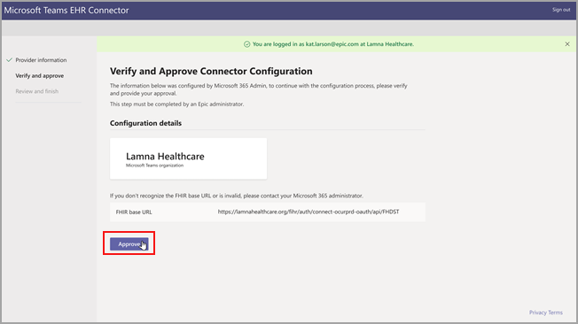
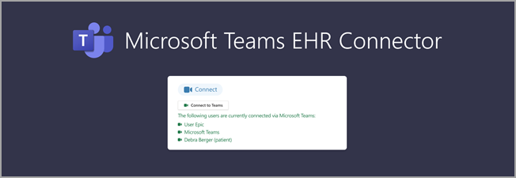

# Virtual visits with Teams - Integration into EHR

Microsoft Teams Electronic Health Record (EHR) Connector makes it easy for clinicians to launch a virtual patient visit or consultation with another provider in Teams directly from the EHR system. The communication and collaboration platform of Teams makes it easy for clinicians to cut through the clutter of traditionally fragmented systems so they can spend time providing the best possible care. Built on the Microsoft 365 cloud, Microsoft Teams enables simple, secure collaboration and communication with chat, video, voice, and healthcare tools in a single hub that supports compliance with HIPAA, HITECH certification, and more.

- Launch Teams meetings from both provider and patient portals.

- Write back into EHR metadata on Connect/Disconnect events to enable automatic auditing and record keeping.

- Integrate into clinician and patient existing workflows while allowing them to use Microsoft Teams.

This integration supports the following virtual visit use cases in web and mobile:

- Provider and patient.

- Multi-provider appointments.

**Prerequisites**

- Active subscription to Microsoft Cloud for Healthcare or subscription to Microsoft Teams EHR Connector standalone offer.

- Users must have an appropriate license. Office 365 A3, A5, E3, and E5, as well as Microsoft 365 Business Standard, A3, A5, E3, and E5 are supported.

- Microsoft Teams should be adopted and used inside the organization.

- Organizations must have a current integration with Epic.

- Your systems must meet all [software and browser prerequisites](https://docs.microsoft.com/microsoftteams/hardware-requirements-for-the-teams-app).

> [!Note]
> Request your Epic resource to provide the Epic-Microsoft Teams Telehealth Integration Guide available in the Epic marketplace.

## Connector setup

Configuring your healthcare organization to launch virtual visits with Microsoft Teams starts by launching the EHR Connector URL. Use the test URL to configure and test from your Epic test environment. Use the production URL when you're ready to test from Epic production environment.
  
- Test environment [https://ehrconnector-ppe.teams.microsoft.com](https://ehrconnector-ppe.teams.microsoft.com)
- Production environment [https://ehrconnector.teams.microsoft.com](https://ehrconnector.teams.microsoft.com)

The Microsoft 365 admin and Epic admin from your organization must complete the information and integration steps in the connector. For Epic configuration steps, contact the Epic resource assigned to your organization.

### Provider information

Your Microsoft 365 administrator must receive a valid Fast Health Interoperability Resources (FHIR) base URL from your Epic administrator and the username of the configuration approver. The Microsoft 365 administrator must launch the connector configuration page and sign in with Microsoft credentials to start the configuration process.

- The FHIR base URL is a constant address that all FHIR API endpoints for the server's default FHIR version live under.
  Sample URL <https://lamnahealthcare.org/fihr/auth/connect-ocurprd-oauth/api/FHDST>

- Configuration approver name is the name of the Epic system administrator who will be responsible for approving the configuration overall process.

  

### Verify and approve configuration

The Epic administrator for your healthcare organization who was added as an approver must use the same EHR Connector link from the previous step to sign in using their Microsoft credentials. After successful validation, the user is going to be asked to sign in to Epic to validate the level of access for the user.

> [!Note]
> Microsoft 365 admin and Epic admin in your organizations can be the same person. In that case, add your own username as approver in the first step. You'll still need to login to Epic to validate your access.

  

After a successful Epic sign-in, the Epic administrator must approve the configuration. If the configuration isn't correct, the Microsoft 365 admin will have the ability to modify the original configurations by logging in to the Microsoft EHR Connector site again.

### Review and finish configuration

When the configuration information is approved by the Epic admin, review the mapping and modify any configuration. Finally, you'll see key data elements that will be needed to complete the telehealth configuration in Epic.

> [!Note]  
> Request your Epic resource to provide the Epic-Microsoft Teams Telehealth Integration Guide (available in the Epic marketplace) and support during the key data elements configuration.

## Launch Teams virtual visits

After completing the EHR Connector steps and Epic configuration, your organization is ready to support video visits with Microsoft Teams.

### Virtual visit prerequisites

- Your systems must meet all [software and browser prerequisites](https://docs.microsoft.com/microsoftteams/hardware-requirements-for-the-teams-app).

- Healthcare organization must have completed the mapping between the organization and Microsoft Teams.

- A Meeting must have been scheduled by the healthcare provider in any of the provider portals (Hyperspace, Haiku, Canto) or by the patient in MyChart portal.

### Patient experience

In MyChart, patients will be able to schedule appointments as they regularly do. Patients must select **Microsoft virtual visit** during the scheduling. At the appointment time, the patient can launch a virtual visit from MyChart.

Key features of the patient experience include:

- Patients aren't required to create a Microsoft account or sign in to launch a virtual visit.

- Patients aren't required to download Microsoft Teams app to launch a virtual visit.

- Virtual visits are supported in a browser. See [software and browser prerequisites](https://docs.microsoft.com/microsoftteams/hardware-requirements-for-the-teams-app) for a list of supported software and browsers.

- Patients will be placed in a lobby until the healthcare provider joins the appointment and permits access to the virtual visit.

- Testing of the video and microphone is allowed before joining the virtual visit

  

### Provider experience

Healthcare providers from your organization can also join virtual visits with Microsoft Teams from their ports (Hyperspace, Haiku, Canto). The **Begin virtual visit** button is embedded in the provider flow where patient information is displayed.

Key features of the provider experience:

- Providers can join virtual visits using supported browsers or the Microsoft Teams web application.

- Providers must do a one-time sign-in to their Microsoft account when joining a virtual visit.

- After the one-time sign-in, the provider will be taken straight to the virtual appointment.

- Providers have the option to end the call for all participants in the virtual appointment.

  

An important feature supported by the integration is the real-time updates in the provider portal of connect and disconnect of participants for a given appointment. That way, the provider can join the virtual visit only when the patient is ready to take the consultation.

### Privacy and location of data

Teams integration into EHR systems optimizes the amount of data being used and stored during integration and virtual visit flows. The solution follows the overall Teams privacy and data management principles and guidelines outlined in Teams Privacy.

The Microsoft Teams EHR connector doesn't store nor transfer any identifiable personal data or any health records of patients or healthcare providers from the EHR system. The only data that is stored by the EHR connector is the EHR user’s unique ID, which is used during Teams meeting setup. The EHR user’s unique ID is stored in one of the three geographic regions described in the [Where your Microsoft 365 customer data is stored](https://docs.microsoft.com/microsoft-365/enterprise/o365-data-locations?view=o365-worldwide#data-center-geographies) article. All chat, recordings, and other data entered into Teams by the meeting participants are stored according to existing storage policies. If you want to learn more information on the location of data in Microsoft Teams, visit [Locations of data in Teams](https://docs.microsoft.com/microsoftteams/location-of-data-in-teams).
