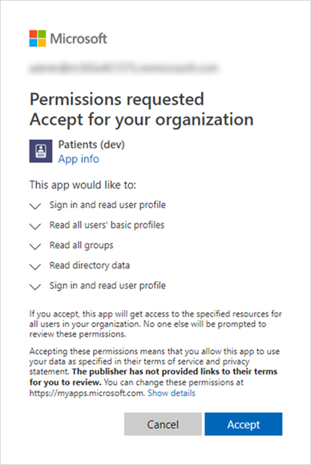

# Patients app overview

The Patients application is a Microsoft Teams store app available to all Teams users. The app enables patient care teams consisting of clinical workers (e.g. Nurses, physicians, social workers) can curate and review lists of patients for scenarios ranging from rounds and interdisciplinary team meetings to general patient monitoring.

The app has two modes:

- The EMR Connected mode that connects to EMRs through FHIR. The EMR Connected mode app stays in private preview and interested customers or admins may request access to the app by dropping Microsoft an email at teamsforhealthcare@service.microsoft.com with information about their Office 365 tenant.
- The manual mode that enables care teams to manually add/bring in patient information. The application is available in the Teams app store for end users to download by default and is in public preview. The app can be restricted to certain sections of users using [app setup policies in Microsoft Teams](../../teams-app-setup-policies.md)

## Usage example

During rounding sessions on every shift in medical wards, clinicians gather at the nursing station to discuss the latest updates on the progress with patients in the ward.  They highlight the key critical metrics (not necessarily medical or that its explicit on the patients’ medical records) and ensure the patient is on the right glide path to discharge based on their diagnosis. In order to round around these patients, the charge nurse sets up the patient app in a team where all the clinicians are added and adds patients to a patient list. During the rounds, the nurses and the other care givers for the patient access Microsoft Teams and the Patients app on their mobile devices and update relevant patient information on their device and then everyone else in the care team can see those updates and notes and stay in sync. Twice a day, at the start and end of a shift, they also have multi-displicinary team meetings to go over the patient list and use the Patients App to ground themselves and share information about each patient using the Patients app on a large display screen. Often times, certain clinicians may also dial in to these Teams meetings remotely and still be part of the discussion.

## Configure Patients app

For information on how to prepare your environment to use the EMR mode Patients app, see [Integrating Electronic Healthcare Records into Microsoft Teams](patients-app.md). You will also need to see [Manage app setup policies in Microsoft Teams](../../teams-app-setup-policies.md) to enable Patients app for your organization.

For information on how your end users can access and install the Patients App to a team that they own or manage, see [Get started with Microsoft Teams Patients](https://support.office.com/article/get-started-with-microsoft-teams-patients-aa7daebe-706a-4a65-8ce9-b9b79233f393) 

<!-- add link out to client doc, doesn't seem to be available yet, Grant is finalizing -->

## Connect the Patients App to Azure API for FHIR

To allow the Patients App access to an Azure API for FHIR instance, follow these steps: 

1. Click [here](https://login.microsoftonline.com/common/adminConsent?client_id=4aee3506-b263-43e0-ba31-1468fa7b2806) to grant admin consent for the Patients App. When prompted, sign in using your tenant admin or global admin credentials, and then click **Accept** to grant the required permissions.

    

After you accept, close the window. You're directed to a page that may look like this. You can safely ignore this error. It's harmless and indicates that consent is granted.
2. Go to the Azure portal

## Frequently asked questions (FAQ)

**Where is the Patients app data stored?**

All of the data entered by end users into the Patients App, including the column/field schema, the actual data entered into the list and list items (i.e. patients), is stored in the secure and compliant Exchange Online infrastructure. All of the data is stored in the group mailbox that's associated with the team. This architecture enables the Patients App to easily fulfill data residency, government cloud support (coming in the future) and other compliance/information protection features like eDiscovery support. The Patients app operates in a team scope. You will need to install an instance of the app per team.

<!-- add link to eDiscovery article for the Patients app, Mark Johnson will finalize soon -->

**Where can I acquire the Patients App from?**

If the Patients app is enabled for their organization by their admin, any end user can go to the Teams app store and add the Patients app to a team they are a member of. For more information, see [Manage app setup policies in Microsoft Teams](../../teams-app-setup-policies.md).

**Can I have multiple instances of the Patients app in a team because that's how my ward/unit operates?**

Currently, you can only install one instance of the Patients app for a given team, and only in the general channel. However, within the app, multiple lists can be created to address multi-channel or isolation/separation scenarios. By default, all members of the team will have access to the Patients tab in the general channel. 

**Can I export all of the data from the Patients app?**
Not right now, but this feature is coming soon. 

**Since this app accommodates PHI, is there auditing to prevent unauthorized access or compliance with regulations?**

Yes, there is. Every single UI action performed by a Microsoft Teams user on the Patients app is audited and available in the security and compliance center. The details are explained in the article [here](patients-audit.md)

## Related topics

[Integrating Electronic Healthcare Records into Microsoft Teams](patients-app.md)
