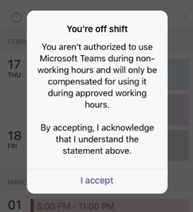

# Manage on-shift and off-shift presence for Firstline Workers in Teams

> [!IMPORTANT]
> Effective June 30, 2020, Microsoft StaffHub will be retired. We’re building StaffHub capabilities into Microsoft Teams. Today, Teams includes the Shifts app for schedule management and additional capabilities will roll out over time. StaffHub will stop working for all users on v. Anyone who tries to open StaffHub will be shown a message directing them to download Teams. To learn more, see [Microsoft StaffHub to be retired](microsoft-staffhub-to-be-retired.md).  

Presence in Microsoft Teams indicates a user's current availability and status to other users. The presence of Firstline Workers is often less predictable than other staff as their working hours are typically not the same each day. As an admin, you can configure Teams to show a set of shift-based presence states for the Firstline Workers in your organization to indicate when they are on and off shift.

These shift-based presence states&mdash; **On shift**,  **Off shift**,  **Busy**&mdash;are separate from the [default set of presence states](../../presence-admins.md) in Teams. With these two sets of presence states, you can configure different experiences for people in your organization based on their role.

With shift-based presence, you can manage access to Teams when Firstline Workers are off shift. For example, you can set up a custom message that Firstline Workers must acknowledge before they can use Teams when they're not on a scheduled shift.  

## Scenario

Here's an example of how your organization can use shift-based presence.

You have Firstline Workers in your organization that should only be paid for hours they work on a shift that their manager scheduled and approved. They shouldn't be paid for time spent working outside a scheduled shift, which includes using the Teams app. You set up a custom message that says "This time won't count toward payable hours", which is displayed when Firstline Workers try to access Teams when off shift. If they choose to use Teams, they click **I accept** with the understanding that they won't be paid for this time.

You also have information workers in your organization who are salaried and who don't work shifts. You configure your information workers to use the default presence states in Teams while giving your Firstline Workers shift-based presence.

## Shift-based presence states

Here are the shift-based presence states.

|App configured |User configured  |More information  |
|---------|---------|---------|
| On shift     |         |Automatically set at the start of a shift         |
| Off shift     |         |Automatically set at the end of a shift         |
| Busy      |  Busy         |Automatically set. Can also be manually set when the Firstline Worker is on shift.|
| In a meeting| ||
| In a call| ||
| Presenting|||

## Off shift access to Teams

You can manage access to Teams when Firstline Workers are off shift. You can set Teams to display a message to Firstline Workers when they access Teams when off shift. Firstline Workers must click **I accept** to acknowledge the message before they can use Teams.

You can customize the message to display any text that you want. Here's the default message:

| |||

## Manage shift-based presence

As an admin, you use PowerShell to set policies to manage shift-based presence.

### Turn on or turn off shift-based presence in your organization

### Turn on or turn off shift-based presence for Firstline Workers

### Set up a custom message to display to Firstline Workers when they access Teams when off shift

#### Set the frequency of the message
 
## Related topics

- [Manage the Shifts app for your organization in Teams](manage-the-shifts-app-for-your-organization-in-teams.md)
- [Teams PowerShell Overview](../../teams-powershell-overview.md)
