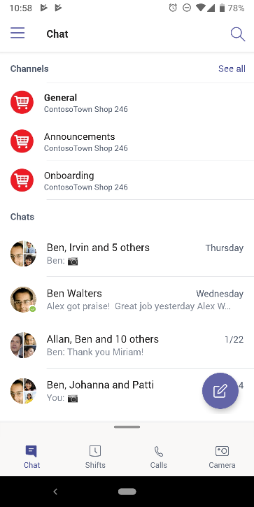
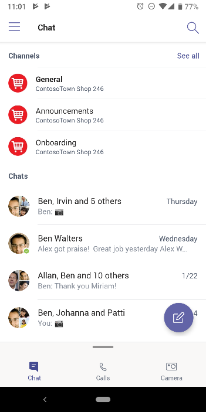
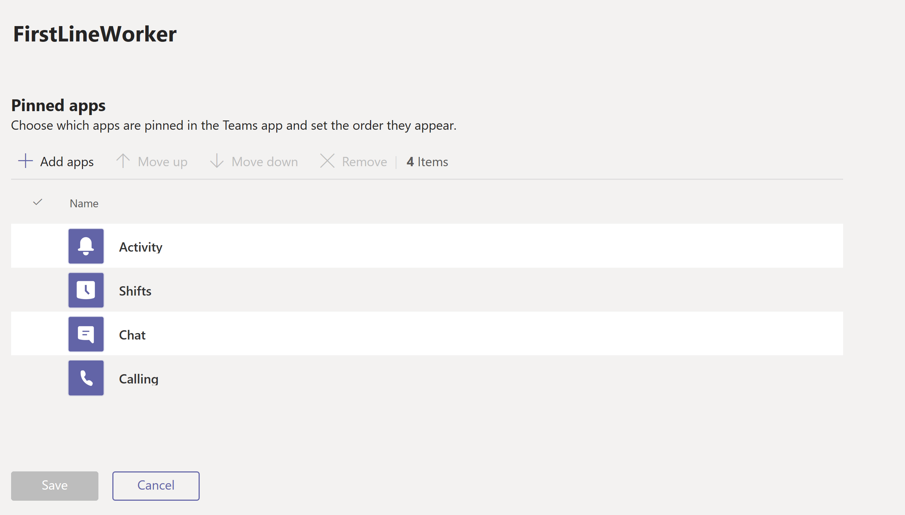
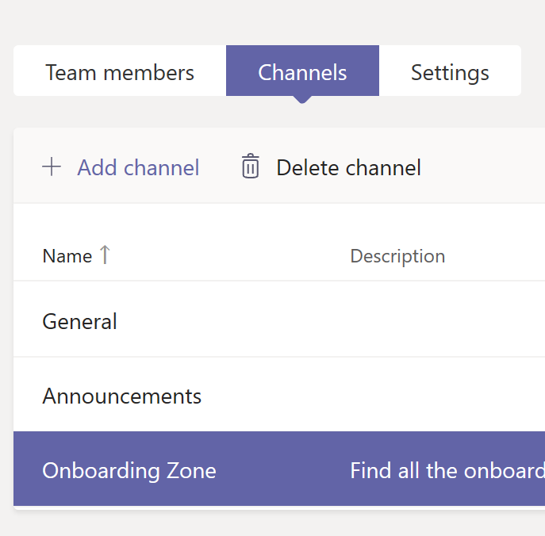

# Microsoft Teams Pilot for Firstline Workers Quick Start Guide

## Objective

Set up an effective pilot for Firstline Workers based on agile principles and an iterative approach.

## Technical Prerequisites

Please review and complete the [Prerequisites and environmental dependencies for Teams](upgrade-plan-journey-prerequisites.md).

## Pilot Methodology

### 6 Steps to Get Up and Running

- [Get your people together](#step-1-get-your-people-together)
- [Plan pilot logistics](#step-2-plan-pilot-logistics)
- [Technical and pilot team configuration](#step-3-technical-and-pilot-team-configuration)
- [Communicate](#step-4-communicate)
- [Measure](#step-5-measure-usage-survey-satisfaction-and-capture-feedback-to-help-drive-adoption)
- [Iterate and expand](#step-6-iterate-and-expand)

### STEP 1: Get your people together

Assemble a group of individuals from your business, IT, and Firstline communities to act as the stakeholder and decision-making group for your Teams Pilot for Firstline Workers. Be sure to include individuals from all 3 communities to give yourself the best chance for success.

Next, identify your phase 1 pilot community and make sure it includes actual Firstline Workers in the smallest logical grouping for your organization. For example: one restaurant, one division of a department store, one store, one clinical ward, one precinct, one plant, one distribution center, etc.. The key is to optimize around the average Firstline worker being part of one team only. Managers or specialists may be in more than one.

#### Best Practice

It's important to include all roles within that smallest logical grouping, from managers to part time or seasonal workers to uncover valuable insights and enable modern communication scenarios. Your most junior staff will surprise you! Some key delightful and unintended valuable scenarios uncovered during pilots with sample customers include:

- Standardized Expectations and Training: Taking a picture of a clean stove to illustrate to kitchen staff what clean means. “If it doesn’t look like this, then it isn’t clean!”
- Reducing shrinkage: Taking a picture of a known shoplifter and notifying other employees immediately. Teams on future shifts will also see this picture to mitigate future risk.

#### Decision Point

> - Who will participate in your Pilot?
> - What's the smallest logical grouping for your organization?

### STEP 2: Plan pilot logistics

For a successful Pilot for Firstline Workers, simplicity is key! For most customers, this community typically isn’t provided any company-supported communication or collaboration technology, but are likely already leveraging unsupported consumer tools to accomplish some basic needs. A recommended best practice it to begin where your users are: mimic the capabilities they’re using in consumer tools today. As your pilot progresses and the iteration process begins, you can grow the experience.

#### Learn what consumer tools these users are currently using

Included in the Firstline Worker “Pilot in a Box” are Sample User Surveys. Utilize the Pre-Pilot survey to inventory the tools, capabilities, and scenarios.

#### Chat configuration options

Within Chat on mobile, you can have the normal traditional chat layout for Teams OR a layout that includes Favorite channels in Chat. This second, simplified UI works well for Firstline workers who are only in one team and is the recommended best practice. Configuring “Show favorite channels in chat” also creates an opportunity to remove the ‘Teams’ button from the Firstline Worker app setup policy to further streamline and simplify the end user experience without a loss of functionality. For users who will be in multiple teams, it is not recommended. Luckily, this can be configured on a per user basis and grow in sophistication as needed.

#### Best Practice

Configure Phase 1 of the Firstline Teams experience to mimic the consumer tools these users are already using! We recommend starting your Pilot for Firstline Workers with “Show favorite channels in Chat” for simplified communications and Shifts (optional).

|  With Shifts  |  Without Shifts  |
|---------|---------|
|    ||

#### Decision Point

> - Which capabilities will be in Phase 1 of your Pilot for Firstline Workers?
> - Do your Firstline Workers need Shifts?
> - Which chat configuration will you use?

### STEP 3: Technical and pilot team configuration

Complete the technical pre-requisites highlighted at the beginning of this document. Understanding the technical pre-requisites and configuring the initial Pilot Team Efficient technical planning is the foundation of a great user experience. This will include creating the Team and inviting the identified Firstline Workers.

#### App Policy Configuration

Create a custom App Setup Policy based on the decisions in Step 2.

1. Navigate to the Skype and Teams Admin Console found at [https://admin.teams.microsoft.com/](https://admin.teams.microsoft.com/).
1. In the left navigation of the Microsoft Teams admin center, go to **Teams Apps > Setup Policies**.
1. Select **New Policy** (There is a default FirstLineWorker policy you may choose to use instead of creating a custom policy).
1. Enter a descriptive name for the policy. Remove and re-arrange the pinned apps to match your desired state. Click **Add apps** to add any third party applications or custom line of business applications you would like to include.

#### Messaging Policy Configuration

Create a custom Messaging policy based on the decisions in Step 2. If you are choosing to enable Priority Notifications, Voice messages, or the “Show favorite channels in chat” configuration, then you will need to set up a Firstline Worker specific messaging policy.

1. Navigate to the Skype and Teams Admin Console found at [https://admin.teams.microsoft.com/](https://admin.teams.microsoft.com/).
1. In the left navigation of the Microsoft Teams admin center, go to **Messaging policies**.
1. Select **New policy**.
1. Enter a descriptive name for the policy and configure the settings as desired to meet the decisions in Step 2.

#### Pilot Team Configuration

Configure the initial Team for the Pilot users identified in Step 2.

1. Navigate to the Skype and Teams Admin Console found at [https://admin.teams.microsoft.com/](https://admin.teams.microsoft.com/).
1. Navigate to Teams.
1. Select **New Team** from the Teams page.
1. Fill in the required fields, including Team name, description, and select an appropriate Team owner and privacy level. Be sure to be descriptive in your team name and anticipate expanding the pilot out to several Teams. Select **Create Team**.
1. Select the team you created to open the **Team Details** page.
1. Select **Channels** to view the current list of channels.
1. Select **Add Channel** to add any additional channels to the General channel that you think are needed for your pilot group.

#### Decision Point

> - How many channels/conversation topics do you want for your pilot?
> - Which topics feel right for your scenarios?

#### Best Practice

**Keep the channels simple**. We recommend resisting the urge to create a channel for every possible topic of conversation and instead keep things very simple. It’s ok if channels are created over time as needed.

#### User Configuration: Admin Console

Apply the App Setup Policy and Messaging Setting policy you created above to your Pilot users.

1. Navigate to the Skype and Teams Admin Console found at [https://admin.teams.microsoft.com/](https://admin.teams.microsoft.com/).
1. Navigate to Users.
1. Search for the pilot users by name.
1. Click on the user's Display Name to open their User Details screen.
1. Select **Edit** next to Assigned policies.
1. Click on the **Teams App Setup policy** drop down, select the policy created for your Pilot, and click Save.
1. Click on the **Teams Messaging policy** drop down, select the policy created for your Pilot, and click Save.
1. Repeat these steps for all pilot users.

#### User Configuration: Powershell

In the advent that you have a large volume of users with which you’d like to apply a policy, a more efficient option may be to use PowerShell.

##### Assign the FirstLineWorker app setup policy to users in a group

You can assign the FirstLineWorker app setup policy to users in a group, such as a security group, by connecting to the Azure Active Directory PowerShell for Graph module and the Skype for Business PowerShell module. For more information about using PowerShell to manage Teams, see [Teams PowerShell Overview](teams-powershell-overview.md).

In this example, we assign the FirstLineWorker app setup policy to all users in the Bellevue Contoso Store 1302 group.

> [!NOTE]
> Make sure you first connect to the Azure Active Directory PowerShell for Graph module and Skype for Business PowerShell module by following the steps in [Connect to all Office 365 services in a single Windows PowerShell window](https://docs.microsoft.com/en-us/office365/enterprise/powershell/connect-to-all-office-365-services-in-a-single-windows-powershell-window).

Get the GroupObjectId of the particular group.
`$group = Get-AzureADGroup -SearchString "Bellevue Contoso Store 1302"`

Get the members of the specified group.
`$members = Get-AzureADGroupMember -ObjectId $group.ObjectId -All $true | Where-Object {$_.ObjectType -eq "User"}`

Assign all users in the group to the FirstLineWorker app setup policy.
`$members | ForEach-Object { Grant-CsTeamsAppSetupPolicy -PolicyName "FirstLineWorker" -Identity $_.EmailAddress}`
Depending on the number of members in the group, this command may take several minutes to execute.

#### Invite the Manager and FirstLine Workers

Now that the Team structure is in place and the user policies are applied, it’s time to start inviting your Firstline Workers.

1. Navigate to the Skype and Teams Admin Console found at [https://admin.teams.microsoft.com/](https://admin.teams.microsoft.com/).
1. Navigate to Teams.
1. Search for the team created during the Pilot Team Configuration phase.
1. Select the team you created to open the Team details page.
1. Select **Add members**.
1. Search for the pilot members' names and click **Save**.

### STEP 4: Communicate

Inform your Firstline Workers of their participation in the pilot, the pilot goals, and provide training, if necessary, on the basic functions. For most customers, this can be a simple instruction to these users to go to the Google Play or Apple Store on their personal mobile devices, download the Microsoft Teams application, and log in with their company credentials. We’ve designed Microsoft Teams with a simple and easy to use interface that most Firstline Workers should find intuitive. If you would like additional training materials and communication templates, you can find them in your Firstline Pilot in a Box.

#### Best Practice

Don’t forget to train your managers on Shifts! If you’re going to include Shifts in your pilot, then make sure to conduct a separate training session with your managers on how to create, manage, and publish schedules to their team. If you would like additional training materials and communication templates, you can find them in your Firstline Pilot in a Box.

### STEP 5: Measure usage, survey satisfaction, and capture feedback to help drive adoption

Empowering your Firstline Workers is more about people than technology. To understand the impact of Teams, stay focused on your Firstline Workers’ experience. Survey them before, during and after the Pilot in order to understand their needs, pain points, and reactions. If you are iterating your pilot and adding new features over time, this feedback can help guide the order, pace, or even whether additional features are needed. In order to help you evaluate the success of your pilot, you can find them in your Firstline Pilot in a Box.

#### Best Practice

**Nurture your champions and highlight your wins**. Reward your Firstline Workers for embracing these new tools and using them in innovative ways that relate to business outcomes for your company. This, above anything, will ensure continued adoption of Teams and value to your company.

### STEP 6: Iterate and expand

Now that you’ve successfully completed your first pilot with an initial group of Firstline workers, it’s time to expand! It’s time to go back to Step 1 with one of the several expansion options below. We recommend working through this process as many times as needed to arrive at a solution, set of best practices, and training documentation for all of your Firstline Workers.

- Expand the number of teams.
  - Instead of one location, can you do one region? Would you want one Team for the whole region or individual Teams for each location?
- Expand the features provided.
  - Was there a key feature that your Firstline Workers suggested I your feedback forms, like Shifts, that you didn’t include in your initial feature set?
