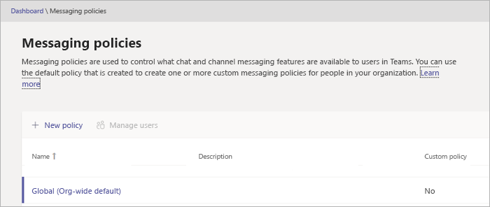

# Get started with Secure Messaging policies for Healthcare organizations

Messaging policies are used to control which chat and channel messaging features are available to users in Microsoft Teams, and are part of the overall deployment of Secure Messaging for Healthcare organizations like Hospitals, clinics, or doctor's offices. 

You can use the default policy that is created or create one or more custom messaging policies for people in your organization. After you create a policy, you will assign it a user or groups of users in your organization. For example, you may choose to only allow certain job roles to use these features (perhaps doctors and nurses only) and other workers (like the janitorial or kitchen staff) to get a more limited set of features. Decide for yourself what needs your organization has.

Policies can be easily managed in the [Microsoft Teams admin center](http://admin.teams.microsoft.com) by logging in with administrator credentials and choosing **Messaging Policies** in the left navigation pane.

To edit the existing default Messaging policy for your organization, click the **Global (Org-wide default)** row, and then make your changes. To create a new custom messaging policy, click **New policy** and select your settings. Choose **Save** when you are done.

The following settings are of special value to Healthcare applications, and should be considered when designing a custom policy used in the Healthcare field:

- **Read receipts** Read receipts allows the sender of a chat message to know when their message was read by the recipient. Use this setting to specify whether read receipts are user controlled, enabled for everyone, or disabled for everyone.

- **Users can send priority notifications** Use this setting to allow users to send priority chat messages to other users. This feature helps hospital staff alert one other when a critical incident requires their attention. Unlike regular “important” messages, priority notifications repeatedly notify users for a period of 20 minutes or until messages are picked up and read by the recipient, maximizing the likelihood that the message is picked up and acted upon in a timely manner.

  An admin can enable or disable the ability for users assigned this policy to send priority notifications. The default setting is disabled. the recipient of the priority message might not have the same messaging policy, and will not have an option to disable receiving priority messages.

When the Priority Messaging and Read Receipts settings are both enabled, if a user sends a message and requests it, they will be notified when the recipient reads the message.

[Full Messaging Policies article](../messaging-policies-in-teams.md)

## Read receipts

Having message read receipts are an important feature in Healthcare organizations since it lets users sending urgent messages know their message was read. 

## Priority Messaging

Priority Messaging helps hospital staff alert one other when a critical incident requires their attention. Unlike regular “important” messages, priority messaging repeatedly notifies users for a period of 20 minutes or until messages are picked up and read by the recipient. The key goal of the feature is to maximize the likelihood that the message is picked up and acted upon in a timely manner.