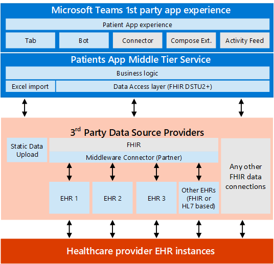
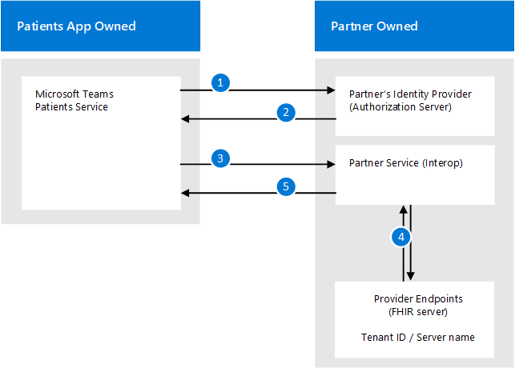
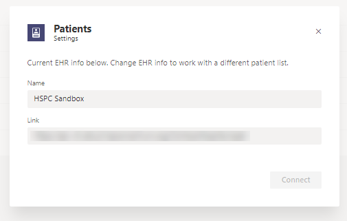

# Integrating Electronic Healthcare Records into Microsoft Teams

[!INCLUDE [preview-feature](../includes/preview-feature.md)]

This article is for you if you're a general healthcare IT developer that is interested in using FHIR APIs on top of your medical information system to connect to Microsoft Teams to enable care coordination scenarios that match the needs of your healthcare organization. This article documents the FHIR interface specifications for the Patients App. The article will also guide you through the step-by-step process of setting up FHIR server and connecting to the Patients App in your development environment\tenant.

> [!NOTE]
> There are no steps in this process that use the Microsoft Teams admin center or PowerShell cmdlets to enable features.

Illustrated below is the architecture of the Microsoft Teams Patients app: 

The following sections explain the requirements of the FHIR only data access layer for the Patients app that a FHIR server (or EHR enabled FHIR APIs) must meet in order to integrate with the Patients App, including the following:

- Expectations around user authentication
- Functional and technical requirements of the integration interface
- Expectations around performance and reliability
- Expectations around FHIR resources to be supported for the Patients App
- Process for integration and the expected engagement model
- How to enroll yourself and your customer in the private preview of the Patients App
- How to get started with FHIR and some common challenges faced with the Patients App
- Future requirements for the next iteration of the Patient App

Note: In the sections below, the word "partner" or "Interop partner" is used to refer to any 3rd party Organization that enables integration to EHR systems for the Microsoft Teams Patients app through FHIR and is implementing a FHIR Server to match the specifications listed below.

## Functional and technical requirements  

### Authentication  

First, a quick note about the current state of the industry:

Based on our understanding of working with Interop vendors that perform data transformations and expose connections to EHR data through FHIR, the more commonly supported form of authorization is an app level authorization with no support for user level authorization even though the EHR system might implement user level authorization. The Interop Service (Partner) gets a “God-Mode” level of access to the EHR data. When they expose the same data as the appropriate FHIR resources there is no authorization context passed on to the Interop Service Consumer (Ex: Microsoft Teams Patient App) that is integrating with the Interop Service or Platform. Hence, in such a case, Microsoft Teams Patients app will not be able to enforce user level authorization. In that model, we will support application to application authentication between the Microsoft Teams 1st Party Patient App and the Interop partner’s service.

The Application to Application authentication model is described below:

Service to service authentication should be done through OAuth 2.0 [Client Credential flow](https://www.oauth.com/oauth2-servers/access-tokens/client-credentials/). Partner service needs to provide the following:

1. Partner service will enable Microsoft Teams Patient App to create an account with Partner, which will enable us to generate and own client_id and client_secret for Microsoft Teams Patient App, managed via an Auth registration portal on the partner’s Authentication server.
2. Partner service will own Authentication/Authorization system, which will accept and verify (authenticate) the client credentials provided and give back an access token with tenant hint in scope, as described below.
3. For security reasons or in a case of secret breach, Microsoft should be able to:
   1. Re-generate the secret
   2. Invalidate or delete the old secret (Example of the same is available in Azure Portal - AAD App Registration)
4. The metadata endpoint hosting the conformance statement should be un-authenticated, it should be accessible without authentication token.
5. Partner service will provide the token endpoint for Microsoft Teams Patient App to request an access token using client credential flow. The token url as per authorization server should be part of the FHIR conformance (capability) statement fetched from metadata on the FHIR server:

A request for access token consists of the following parameters:

    POST /token HTTP/1.1
    Host: authorization-server.com

    grant-type=client_credentials
    &client_id=xxxxxxxxxx
    &client_secret=xxxxxxxxxx

Partner service will provide client_id and client_secret for Microsoft Teams Patient App, managed via an Auth registration portal on the partner’s side. Partner service will provide the endpoint to request access token using client credential flow. A successful response must include token_type, access_token and expires_in parameters.

### Routing: Mapping AAD Tenant to the Provider endpoint

Microsoft Teams Patient app will connect to partner service through a single endpoint. Partner service will have to own and maintain a mechanism to map Microsoft customer (AAD Tenant ID) to respective healthcare Provider (FHIR server) that Partner service is working with.

Mapping of AAD tenant to a provider endpoint should be done through AAD Tenant ID (GUID). Microsoft Teams Patient app will pass Tenant ID in scope, while requesting access-token for each request. Partner service will keep the mapping of Tenant ID to Provider endpoint and redirect request to a provider endpoint based on Tenant ID. To do this partner must support configuration on their end (manually or via a portal as part of onboarding of provider organizations to their Interop Platform).

The Authentication and Routing work-flow is shown below:

1. Request for app access token by sending:
 
        {   grant_type: client_credentials,
            client_id: xxxxxx, 
            client_secret: xxxxxx,
            scope: {Provider Identifier, Ex: tenant ID}
        }

2. Reply with an app token:

        {  access_token: {JWT, with scope: tenant ID},
           expires_in: 156678,
           token_type: "Bearer",
        }

3. Request for protected data with Access token.
4. Authorization message: Select the appropriate FHIR server to route to from tenant ID in scope
5. Sends the app protected  data from the authorized FHIR server after authenticating with the app token.

## Interfaces

Specific calls and fields used by the Patients app are documented in the following articles. Select the interface applicable to your FHIR server/FHIR APIs.

- [DSTU2 interface specification](dstu2-interface.md)
- [STU3 interface specification](stu3-interface.md)

## Performance and Reliability

While the Patients app is in private preview, we cannot make any guarantees on the end-to-end performance. Factors in performance include the relative latencies of all the hops involved in the workflow, starting from the EHR in the health system's environment, to the Interop partner and their infra, including the FHIR Server and across to the Office 365 ecosystem and Microsoft Teams Patients app.

## Get started with FHIR  

If you're new to FHIR and need easy access to a FHIR Server that you can expose to the Microsoft Teams EHR integration interface, please follow instructions from here. Microsoft has an open-source FHIR Server available for all developers to use. Please see [What is FHIR Server for Azure](https://docs.microsoft.com/en-us/azure/healthcare-apis/overview-open-source-server) article to learn more about the open source FHIR Server available from Microsoft and deploy it for your organizations.

You can also use the HSPC Open sandbox EHR environment to create an an EHR which also supports an open FHIR Server and use this to play around with the Patients app. We recommend that you read through the documentation [here](https://healthservices.atlassian.net/wiki/spaces/HSPC/pages/64585866/HSPC+Sandbox). Not only does the sandbox provide an easy, UI oriented, and user friendly way of creating, adding and editing Patients, it also gives you several samples to get started.  

## Enroll in the private preview

Once you've created the open source FHIR Server, it's really easy to connect to the Patients app inside of your tenant by following the steps mentioned below:

1. Please [drop us a note](mailto:Teamsforhealthcare@service.microsoft.com?subject=Microsoft%20Teams%20Patients%20App%20private%20preview) with the following initial details - Your Name, Your Position, The company or organization you represent and why you are interested in the Microsoft Teams Patients app for EHR integration. We will get back to you as soon as possible with more questions and guide you through a process to get setup for the private preview.

2. Ensure that sideloading of custom apps is enabled in the tenant where you are going to try out the Microsoft Teams Patients app. Please refer to documentation [here](https://docs.microsoft.com/en-us/microsoftteams/admin-settings) on how to turn this on from the Teams Admin center for your or your customer's tenant.

3. Sideload the Microsoft Teams Patients app manifest that you will get from Microsoft (after we process your email to us) into a team in the tenant that is going to be used for care-coordination and patient rounding scenarios. Detailed instructions around how to side-load an app are [here](https://docs.microsoft.com/en-us/microsoftteams/platform/concepts/apps/apps-upload)

4. Navigate to the general channel as the Team owner and then click on the Patients tab. You should see a first run experience that will present two options i.e. EHR Mode and Manual Mode. Please select the **EHR mode** and copy the FHIR Server endpoint (that you've just setup earlier with all the required data and resources per the specifications above) into the Link and give the connection a name that well represents the FHIR Server. Hit Connect, and everything should be ready to go.

    

5. Start using the app to search for Patients from the FHIR Server/EHR and add them to list and please [give us feedback](mailto:Teamsforhealthcare@service.microsoft.com?subject=Microsoft%20Teams%20Patients%20App%20feedback) if something doesn't work. Also, to establish a fully authenticated version of the Patient App -> FHIR Server flow, please engage in offline dialogue with Microsoft Teams for healthcare product engineering, through the email request mentioned in Step 1 to clarify requirements and we will help enable this for you per the Authentication requirements described above in the FHIR Interface document. This part of the process will become more self-serve in the future. Stay tuned for more updates to this article!
