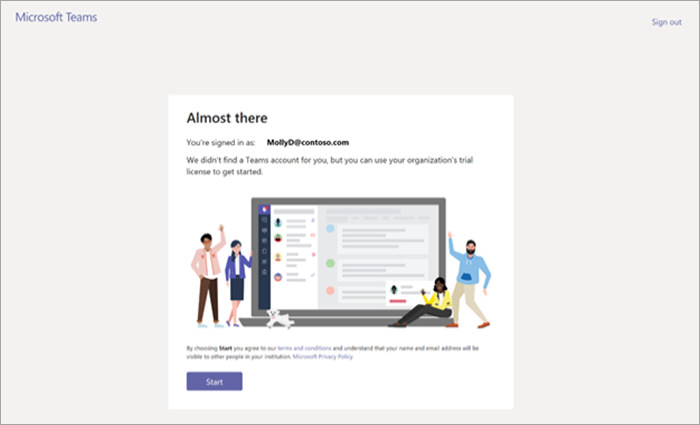

Manage the Microsoft Teams Commercial Cloud Trial offer
=======================================================

Microsoft Teams is a great collaborative tool for your organization. It empowers people and teams to discuss, innovate, and share ideas using the power of Office 365. The Microsoft Teams Commercial Cloud Trial offers existing Office 365 users in your organization who are not licensed for Microsoft Teams to initiate a 1-year trial of the product. Admins have the ability to switch on or off this feature for users within their tenant.

## What's in the offer

The service plans included in this offer are:

- Exchange Foundation
- Flow for Office 365 Plan 1
- Microsoft Planner
- Microsoft Teams (Teams1, Teams IW)
- Office Online
- PowerApps for Office 365 Plan 1
- SharePoint Online Plan 1
- Sway
- Yammer Enterprise

## Who is eligible

Users who do not have an Office 365 license that includes Teams can initiate the Microsoft Teams Commercial Cloud Trial offer. For example, if a user has Office 365 Business Premium (which includes Teams), and the Teams service plan is disabled, they are not eligible for the trial.

Also, your tenant is NOT eligible for the trial if: 
- You are a Syndication Partner Customer
- You are a Reseller Partner Customer
- You are a GCC, GOV, or EDU customer

In addition, if your tenant is ineligible for the Microsoft Teams Commercial Cloud Trial offer, you will not see the **Let users install trial apps and services** switch.

At the tenant level, Teams as a service needs to be enabled (in the Teams admin center). (For more information, see [Manage Microsoft Teams features in your Office 365 organization](enable-features-office-365.md).) Also, users must be enabled to sign up for apps and trials (in the Office 365 admin center). For more information, see [Manage the IW trial](#manage-the-iw-trial) later in this article.

## How users sign up for the trial

Eligible users can sign up for the IW trial by logging into Teams ([teams.microsoft.com](https://teams.microsoft.com)). If eligible, they will see the following screen to start the trial. 

The IW trial grants a 1-year trial to your entire organization. Additional eligible users within your organization can sign up for the IW trial by going through the same process.
 
All trials within your organization share the same start and end dates, which is the date that first user signed for the trial. For example, if user A starts the first trial on April 25, 2018 and user B starts a trial on June 3, 2018, both users' trial will expire on April 25, 2019.

## Manage the IW trial

Admins can disable the ability for end users to claim trial apps and services within their tenant. Currently, the Teams IW trial is the only trial in this category, but this might apply to other similar programs in the future. 

1\. From the [Office 365 admin center](https://portal.office.com/adminportal/home), go to **Services & add-ins** > **User owned Apps and Services**.

2\. Turn off **Let users install trial apps and services**.

3\. You can turn off Teams for the tenant by going to the Teams admin portal. When this is disabled, users cannot claim the Teams IW trial.

4\. If you have disabled the Teams service plan for an individual user who has an eligible license, that user is not eligible to claim a trial license.

5\. If a user has claimed a Teams trial license, you can remove it by removing the license or service plan. 

### Upgrade users from the trial license

To upgrade users from the trial license, do the following:

1. Purchase a SKU that includes Teams.
2. Remove the Teams trial SKU from the user.
3. Then assign the newly purchased license.

For more information, see [Office 365 licensing for Microsoft Teams](Office-365-licensing.md).