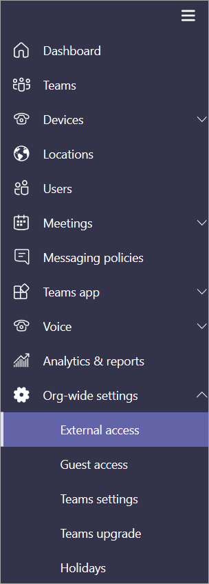
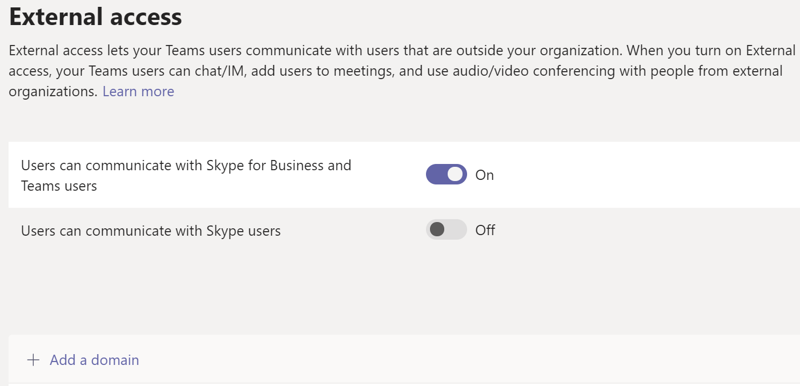
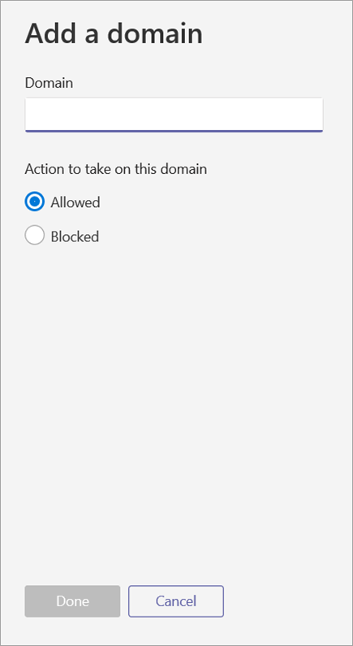

Manage external access (federation) in Microsoft Teams
======================================================

With Microsoft Teams external access, users from other domains can participate in your chats and channels. You can also allow external users who are still using Skype for Business to participate. External access differs from guest access in that an entire domain is given access permission, not an individual. 

Guest access, once granted, allows a guest full access to a team (including chat and channels), and only admins can add a guest. Also, as a guest, you need to switch to the tenant in which the chat is taking place to participate in a chat with people in that tenant. If you are not in the right tenant, the chat is not accessible.

With external access, the external chat participant has no other access to the team other than being part of a chat conversation. Federated chats happen in the user's home tenant, so the user can have multiple federated chats with multiple people from different organizations without having to switch tenants. 

See the following table for a comparison of external and guest access features.

| Feature | External access users | Guest access users |
|---------|-----------------------|--------------------|
| User can chat with someone in another company | Yes |Yes |
| User can call someone in another company | Yes | Yes |
| User can see if someone from another company is available for call or chat | Yes | Yes |
| User can search for users across external tenants | Yes1 | No |
| User can share files | No | Yes |
| User can be added to a group chat | No | Yes |
| User can be added to a meeting | Yes | Yes |
| Additional users can be added to a chat with an external user | No | N/A |
| User is identified as an external party | Yes | Yes |
| Presence is displayed | Yes | Yes |
| Out of office message is shown | No | Yes |
| Individual user can be blocked | No | Yes |
| @mentions are supported | No | Yes |

1 Only by email of Session Initiation Protocol (SIP) address.

## Turn on or turn off external access

You can use the Microsoft Teams & Skype for Business Admin Center to manage external access.

1. In the Microsoft Teams & Skype for Business Admin Center, select **Org-wide settings** > **External access**.

     .

2. Toggle the **External access** switch to **On** or **Off**.

     .

3. Click **Save**. 

## Add or block a domain

Follow these steps to add a domain or turn off external access for a domain.

1. In the Microsoft Teams & Skype for Business Admin Center, select **Org-wide settings** > **External access**.

2. Select **Add a domain**. 
 
    .

   The **Add a domain pane** appears.

    .

3. Under **Add a domain**, type the name of the domain; for example, type Contoso.com.

4. Select **Allowed** or **Blocked**. You can change this setting at any time.

2. Select **Done**.

After you add a domain, you will see the domain name and status added to the list of domains on the External access page.

## More information

For information about guest access in Microsoft Teams, see [Manage guest access in Microsoft Teams](manage-guests.md).