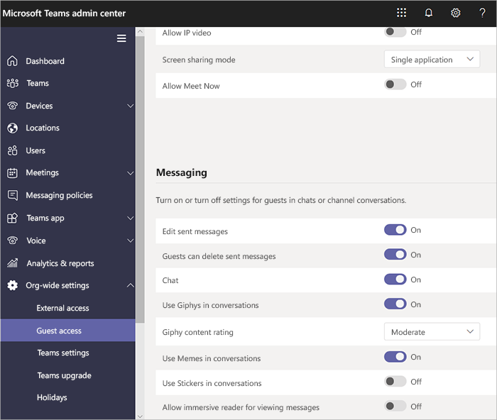

Manage guest access in Microsoft Teams
======================================

> [!IMPORTANT]
> You may have to wait up to 24 hours for your changes to take effect. 

**Guest** is a user type in Microsoft Teams that is included with all Office 365 Business Premium, Office 365 Enterprise, Office 365 Business Essentials, and Office 365 Education subscriptions. No additional Office 365 license is necessary. Read more about [guest access licensing](#guest-access-licensing-limits) below.

Teams guest access is a tenant-level setting and is turned off by default. For details about how to turn on guest access, see [Turn on or turn off guest access to Teams](set-up-guests.md), or use the [Guest access checklist ](guest-access-checklist.md) to walk you through the setup.

After guest access is turned on, you can configure settings for guests using the controls described in [Manage Teams settings for your organization](enable-features-office-365.md) and [Manage Teams during the transition to the new Microsoft Teams admin center](manage-teams-skypeforbusiness-admin-center.md).     
    
IT admins can add guests at the tenant level, set and manage guest user policies and permissions, and pull reports on guest user activity. These controls are available in the Teams admin center. Guest user content and activities fall under the same compliance and auditing protection as the rest of Office 365.

Team owners can invite new guests and add existing directory guest users to their teams in the Teams admin center. Identify guest users on the **Teams** > **Manage teams** page, and set channel-related capabilities for guests on the  **Org-wide settings** > **Guest access** page. Settings include allowing guests to create, update, and delete channels, as shown in the following illustration.

  
You can use the Azure Active Directory (Azure AD) portal to manage guests and their access to Office 365 and Teams resources. Teams guest access makes use of Azure AD business-to-business (B2B) collaboration capabilities as the underlying infrastructure to store security principles information such as identity properties, memberships, and multi-factor authentication settings. To learn more about Azure AD B2B, see [What is Azure AD B2B collaboration?](https://go.microsoft.com/fwlink/p/?linkid=853011) and [Azure Active Directory B2B collaboration FAQs](https://go.microsoft.com/fwlink/p/?linkid=853020).

> [!NOTE]
> Microsoft Teams always honors Azure AD external settings to allow or prevent guest user additions to the tenant. For more details, see [Authorize guest access in Microsoft Teams](Teams-dependencies.md).

## Guest access licensing limits

Teams doesn't restrict the number of guests you can add. However, the total number of guests that can be added to your tenant is based on what your Azure AD licensing allows - usually 5 guests per licensed user. For more information, see [Azure AD B2B collaboration licensing](https://docs.microsoft.com/azure/active-directory/b2b/licensing-guidance).

Because of these licensing limitations (and to keep your tenant up-to-date), you should review guest access periodically to identify users who have access that they don't need anymore. You can use Azure AD to create an access review for group members or users assigned to an application. Creating recurring access reviews can save you time. If you need to routinely review users who have access to an application or are members of a group, you can define the frequency of those reviews. 

You can perform a guest access review yourself, ask guests to review their own membership, or ask an application owner or business decision maker to perform the access review. Use the Azure portal to perform guest access reviews. For more information, see [Manage guest access with Azure AD access reviews](https://docs.microsoft.com/azure/active-directory/governance/manage-guest-access-with-access-reviews).

###  Prerequisites for Azure AD access reviews

Access reviews are available with the Premium P2 edition of Azure AD, which is included in Microsoft Enterprise Mobility + Security, E5. For more information, see [Azure Active Directory editions](https://docs.microsoft.com/azure/active-directory/fundamentals/active-directory-whatis). Each user who interacts with this feature by creating a review, filling out a review, or confirming their access, must have a license.

## Lag time for guest access settings to take effect

For the guest access settings in Azure Active Directory, it takes 2-24 hours for the changes to take effect across your Office 365 organization. If a user sees the message "Contact your administrator" when they try to add a guest to their team, it's likely that either the guest feature hasn't been turned on or the settings aren't effective yet. For help with problems setting up guest access, read [Troubleshoot guest access in Teams](troubleshoot-guest-access.md).

  
## External access (federation) vs. guest access

[!INCLUDE [guest-vs-external-access](includes/guest-vs-external-access.md)]

## More information

For information about using PowerShell to manage guest access, see [Use PowerShell to control guest access to a team](guest-access-powershell.md).

