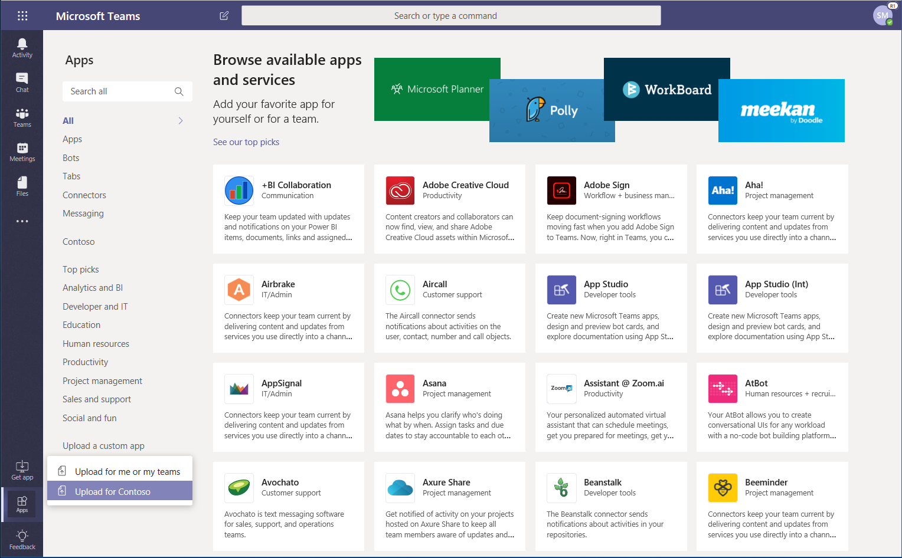
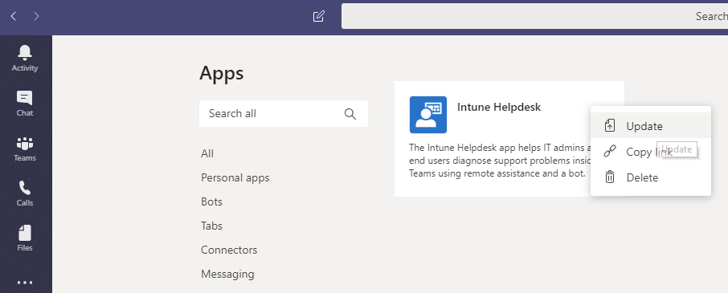

# Manage your line-of-business apps in Microsoft Teams

This article provides end-to-end guidance for how to take your Teams app from development to deployment. This guidance focuses on the Teams aspects of the app and is intended for IT pros. For more information on developing Teams apps, see [here](https://docs.microsoft.com/microsoftteams/platform).

## Getting started

To create and manage line-of-business (LOB) apps in Teams, you’ll need two tenants: a test tenant for development and a production tenant.

> [!NOTE]
> If you don’t already have a test tenant, you can quickly create one and populate it with test data using the Office 365 Developer Program. [Learn more here](https://developer.microsoft.com/office/dev-program).

## Step 1: Develop and test

### Create test users

Make sure that your developers, whether in-house or external, have accounts in your test tenant. [Learn more about adding users](https://docs.microsoft.com/office365/admin/add-users/add-users).

### Allow custom apps in the test tenant

To give developers the access they need for testing, allow all users in the test tenant to upload custom apps (also known as sideloading). This lets developers upload a custom app to be used personally or across the test tenant without having to submit the app to the Teams apps store. Uploading a custom app lets developers test an app before you distribute it more widely.

To allow users to upload custom apps, follow these steps:

1. Turn on the **Allow interaction with custom apps** org-wide setting. To do this:
    1. In the left navigation of the [Microsoft Teams admin center](https://admin.teams.microsoft.com/), go to **Teams apps** > **Permission policies**, and then click **Org-wide settings**.
    2. Under **Custom apps**, turn on **Allow interaction with custom apps**, and then click **Save**.

    

2. Turn on the **Upload custom apps** setting in the global app setup policy. To do this:
    1. In the left navigation of the [Microsoft Teams admin center](https://admin.teams.microsoft.com/), go to **Teams apps** > **Setup policies**, and then click the **Global (Org-wide default)** policy.
    2. Turn on **Upload custom apps**, and then click **Save**.

    

> [!NOTE]
> There's also an upload custom app setting at the team level. By default this setting is on. However, if developers are unable to upload a custom app to a team, check the setting by following the steps [here](teams-custom-app-policies-and-settings.md#configure-the-team-custom-app-setting).

### Create your app

Developers should now have what they need to create your app. See [here](https://docs.microsoft.commicrosoftteams/platform) for guidance on that.

## Step 2: Validate in production

### Get the app package

When the app is ready for use in production, the developer should produce an app package. They can use [App Studio](https://docs.microsoft.com/microsoftteams/platform/get-started/get-started-app-studio) for that. They'll send you the file in .zip format.

Microsoft uses [these guidelines](https://docs.microsoft.com/microsoftteams/platform/publishing/office-store-approval) to ensure apps comply with the quality and security standards of the global Teams apps store.

### Allow trusted users to upload custom apps in the production tenant

To validate that the app is working correctly in your production tenant, you need to allow yourself and/or trusted users in your organization to upload custom apps.  Much like in the earlier [Allow custom apps in the test tenant](#allow-custom-apps-in-the-test-tenant) step, you use app setup policies to do this.

> [!NOTE]
> If you’re uncomfortable with uploading the app to your production tenant for validation, even for yourself or trusted users, you can skip this step and follow steps 3 and 4 to upload the unvalidated app to your tenant apps store. Then, restrict access to that app to only yourself and users you trust. These users can then get the app from the tenant apps store to perform validation. After the app is validated, use the same permission policies to open access and roll the app out for production use.

To allow trusted users to upload custom apps, follow these steps:

1. Turn on the **Allow interaction with custom apps** org-wide setting. To do this:
    1. In the left navigation of the [Microsoft Teams admin center](https://admin.teams.microsoft.com/), go to **Teams apps** > **Permission policies**, and then click **Org-wide settings**.
    2. Under **Custom apps**, turn on **Allow interaction with custom apps**, and then click **Save**.
2. Turn off the **Upload custom apps** setting in the global app setup policy. To do this:
    1. In the left navigation of the [Microsoft Teams admin center](https://admin.teams.microsoft.com/), go to **Teams apps** > **Setup policies**, and then click the **Global (Org-wide default)** policy.
    2. Turn off **Upload custom apps**, and then click **Save**.
3. Create a new app setup policy that allows uploading custom apps and assign it to your set of trusted users. To do this:
    1. In the left navigation of the [Microsoft Teams admin center](https://admin.teams.microsoft.com/), go to **Teams apps** > **Setup policies**, and then click the **Add**. Give the new policy a name and description, turn on **Upload custom apps**, and then click **Save**.
    2. Select the new policy you created, and then click **Manage users**. Search for a user, click **Add**, and then click **Apply**. Repeat this step to assign the policy to all your trusted users.

        

    These users can now upload the app manifest to validate that the app is working correctly in the production tenant.

## Step 3: Upload to the Tenant Apps Catalog

To make the app available to users in the tenant apps store, upload the app. You can do this using the Teams desktop client. Follow the steps [here](tenant-apps-catalog-teams.md#go-to-the-tenant-apps-catalog).

## Step 4: Configure and assign permissions

### Control access to the app

By default, all users have access to this app in the the Teams apps store. To restrict and control who has permission to use the app, you can create and assign a new app permission policy. Follow the steps [here](teams-app-permission-policies.md#create-a-custom-app-permission-policy).

### Pin the app for users to discover

By default, for users to find this app they would have to go to Teams apps store and browse or search for it. To make it easy for users to get to the app, you can pin the app to the app bar in Teams. To do this, create a new app setup policy and assign it to users. Follow the steps [here](teams-app-setup-policies.md#create-a-custom-app-setup-policy).

## Step 5: Update the app

To update an app, developers should continue to follow [step 1](#step-1-develop-and-test) and [step 2](#step-2-validate-in-production).

You can update the app through the Tenant Apps Catalog. To do this, in the Teams desktop client, go to **Apps** > **Built for &lt;Your tenant name&gt;**, click **…** in the upper-right corner of the app, and then click **Update**. Doing this replaces the existing app in the Tenant Apps Catalog, and all permission policies and setup policies remain enforced for the updated app. 

