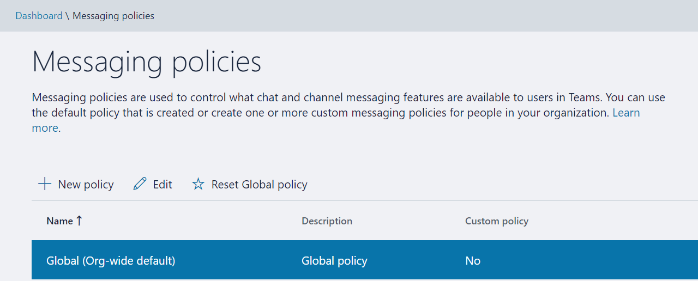

# What are Messaging policies in Teams?
::: zone target="docs"
Messaging policies are used to control which chat and channel messaging features are available to users in Microsoft Teams. You can use the default policy that is created or create one or more custom messaging policies for people in your organization. After you create a policy, you will assign it a user or groups of users in your organization.

Policies can be easily managed in the Teams Admin Center (http://admin.teams.microsoft.com) by logging in with administrator credentials and clicking **Messaging Policies** in the left navigation. To edit the existing default policy for your organization, select the **Global (Org-wide default)** row and click **Edit**. To create a new messaging policy, click **New policy**.

::: zone-end

::: zone target="chromeless"
The available settings for the policy are described below: 

- **Owners can delete sent messages**  Use this setting to let owners delete messages that users send in chat.
- **Users can delete sent messages** Use this setting to let users delete messages that they send in chat.
- **Users can edit sent messages** Use this setting to let users edit the messages that they send in chat.
- **Read receipts** Use this setting to specify whether read receipts are user controlled, enabled for everyone, or disabled.

- **Chat**  Turn this setting on if you want users in your organization to be able to use the Teams app to chat with other people.
- **Use Giphys in conversations**  If you turn this on, users can include Giphys in chat conversations with other people. Giphy is an online database and search engine that allows users to search for and share animated GIF files. Each Giphy is assigned a content rating.
- **Giphy content rating** 
    - **No restriction** This means that your users will be able to insert all Giphys in chats regardless of the content rating.
    - **Moderate**  This means that your users will be able to insert Giphys in chats but will be moderately restricted from adult content.
    - **Strict**  This means that your users will be able to insert Giphys in chats but will be strictly restricted from adult content.
- **Use Memes in conversations** If you turn this on, users can include Memes in chat conversations with other people. 
- **Use Stickers in conversations** If you turn this on, users can include Stickers in chat conversations with other people.
- **Allow URL previews** Use this setting to turn automatic URL previewing on or off in messages.
- **Allow users to translate messages** Turn this setting on to let users automatically translate Teams messages into the language specified by their personal language settings for Office 365.
::: zone-end

::: zone target="docs"
If you have created a custom Messaging policy, it will only be active for a user if that policy is assigned to a user.  To assign a custom policy to a user in the Teams Admin Center, click **Users** in the left navigation, select the user you want to assign the policy to, and then choose **Edit** under **Assigned Policies**.

### Related topics
[Meeting policies in Teams](meeting-policies-in-teams.md)
::: zone-end