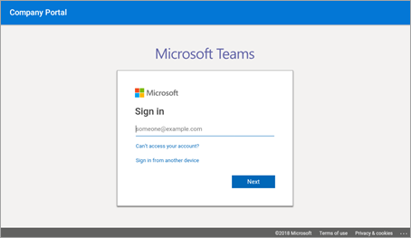
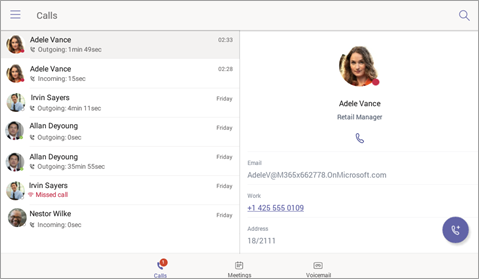
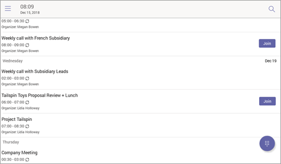
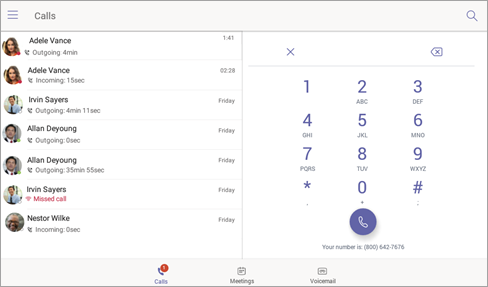
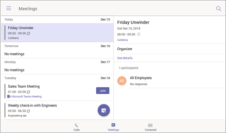
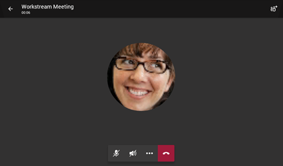
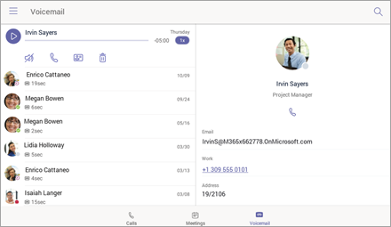
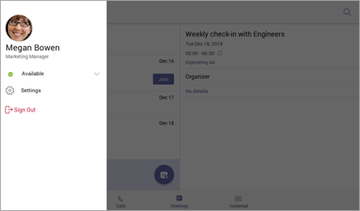
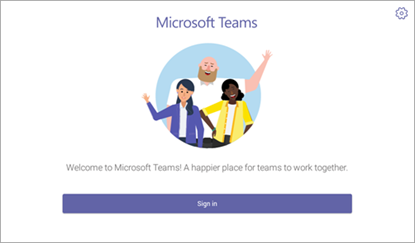

# Phones for Microsoft Teams

Microsoft Teams supports a portfolio of desk phones for users who require a traditional phone experience. This article covers the list of phones that are certified for Microsoft Teams and the features supported in the phones certified for Microsoft Teams. To get the latest and up-to-date information on Teams certified devices, go to [Teams Marketplace](http://office.com/teamsdevices).

## Teams certified IP phones

To deliver a high-quality and reliable Microsoft Teams experience on phones, we are partnering and actively working with Yealink, Crestron, Polycom, and Audiocodes to develop and certify a wide portfolio of desk phones and conference room audio devices. See [Currently certified IP Phones](/microsoftteams/teams-ip-phones#currently-certified-ip-phones) for current supported devices.

## Microsoft Teams phones feature set

A high-level set of features supported in Teams certified IP phones is available in the following table.

|Features |Desk Phone (Personal Mode) |Conference Room Phone (Shared Mode)|
|---------|---------|---------|
|**Authentication** | |  |
|Sign in with user credentials |  Yes | Yes|
|Sign in using PC/Smartphone  | Yes |Yes|
|Modern Authentication | Yes |Yes |
|Phone lock/unlock | Yes |No |
|**Calling** |  |  |
|Incoming/Outgoing P2P calls | Yes  |Yes |
|In-call controls via UI (Mute, hold/resume, transfer, end call)| Yes  |Yes |
|PSTN calls| Yes  |Yes |
|Visual Voicemail | Yes | No |
|911 support  | Yes  |Yes |
|**Calendar and Presence**|   | |
|Calendar Access and Meeting Details|Yes |Yes|
|Presence Integration |Yes|Yes|
|Exchange Calendar Integration |Yes|Yes|
|Contact Picture Integration  |Yes|Yes|
|Corporate Directory Access | Yes|Yes|
|**Meetings**|   ||
|One-click Join for Meetings  | Yes  |Yes |
|Join Skype for Business meetings | Yes  | Yes|
|Meeting Call controls (Mute/unmute, hold/resume, hang up, add/remove participant)|Yes|Yes|
|Meeting Details|Yes|No|

We are working to continuously add features to help our users enhance their Teams experience on phones. The screen shots below illustrate some of the experiences we support today.

## Sign-in experience

When a user clicks the sign-in button in Teams, sign-in is started via the Company Portal. The user has the option to sign in by entering user credentials on the phone or by choosing to sign in from another device. If the user chooses to sign in from another device, the user can complete authentication from their PC or smartphone.

**User sign-in with credentials**

**User sign-in via PC/smartphone**

## Personal/shared mode

After successful sign-in, the user can choose whether the device will be used for personal use or in a shared conference room.

The Teams phone experience is optimized based on the user's selection.

**Personal mode**

**Shared mode**

## Calling experience

The Microsoft Teams user can lift the handset or press the speaker button to launch the dial pad on the calling screen. Alternatively, the user can use the hardware buttons (if available) to dial out a number.

**On-screen dial pad**

**Calling screen**

## Meeting experience

The Microsoft Teams user can navigate to the meetings tab to view their meetings and use the **Join** button to join their Teams meetings.

**Calendar view**

**Meeting join view**

## Voicemail

The Microsoft Teams user can access their voicemail when they navigate to the **Voicemail** tab.

## User sign-out

The Teams phone user can choose to sign out by selecting the **Sign Out** option from the top left menu.

## Finding the Firmware version on a mobile device

The minimum firmware version can be checked on the Teams sign-in page by choosing the **Settings** icon in the top-right corner and then clicking **About**.

**Teams sign-in page**

**Settings page**

## Required Licenses

Microsoft Teams licenses can be purchased as part of their [Office 365 subscriptions](Office-365-licensing.md). To learn more about the required licenses for using Microsoft Teams on phones, see available [phone system licenses](https://products.office.com/en-us/microsoft-teams/voice-calling).

For more information about getting Teams, check out [How do I get access to Microsoft Teams?](https://support.office.com/article/fc7f1634-abd3-4f26-a597-9df16e4ca65b)

## See also

[Teams Marketplace](http://office.com/teamsdevices)

[IP Phones certified for Microsoft Teams](/microsoftteams/teams-ip-phones
