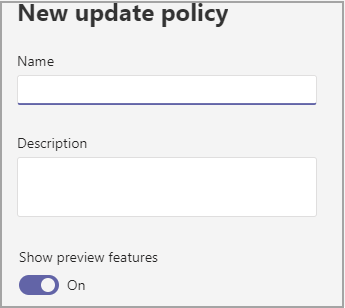

# Microsoft Teams Public Preview

> [!NOTE]
> Features included in preview might not be complete, and might undergo changes before becoming available in the public release. They're provided for evaluation and exploration purposes only.

Public Preview for Microsoft Teams provides early access to unreleased features in Teams. Previews allow you to explore and test upcoming features. We also welcome feedback on any feature in public previews. Public preview is enabled each Teams user, so you don't need to worry about affecting your entire organization.

## Enable public preview

Public preview is enabled for each user, and the option to turn on public preview is controlled in an admin policy.

### On a desktop or web client

To enable the public preview on a desktop or web client, you need to do the following tasks:

1. Enable uploading of apps in the admin center of your tenant as described in [Prepare your Office 365 tenant](https://docs.microsoft.com/microsoftteams/platform/concepts/build-and-test/prepare-your-o365-tenant).
2. Enable public developer preview as described in [Public developer preview in Teams](https://docs.microsoft.com/microsoftteams/platform/resources/dev-preview/developer-preview-intro)
3. Select your profile to display the Teams menu.
4. Select **About** → **Developer preview**.
5. Select **Switch to Developer preview**.

### On a mobile client

To enable the public preview on a mobile client, you need to do the following tasks:

1. Open the hamburger menu, then select Settings.
2. Select **About**.
3. Select the **Public preview** toggle.
4. Disable public preview
5. Use the same menu item under **About** → **Public preview**, and select it to turn it off.
You might need to restart Teams after switching to Public preview.

## Set the Update policy

Update policies are used to manage Teams and Office preview users who will see pre-release or preview features in the Teams app. You can use the Global (Org-wide default) policy and customize it, or create one or more custom policies for your users.

1. Sign in to the admin center.
2. Select **Teams**>**Update policies**. 
 
   

3. Select **Add**.
4. Name the update policy, add a description, and turn on **Show preview features**.

   

## Features available in public preview

For a full list of the features currently enabled in public preview see (IS THE A PUBLIC PREVIEW FEATURES PAGE?)

## Batch preview settings (DO WE WANT TO MENTION BATCH PREVIEW SETTINGS?)

REVIEWERS do you want this note? note from eng. doc. Make sure this policy can be assigned via PowerShell / to a group rather than to individual users at a time.

## Related topics

[Public developer preview](https://docs.microsoft.com/microsoftteams/platform/resources/dev-preview/developer-preview-intro)
