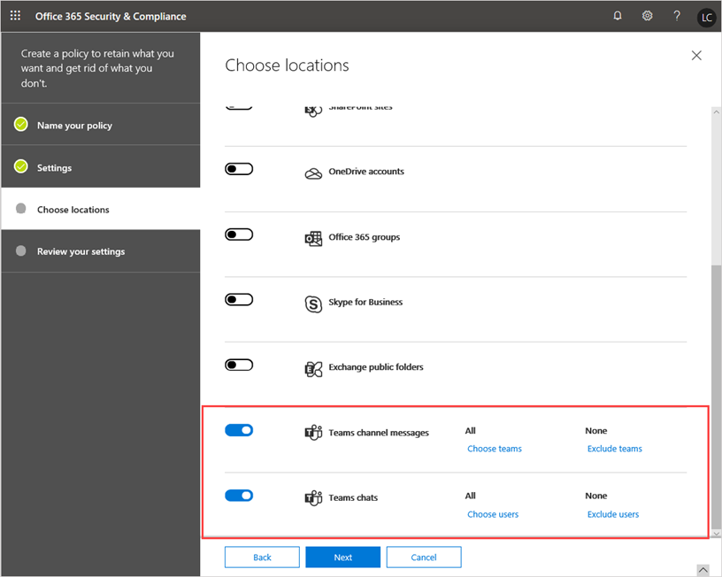
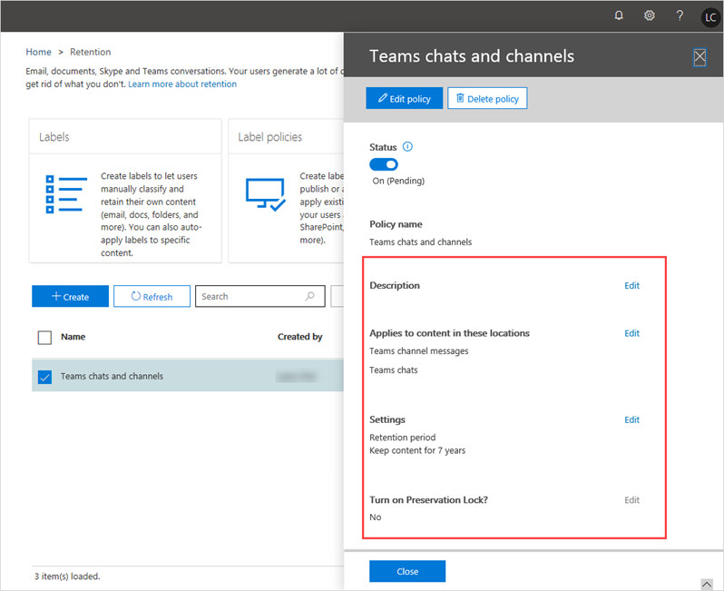

# Retention policies in Microsoft Teams  (WIP)

Teams conversations are persistent and retained forever by default. As an admin, you can set up retention policies for Teams chat and channel messages. Use retention policies to retain data for compliance for a specific period of time or delete data if it's considered a liability after a specific period of time. Teams retention policies ensure that when you delete data, it's removed from all permanent data storage locations on the Teams service.

You create and manage retention policies in the [Office 365 Security & Compliance Center](https://protection.office.com/) or by using the Security & Compliance Center PowerShell cmdlets.

> [!NOTE]
> We don’t yet support configuration for retention of private channel messages. Retention of files shared in private channels is supported.

## What are retention policies

With a retention policy, you decide whether to retain data, delete data, or both-retain and then delete the data. When data is subject to a retention policy, users can continue to work with it as if nothing's changed because the data is retained in place, in its original location. If a user edits or deletes data that's subject to the policy, a copy is saved to a secure location where it's retained while the policy is in effect.

When you set up a retention policy for Teams or any other workload, you can set up two main types of policies:

- Preservation: These policies ensure that your data is preserved for a given period of time, no matter what happens in the end user tools. They ensure that data is preserved for compliance reasons and available in eDiscovery until this time expires. After the time expires, your policy can indicate whether to do nothing or delete the data. In Teams, if you create a preservation policy for 7 years, even if end users delete their Teams messages, these messages are still preserved for eDiscovery for 7 years.
- Deletion: These policies ensure that data is not a liability for your organization. After the specified duration, data is deleted from all relevant storage in Teams.

Retention policies support the following:
    
- Retain Teams data for a specified duration and then do nothing
- Retain Teams data for a specified duration and then delete
- Delete Teams data after a specified duration

Teams retention policies don't yet support the following:

- Advanced retention policies don't apply to Teams chat and Teams channel message locations
- Duration of fewer than 30 days

Retention policies are retroactive. In other words, if you create a retention policy to delete data older than 90 days, Teams data created more than 90 days ago is deleted.

By default, Teams chat, channel, and files data are retained forever.

If you use the Group mailbox and User mailbox location rows for Exchange Online, Teams data will be deleted from the specified mailboxes. However, this only removes data from the mailbox. It doesn’t delete other Teams data, such as chats service. We recommend that you use Teams retention policies to properly manage all Teams data. A Teams retention policy removes teams data from all storage locations – Mailboxes, Chat service, Teams clients.

Currently, you can't include Teams in org-wide retention policies. You must create specific policies for Teams chat and channel messages by using the Security & Compliance Center or the [Security & Compliance Center PowerShell cmdlets](https://docs.microsoft.com/powershell/exchange/office-365-scc/office-365-scc-powershell?view=exchange-ps).

The minimum licensing requirement for retention policies is Office 365 E3. For more information on licensing, see [Office 365 licensing for Teams](Office-365-licensing.md).

## Why and when to use retention policies

In many cases, organizations consider private chat data as more of a liability than channel messages, which are typically more project-related conversations.

You can set up separate Teams retention policies for private chats (1:1 or 1:many chats) and channel messages. You can also configure unique policies that apply to specific users or teams in your organization. For Teams chats, you can select which users the policy applies to. For Teams channel messages, you can select which teams the policy applies to.

For example, for channel messages, you can apply a one-year deletion policy to specific teams in your organization and apply a three-year deletion policy to all other teams.

### Multiple retention policies with different retention periods

If you set up multiple retention policies for Teams with varying durations, the [principles of retention policies](https://support.office.com/article/overview-of-retention-policies-5e377752-700d-4870-9b6d-12bfc12d2423) apply.

- Preservation always wins over deletion
- Longest preservation period always wins
- Explicit inclusion wins over implicit inclusion in terms of locations
- Shortest deletion period wins

### Skype for Business Online and Teams interop chats

Skype for Business Online and Teams interop chats work the same way. When the Skype for Business Online chat comes into Teams, it becomes a message in a Teams chat thread and gets ingested into the appropriate mailbox. So the same flow works – Teams deletion policies will delete these messages from the Teams thread. However, if conversation history is turned on for Skype for Business Online and from the Skype for Business Online client side those are being saved into a mailbox, this chat data isn't handled by a Teams retention policy.

## Manage Teams retention policies

### Using the Security & Compliance Center

#### Create a retention policy

To create a retention policy for Teams chats and channel messages, do the following:

1. In the left navigation of the Security & Compliance Center, go to **Information governance** > **Retention**.
2. Select **Create**.
3. On the **Name your policy** page, enter a name and description for your policy, and then click **Next**.
4. On the **Settings** page, specify whether you want to retain data, delete it, or both, the retention period, and then click **Next**.
5. On the **Choose locations** page, do the following, and then click **Next**:

    
    - To apply the policy to channel messages, turn on **Teams channel messages**.  If you want to apply the policy to specific teams in your organization, select **Choose teams**, and then select the teams that you want.
    - To apply the policy to chats, turn on **Teams chats**. If you want to apply the policy to specific users in your organization, select **Choose users**, and then select the users that you want.
6. Review your settings, and then when you're ready, select **Create this policy**.

> [!IMPORTANT]
> The Teams channel message locations and Teams chats locations only address the Teams conversations stored in Exchange Online mailboxes (user and group mailboxes). The messages are deleted from all relevant storage locations, namely the mailboxes, substrate, and chat service. 
> 
> To manage retention policies for Teams files, which are stored in OneDrive for Business and SharePoint, use their retention policies.

By design, deletion policies for Teams files are configured through SharePoint Online and OneDrive for Business locations. As a result, it's possible that a policy could delete a file referenced in a Teams chat or channel message before those messages get deleted. In this case, the file will still show up in the Teams message, but if you click the file, you'll get a "File not found" error (this could also happen in the absence of a policy, if someone manually deletes a file from SharePoint Online or OneDrive for Business).

#### Edit a retention policy

To edit an existing Teams retention policy, do the following:

1. In the left navigation of the Security & Compliance Center, go to **Information governance** > **Retention**.
2. In the list of retention policies, select the check box next to the retention policy you want to edit.
3. Select **Edit** next to what you want to edit, make your changes, click **Save**, and then click **Close**.

    

### Using PowerShell

To create and manage Teams retention policies by using PowerShell, use the following cmdlets.

|Policy|Rule|
|---|---|
|[New-TeamsRetentionCompliancePolicy](https://docs.microsoft.com/powershell/module/exchange/policy-and-compliance-retention/new-teamsretentioncompliancepolicy?view=exchange-ps)| [New-TeamsRetentionComplianceRule](https://docs.microsoft.com/powershell/module/exchange/policy-and-compliance-retention/new-teamsretentioncompliancerule?view=exchange-ps)|
|[Get-TeamsRetentionCompliancePolicy](https://docs.microsoft.com/powershell/module/exchange/policy-and-compliance-retention/get-teamsretentioncompliancepolicy?view=exchange-ps)| [Get-TeamsRetentionComplianceRule](https://docs.microsoft.com/powershell/module/exchange/policy-and-compliance-retention/get-teamsretentioncompliancerule?view=exchange-ps)|
|[Set-TeamsRetentionCompliancePolicy](https://docs.microsoft.com/powershell/module/exchange/policy-and-compliance-retention/set-teamsretentioncompliancepolicy?view=exchange-ps)| [Set-TeamsRetentionComplianceRule](https://docs.microsoft.com/powershell/module/exchange/policy-and-compliance-retention/set-teamsretentioncompliancerule?view=exchange-ps)|
|[Remove-TeamsRetentionCompliancePolicy](https://docs.microsoft.com/powershell/module/exchange/policy-and-compliance-retention/remove-teamsretentioncompliancepolicy?view=exchange-ps)| [Remove-TeamsRetentionComplianceRule](https://docs.microsoft.com/powershell/module/exchange/policy-and-compliance-retention/remove-teamsretentioncompliancerule?view=exchange-ps)|

++++++++++++

Teams chats are stored in a hidden folder in the mailbox of each user included in the chat, and Teams channel messages are stored in a similar hidden folder in the group mailbox for the team. However, it's important to understand that Teams uses an Azure-powered chat service that also stores this data, and by default this service stores the data forever. For this reason, we strongly recommend that you use the Teams location to retain and delete Teams data. Using the Teams location will permanently delete data from both the Exchange mailboxes and the underlying Azure-powered chat service.

Teams chats and channel messages are not affected by retention policies applied to user or group mailboxes in the Exchange or Office 365 groups locations. Even though Teams chats and channel messages are stored in Exchange, they're affected only by a retention policy that's applied to the Teams location.

## Related topics

- [Overview of retention policies](https://support.office.com/article/overview-of-retention-policies-5e377752-700d-4870-9b6d-12bfc12d2423)
