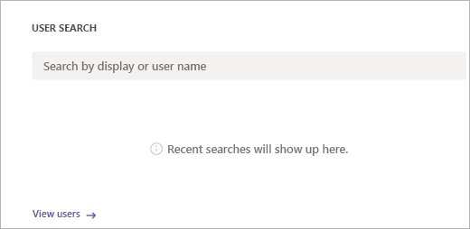
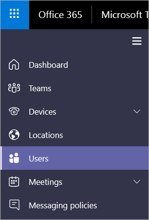

# Set up Call Analytics

As a Teams or Skype for Business Online admin, you can use Call Analytics to troubleshoot Skype for Business and Microsoft Teams call quality and connection problems. You may find it useful to set up the following capabilities in Call Analytics:
  
- Set permissions that let other personnel, such as helpdesk agents, use Call Analytics, but prevent them from accessing the rest of the Microsoft Teams & Skype for Business Admin Center. 
    
- Add building, site, and tenant information to Call Analytics by uploading a .tsv or .csv data file.
    
**Call Analytics is now available in the Microsoft Teams and Skype for Business Admin Center.** To see all the call information and data for a user, use the **Call History** tab. You can do this by looking on the user's profile page by doing one of the following:

- Search for the user from the dashboard.
  
   

-  Select **Users** in the left navigation.

   
  
## Set Call Analytics permissions

As the admin, you get full access to all the features of Call Analytics. In addition, you can assign Azure Active Directory roles to support staff. Assign the Teams communications support specialist role to users who should have a limited view of Call Analytics. Assign the Teams communications support engineer role to users who need access to the full functionality of Call Analytics. Both permission levels prevent access to the rest of the Microsoft Teams & Skype for Business Admin Center.

For more information about Teams admin roles, see [Use Microsoft Teams admin roles to manage Teams](using-admin-roles.md). 
  
Communications support specialists handle basic call-quality problems. They don't investigate issues with meetings. Instead, they collect related information and then escalate to a communications support engineer. Communications support engineers see information in detailed call logs that's hidden from communications support specialists. The following table gives an overview of information available to communications support specialists and communications support engineers when they use Call Analytics.

|**Activity**|**Information in Call Analytics**|**What the communications support specialist sees**|**What the communications support engineer sees**|
|:-----|:-----|:-----|:-----|
|**Calls**   |Caller name    |Only the name of the user for whom the agent searched.    |User name.    |
||Recipient name    |Shows as Internal User or External User.    |Recipient name.    |
||Caller phone number    |Entire phone number except last three digits are obfuscated with asterisk symbols. For example, 15552823***.    |Entire phone number except last three digits are obfuscated with asterisk symbols. For example, 15552823***.    |
||Recipient phone number    |Entire phone number except last three digits are obfuscated with asterisk symbols. For example, 15552823***.    |Entire phone number except last three digits are obfuscated with asterisk symbols. For example, 15552823***.    |
||**Call Details** > **Advanced** tab   |Information not shown.    |All details shown, such as device names, IP address, subnet mapping, and more.    |
||**Call Details** > **Advanced** > **Debug** tab   |Information not shown.    |All details shown, such as DNS suffix and SSID.    |
|**Meetings**   |Participant names    |Only the name of the user for whom the agent searched. Other participants identified as Internal User or External User.    |All names shown.    |
||Participant count    |Number of participants.    |Number of participants.    |
||Session details    |Session details shown with exceptions. Only the name of the user for whom the agent searched is shown. Other participants identified as Internal User or External User. Last three digits of telephone number obfuscated with asterisk symbols.    |Session details shown. User names and session details shown. Last three digits of telephone number obfuscated with asterisk symbols.    |
||||
   
 ### Set up permissions by assigning admin roles

To learn how to assign administrative roles in Azure Active Directory, see [View and assign roles in Azure Active Directory](https://docs.microsoft.com/en-us/azure/active-directory/users-groups-roles/directory-manage-roles-portal).

## Upload a .tsv or .csv file to add building, site, and tenant information

You can add building, site, and tenant information to Call Analytics by uploading a .csv or .tsv file. With all this information, Call Analytics can map IP addresses to physical locations. You or helpdesk agents might find this information useful to help spot trends in call problems. For example, why are many users in the same building having similar call quality issues? 

If you're a Teams and Skype for Business admin, you can use an existing data file from the Teams & Skype for Business Call Quality Dashboard. First, you download the file from Call Quality Dashboard, and then you upload it to Call Analytics. 

1. To download an existing data file, go to **Microsoft Teams & Skype for Business Admin Center** > **Call Quality Dashboard** > **Upload now**. In the **My uploads** list, click **Download** next to the file you want.

2. To upload the file, go to **Microsoft Teams & Skype for Business Admin Center** > **Locations**, and then select **Upload location data** or **Replace location data**.
  
If you're creating the .tsv or .csv file from scratch, see [Tenant data file format and Building data file structure](turning-on-and-using-call-quality-dashboard.md#BKMKTenantDataFile).
  
## Related topics

[Use Call Analytics to troubleshoot poor call quality](use-call-analytics-to-troubleshoot-poor-call-quality.md)

[Call Analytics and Call Quality Dashboard](difference-between-call-analytics-and-call-quality-dashboard.md)

  
 
