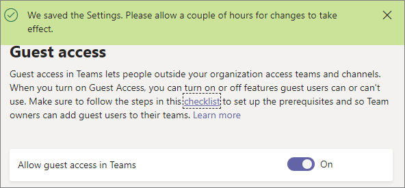

Turn on or off guest access to Microsoft Teams
======================================

As the Office 365 admin, you must enable the guest feature before you or your organization's users (specifically, team owners) can add guests. 

The guest settings are set in Azure Active Directory. It takes 2 hours to 24 hours for the changes to be effective across your Office 365 organization. If a user sees the message "Contact your administrator" when they try to add a guest to their team, it's likely that either the guest feature hasn't been enabled or the settings haven’t become effective yet.


> [!IMPORTANT]
> To enable the full experience of the guest access feature, it's important to understand the core authorization dependency between Microsoft Teams, Azure Active Directory, and Office 365. For more information, see [Authorize guest access in Microsoft Teams](Teams-dependencies.md).

## Configure guest access in the Teams & Skype for Business admin center

1.	Sign in to the Teams & Skype for Business admin center.

2.	Select **Org-wide settings** > **Guest access**.

3. Set the **Allow guest access in Microsoft Teams** switch to **On**.

    

4.	Set the toggles for **Calling**, **Meeting**, and **Messaging** to **On** or **Off**, depending on the access you want to allow.

5.	Click **Save**.

## Use PowerShell to turn guest access on or off

1.	Download the Skype for Business Online PowerShell module from https://www.microsoft.com/en-us/download/details.aspx?id=39366
 
2.	Connect a PowerShell session to the Skype for Business Online endpoint.

    ```
    Import-Module SkypeOnlineConnector
    $Cred = Get-Credential
    $CSSession = New-CsOnlineSession -Credential $Cred
    Import-PSSession -Session $CSSession
    ```
3.	Check your configuration and if `AllowGuestUser` is `$False`, set it to `$True` by using the `Set-CsTeamsClientConfiguration` cmdlet:

    ```
    Get-CsTeamsClientConfiguration

    Identity                         : Global
    AllowEmailIntoChannel            : True
    RestrictedSenderList             :
    AllowDropBox                     : True
    AllowBox                         : True
    AllowGoogleDrive                 : True
    AllowShareFile                   : True
    AllowOrganizationTab             : True
    AllowSkypeBusinessInterop        : True
    AllowTBotProactiveMessaging      : False
    ContentPin                       : RequiredOutsideScheduleMeeting
    AllowResourceAccountSendMessage  : True
    ResourceAccountContentAccess     : NoAccess
    AllowGuestUser                   : True
    AllowScopedPeopleSearchandAccess : False
    
    Set-CsTeamsClientConfiguration -AllowGuestUser $True -Identity Global
    ```
You can now have guest users in Teams for your organization.

## More information

Watch the following video for more details about guest access.

|  |  |
|---------|---------|
| Adding Guests in Microsoft Teams   | <iframe width="350" height="200" src="https://www.youtube.com/embed/1daMBDyBLZc" frameborder="0" allowfullscreen></iframe>   | 
