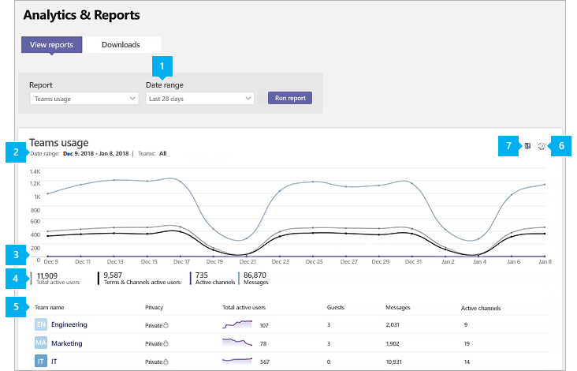

# Microsoft Teams PSTN blocked users report

The PSTN blocked users report in the Microsoft Teams admin center shows you the users in your organization who are blocked from making PSTN calls in Teams. You can view more information about each blocked user, including their assigned phone number and the reason they were blocked from making calls.

[placeholder only-replace with new screen shot]

## View the report

Go to the Microsoft Teams admin center, in the left navigation, click **Analytics & reports**, and then under **Report**, select **PSTN blocked users**.

## Interpret the report

[placeholder only-replace with new screen shot]

|Callout |Description  |
|--------|-------------|
|**1**   |Each report has a date for when this report was generated. The reports usually reflect a 24 to 48 hour latency from time of activity. |
|**5**   |The table gives a breakdown of all users who are blocked from making PSTN calls.  It shows all users who have Phone System or Audio Conferencing assigned and gives you more information about each user. <ul><li>**Display name** is the display name of the user. You can click the display name to go to the user's setting page in the Microsoft Teams admin center. </li> <li>**Phone** is the number that's assigned to the user.</li> <li>**Blocked reason** is the reason the user is blocked from making calls.</li><li>**Blocked action**  tells you whether the user is blocked or unblocked from making PSTN calls in Teams.</li> <li>**Blocked time** is the date and time (UTC) that the user was blocked from making calls.</li></li> </ul>To see the information that you want in the table, make sure to add the columns to the table. |
|**6**   |Select **Edit columns** to add or remove columns in the table.|
|**7**   |You can export the report to a CSV file for offline analysis. Click **Export to Excel**, and then on the **Downloads** tab, click **Download** to download the report when it's ready. |

## Related topics
- [Teams analytics and reporting](teams-reporting-reference.md)