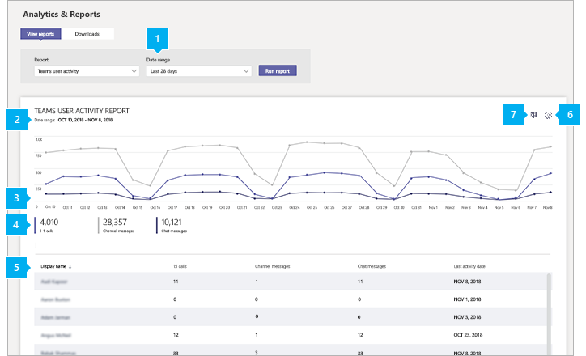

# Microsoft Teams user activity report

The Teams user activity report gives you insight into the types of activities that users in your organization perform in Teams. For example, you can see how many users communicate through 1:1 calls, how many users communicate through channel messages, and how many users engage in private chat messages.

## View the report

1. Go to the Microsoft Teams admin center, in the left navigation, click **Analytics & reports**, and then under **Report**, select **Teams user activity**. 
2. Under **Date range**, select a range, and then click **Run report**. 

## Interpret the report

|Callout |Description  |
|--------|-------------|
|**1**   |The Teams user activity report can be viewed for trends over the last 7 days or 28 days. |
|**2**   |Each report has a date for when this report was generated. The reports usually reflect a 24 to 48 hour latency from time of activity. |
|**3**   |<ul><li>The X axis on the charts is the selected date range for the specific report. </li><li>The Y axis is the number of users participating in the activity.</li></ul>Hover over the dot representing an activity on a given date to see the number of instances of that activity on that given date. |
|**4**   |You can filter what you see on the chart by clicking an item in the legend. For example, click **1:1 calls**, **Channel messages**, or **Chat messages** to see only the info related to each one. Changing the selection doesn’t change the information in the table. |
|**5**   |The table gives you a breakdown of usage by user.   <ul><li>**Display name** is the display name of the user. You can click the display name to go to the user's setting page in the Microsoft Teams admin center.</li><li>**1:1 calls** is the number of 1:1 calls that the user participated in during the specified time period.</li><li>**Channel messages** is the number of unique messages that the user posted in a team chat during the specified time period.</li> <li>**Chat messages** is the number of unique messages that the user posted in a private chat during the specified time period.</li>  <li>**Last activity** is the last date (UTC) that the user participated in a Teams activity.</li> </ul>To see the information that you want in the table, make sure to add the columns to the table.
|**6**   |Select **Edit columns** to add or remove columns in the table. |
|**7**   |You can export the report to a CSV file for offline analysis. Click **Export to Excel**, and then on the **Downloads** tab, click **Download** to download the report when it's ready. ||

## Related topics
- [Teams analytics and reporting](teams-reporting-reference.md)
- [Teams usage report](teams-usage-report.md)
- [Teams device usage report](device-usage-report.md)