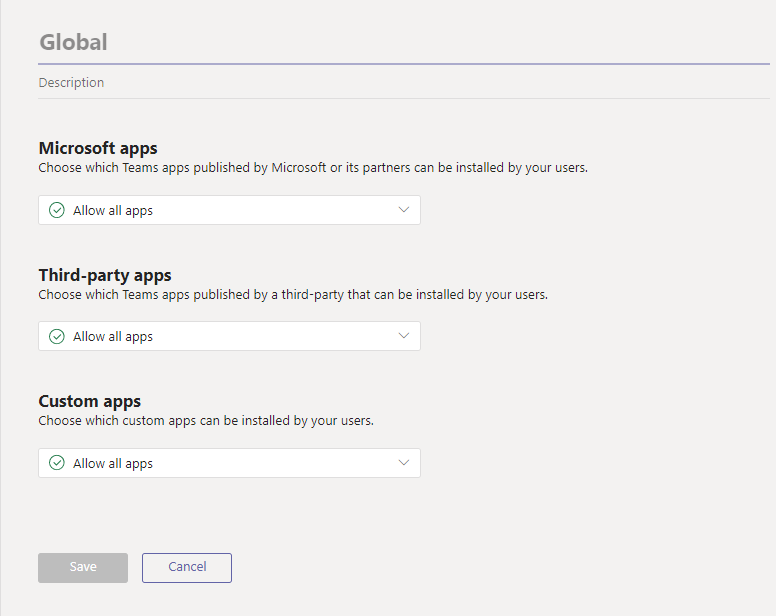
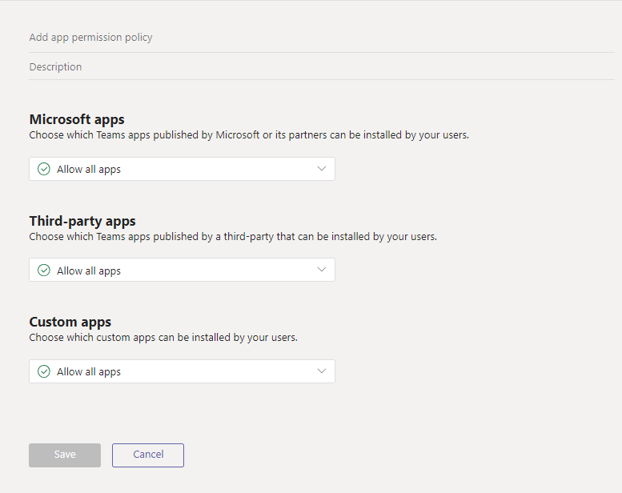

---
title: Manage app permission policies in Microsoft Teams
author: lanachin
ms.author: v-lanac
manager: serdars
ms.reviewer: rarang
ms.topic: article
ms.tgt.pltfrm: cloud
ms.service: msteams
audience: Admin
ms.collection: 
- M365-collaboration
- Teams_ITAdmin_Help
appliesto: 
- Microsoft Teams
localization_priority: Normal
search.appverid: MET150
description: Learn about app permission policies in Microsoft Teams and how to use them to control what apps are available for users in your organization. 
f1keywords:
- ms.teamsadmincenter.apppermspolicies.overview  
- ms.teamsadmincenter.apppermspolicies.orgwideapps.customapps
- ms.teamsadmincenter.appsetuppolicies.overview
---

# Manage app permission policies in Microsoft Teams

As an admin, you can use app permission policies to control what apps are available to Microsoft Teams users in your organization. You can allow or block all apps or specific apps published by Microsoft, third-parties, and your organization. When you block an app, users are unable to install it from the Teams app store.

You manage app permission policies in the Microsoft Teams admin center. You can apply settings org-wide, use the global (Org-wide default) policy, and create and assign custom policies to individual users or users in a group.  



> [!NOTE]
> Users in your organization will automatically get the global policy unless you create and assign a custom policy. Org-wide app settings override the global policy and any custom policies that you create and assign to users.

If your organization is already on Teams, the app settings you configured in **Tenant-wide settings** in the Microsoft 365 admin center are reflected in org-wide app settings. If you're new to Teams and just getting started, by default, all apps are allowed in the global policy. This includes apps published by Microsoft, third-parties, and your organization.

Say, for example, you want to block all third-party apps and allow specific apps from Microsoft for the HR team in your organization. You would create a custom policy named HR App Permission Policy, set it to block and allow the apps that you want, and then assign it to users on the HR team.

## Manage org-wide app settings

Use org-wide app settings to control which apps are available across your organization. Org-wide app settings govern the behavior for all users and override any other app permission policies assigned to users. You can use them to control malicious or problematic apps.

1. In the left navigation of the Microsoft Teams admin center, go to **Teams apps** > **Permission policies**.
2. Select **Org-wide settings**. You can then configure the settings you want in the panel. 

3. Under **Third-party apps**, turn off or turn on these settings to control access to third-party apps:

    - **Allow third-party or custom apps in Teams**: This controls whether users can use third-party or custom apps.
    - **Allow any new third-party apps published to the store by default**: This controls whether new third-party apps that are published to the Teams app store become automatically available in Teams. You can only set this option if you allow third-party apps.

4. Under **Custom apps**, turn off or turn on **Allow interaction with custom apps**. This setting controls whether users can interact with custom (sideloaded) apps. Keep in mind that this is different from allowing users to *upload* custom apps.
5. Under **Blocked apps**, search for and add the apps that you want to block across your organization. You can choose apps from the tenant app catalog or the Teams app store.
6. Click **Save** for org-wide app settings to take effect.

## Create a custom app permission policy

If you want to control the apps that are available for different groups of users in your organization, create and assign one or more custom app permission policies. You can create and assign separate custom policies based on whether apps are published by Microsoft, third-parties, or your organization. It's important to know that after you create a custom policy, you can't change it if third-party apps are disabled in org-wide settings. 

1. In the left navigation of the Microsoft Teams admin center, go to **Teams apps** > **Permission policies**.
2. Click **Add**.
    
3. Enter a name and description for the policy.
4. Under **Microsoft apps**, **Third-party apps**, and **Tenant apps**, select one of the following:

    - **Allow all apps**
    - **Allow specific apps and block all others**
    - **Block specific apps and allow all others**
    - **Block all apps**

5. If you selected **Allow specific apps and block others**, add the apps that you want to allow:

    1. Select **Allow apps**.
    1. Search for the apps that you want to allow, and then click **Add**. The search results are filtered to the app publisher (**Microsoft apps**, **Third-party apps**, or **Tenant apps**).
    1. When you've chosen the list of apps, click **Allow**.

6. Similarly, if you selected **Block specific apps and allow all others**, search for and add the apps that you want to block.
7. Click **Save**.

## Edit an app permission policy

You can use the Microsoft Teams admin center to edit a policy, including the global policy and custom policies that you create.

1. In the left navigation of the Microsoft Teams admin center, go to **Teams apps** > **Permission policies**.
2. Select the policy by clicking to the left of the policy name, and then click **Edit**.
3. From here, make the changes that you want. You can manage settings based on the app publisher and add and remove apps based on the allow/block setting.
4. Click **Save**.

## Assign a custom app permission policy to users

You can use the Microsoft Teams admin center to assign a custom policy to one or more users or the Skype for Business PowerShell module to assign a custom policy to groups of users, such as all users in a security group or distribution group.

### Assign a custom app permission policy to a user

1. In the left navigation of the Microsoft Teams admin center, go to **Users**.
2. Select the user by clicking to the left of the user name, and then click **Edit settings**.
3. Under **App permission policy**, select the app permission policy you want to assign, and then click **Apply**.

To assign a policy to multiple users at a time, see [Edit Teams user settings in bulk](edit-user-settings-in-bulk.md).

Or, you can also do the following:

1. In the left navigation of the Microsoft Teams admin center, go to **Teams apps** > **Permission policies**.
2. Select the policy by clicking to the left of the policy name.
3. Select **Manage users**.
4. In the **Manage users** pane, search for the user by display name or by user name, select the name, and then click **Add**. Repeat this step for each user that you want to add.
5. When you're finished adding users, click **Save**.

### Assign a custom app permission policy to users in a group

You may want to assign a custom app permission policy to multiple users that you’ve already identified. For example, you may want to assign a policy to all users in a security group. You can do this by connecting to the Azure Active Directory PowerShell for Graph module and the Skype for Business PowerShell module. For more information about using PowerShell to manage Teams, see [Teams PowerShell Overview](teams-powershell-overview.md).

In this example, we assign a custom app permission policy called HR App Permission Policy to all users in the Contoso Pharmaceuticals HR Project group.  

> [!NOTE]
> Make sure you first connect to the Azure Active Directory PowerShell for Graph module and Skype for Business PowerShell module by following the steps in [Connect to all Office 365 services in a single Windows PowerShell window](https://docs.microsoft.com/office365/enterprise/powershell/connect-to-all-office-365-services-in-a-single-windows-powershell-window).

Get the GroupObjectId of the particular group.
```
$group = Get-AzureADGroup -SearchString "Contoso Pharmaceuticals HR Project"
```
Get the members of the specified group.
```
$members = Get-AzureADGroupMember -ObjectId $group.ObjectId -All $true | Where-Object {$_.ObjectType -eq "User"}
```
Assign all users in the group to a particular app permission policy. In this example, it's HR App Permission Policy.
```
$members | ForEach-Object { Grant-CsTeamsAppPermissionPolicy -PolicyName "HR App Permission Policy" -Identity $_.EmailAddress}
``` 
Depending on the number of members in the group, this command may take several minutes to execute.

## FAQ

### Working with app permission policies

#### Can I control line of business (LOB) apps?
Yes, you can use app permission policies to control the rollout and distribution of custom (LOB) apps. You can create a custom policy or edit the global policy to allow or block custom apps based on the needs of your organization.

#### How do app permission policies relate to pinned apps and app setup policies?

You can use app setup policies together with app permission policies. Pre-pinned apps are selected from the set of enabled apps for a user. Additionally, if a user has an app permission policy that blocks an app in their app setup policy, that app won't appear in Teams.

#### Can I use app permission policies to restrict uploading custom apps (also known as sideloading)?

Use org-wide settings in app permission policies to restrict uploading custom apps for your organization.  

To restrict specific users from uploading custom apps, use custom app policies (coming soon). To learn more, see [Manage custom app policies and settings in Teams](teams-custom-app-policies-and-settings.md).

#### Does blocking an app apply to Teams mobile clients?

Yes, when you block an app, that app is blocked across all Teams clients.  

### User experience

#### What does a user experience when an app is blocked?

Users can't interact with a blocked app or its capabilities, such bots, tabs, and messaging extensions. In a shared context, such as a team or group chat, bots can still send messages to all participants of that context. Teams indicates to the user when an app is blocked.

For example, when an app is blocked, users can't do any of the following:

- Add the app personally or to a chat or team
- Send messages to the app’s bot
- Perform button actions that send information back to the app, such as actionable messages  
- View the app’s tab
- Set up connectors to receive notifications
- Use the app’s messaging extension

The legacy portal allowed controlling apps at the organization level, which means when an app is blocked, it's blocked for all users in the organization. The org-wide app setting in app permission policies works exactly the same way.

For app permission policies assigned to specific users, if an app with bot or connector capability was allowed and then blocked, and if the app is then allowed only for some users in a shared context, members of a group chat or channel that don't have permission to that app can see the message history and messages that were posted by the bot or connector, but can't interact with it.

 ## Related topics
- [Admin settings for apps in Teams](admin-settings.md)
