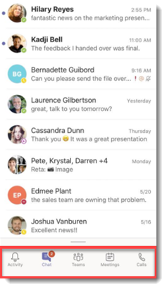
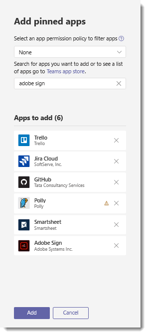

# Manage app setup policies in Microsoft Teams

> [!NOTE]
> If you enabled the org-wide app permission policy setting, **Allow interaction with custom apps**, you may not see app setup policies yet in the Microsoft Teams admin center. It's currently being rolled out and will be available soon in your organization.

As an admin, you can use app setup policies to customize Microsoft Teams to highlight the apps that are most important for your users. You choose the apps to pin and set the order that they appear. App setup policies let you showcase apps that users in your organization need, including those built by third parties or by developers in your organization. You can also use app setup policies to manage how built-in features appear.

Apps are pinned to the app bar. This is the bar on the side of the Teams desktop client and at the bottom of the Teams mobile clients (iOS and Android). 

|Teams desktop client  |Teams mobile client |
|---------|---------|
|<br>  |         |

You manage app setup policies in the Microsoft Teams admin center. You can use the global (Org-wide default) policy or create custom policies and assign them to users. Users in your organization will automatically get the global policy unless you create and assign a custom policy.

You can edit the settings in the global policy to include the apps that you want. If you want to customize Teams for different groups of users in your organization, create and assign one or more custom policies. If a user is assigned a custom policy, that policy applies to the user. If a user isn't assigned a custom policy, the global policy applies to the user.


> [!NOTE]
> If you have Teams for Education, it's important to know that the Assignments app is pinned by default in the global policy even though currently, you don't see it listed in the global policy. It will be the fourth app in the list of pinned apps on Teams clients.

## Create a custom app setup policy

You can use the Microsoft Teams admin center to create a custom policy.

1. In the left navigation of the Microsoft Teams admin center, go to **Teams apps** > **Setup policies**.
2. Click **Add**.
3. Enter a name and description for the policy, and then click **Add apps**.
4. Turn on or turn off **Allow uploading custom apps**, depending on whether you want to let users upload custom apps to Teams. You won't be able to change this setting if **Allow third-party or custom apps** is turned off in [org-wide app settings](teams-app-permission-policies.md#manage-org-wide-app-settings) in app permission policies.
5. In the **Add pinned apps** pane, search for the apps you want to add, and then click **Add**. You can also filter apps by app permission policy. When you've chosen your list of apps, click **Add**.

     

6. Arrange the apps in the order that you want them to appear in Teams, and then click **Save**.

    

## Edit an app setup policy

You can use the Microsoft Teams admin center to edit a policy, including the global (Org-wide default) policy and custom policies that you create.

1. In the left navigation of the Microsoft Teams admin center, go to **Teams apps** > **Setup policies**.
2. Select the policy by clicking to the left of the policy name, and then click **Edit**.
3. From here, make the changes that you want. You can add, remove, and change the order of apps.
4. Click **Save**.

## Assign a custom app setup policy to users

You can use the Microsoft Teams admin center to assign a custom policy to individual users or the Skype for Business PowerShell module  to assign a custom policy to groups of users, such as a security group or distribution group.

### Assign a custom app setup policy to users

1. In the left navigation of the Microsoft Teams admin center, go to **Users**, and then click  the user.
2. Select the user by clicking to the left of the user name, and then click **Edit settings**.
3. Under **App setup policy**, select the app setup policy you want to assign, and then click **Apply**.

To assign a policy to multiple users at a time, see [Edit Teams user settings in bulk](edit-user-settings-in-bulk.md).

Or, you can also do the following:

1. In the left navigation of the Microsoft Teams admin center, go to **Teams apps** > **Setup policies**.
2. Select the policy by clicking to the left of the policy name.
3. Select **Manage users**.
4. In the **Manage users** pane, search for the user by display name or by user name, select the name, and then select **Add**. Repeat this step for each user that you want to add.
5. When you're finished adding users, select **Save**.

### Assign a custom app setup policy to users in a group

You may want to assign a custom app setup policy to multiple users that you’ve already identified. For example, you may want to assign a policy to all users in a security group. You can do this by connecting to the Azure Active Directory PowerShell for Graph module and the Skype for Business PowerShell module. For more information about using PowerShell to manage Teams, see [Teams PowerShell Overview](teams-powershell-overview.md).

In this example, we assign a custom app setup policy called HR App Setup Policy to all users in the Contoso Pharmaceuticals HR Project group.  

> [!NOTE]
> Make sure you first connect to the Azure Active Directory PowerShell for Graph module and Skype for Business PowerShell module by following the steps in [Connect to all Office 365 services in a single Windows PowerShell window](https://docs.microsoft.com/office365/enterprise/powershell/connect-to-all-office-365-services-in-a-single-windows-powershell-window).

Get the GroupObjectId of the particular group.
```
$group = Get-AzureADGroup -SearchString "Contoso Pharmaceuticals HR Project"
```
Get the members of the specified group.
```
$members = Get-AzureADGroupMember -ObjectId $group.ObjectId -All $true | Where-Object {$_.ObjectType -eq "User"}
```
Assign all users in the group to a particular app setup policy. In this example, it's HR App Setup Policy.
```
$members | ForEach-Object { Grant-CsTeamsAppSetupPolicy -PolicyName "HR App Setup Policy" -Identity $_.EmailAddress}
``` 
Depending on the number of members in the group, this command may take several minutes to execute.

## FAQ

### Working with app setup policies

#### What built-in app setup policies are included in the Microsoft Teams admin center?

- **Global (Org-wide default)**: This default policy applies to all users in your organization unless you assign another policy. Edit the global policy to pin apps that are most important for your users.
- **FirstLineWorker**: This policy is for firstline workers. You can assign it to firstline workers in your organization. It's important to know that like custom policies that you create, you have to assign the policy to users for the settings to be active. For more information, go to the [Assign a custom app setup policy to users](#assign-a-custom-app-setup-policy-to-users) section of this article.

#### Why can't I find an app in the Add pinned apps pane?

Not all apps can be pinned to Teams through an app setup policy. Some apps may not support this functionality. To find apps that can be pinned, search for the app in the **Add pinned apps** pane. Tabs that have a personal scope (static tabs) and bots can be pinned to the Teams desktop client and these apps are available in the **Add pinned apps** pane.

Keep in mind that the Teams app store lists all Teams apps whereas the **Add pinned apps** pane includes only apps that can be pinned to Teams through a policy. 

#### I'm a Teams for Education admin. What do I need to know about app setup policies in Teams for Education?

The Calling app isn't available in Teams for Education. When you create a new custom app setup policy, the Calling app is displayed in the list of apps. However, the app isn't pinned to Teams clients and Teams for Education users won't see the Calls app in Teams.

#### How many apps can be added to a policy?

A minimum of two apps must be pinned to the Teams mobile clients (iOS and Android). If a policy has less than two apps, the mobile clients won't reflect the policy settings and instead will continue to use the existing configuration.

#### How long does it take for policy changes to take effect?

After you edit the global policy or assign a policy, it can take up to 24 hours for changes to take effect.

### User experience

#### How can users see all their pinned apps in Teams?

To view all apps that are pinned for a user, users may have to do the following depending on the number of installed apps and the size of their Teams client window.

|Teams desktop client |Teams mobile client |
|---------|---------|
|In the app bar on the side of Teams, click **... More apps**.| In the app bar near the bottom of Teams, swipe up.|
|<br>   |  

#### What do I need to know about the Teams mobile experience?

The Teams mobile clients (iOS and Android) currently don't support personal apps with static tabs. Depending on the apps set in the policy, apps pinned to the Teams desktop client might not appear in the Teams mobile clients. Personal bots will still appear in Chat on mobile clients.

With the Teams mobile clients, users will see core Teams apps such as Activity, Chat, and Teams, and you can pin some first-party apps from Microsoft, such as Shifts. 

#### Can users change the order of apps pinned through a policy?

Currently, users can change the order of their pinned apps on Teams mobile clients but not on the Teams desktop or web clients. 

### Custom Teams apps

#### My organization built a custom Teams app and published it, either to AppSource or the Tenant app catalog, but the app icon isn't displayed as expected when the app is pinned to the app bar in Teams. How do I fix it? 

Make sure that you follow the logo guidelines before you submit the app. To learn more, see [Checklist for Seller Dashboard submission](https://docs.microsoft.com/microsoftteams/platform/publishing/office-store-checklist). 

 ## Related topics
- [Admin settings for apps in Teams](admin-settings.md)
- [Publish an app to the Tenant Apps Catalog from the Teams client](tenant-apps-catalog-teams.md)
