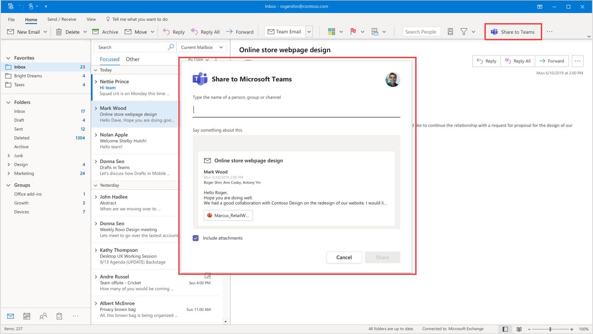

# Teams and Outlook email integration

Microsoft Teams includes features that make it easy for users in your organization to share information between email in Outlook and chat or channel conversations in Teams and to stay on top of missed conversations. This article gives you an overview of these features and admin controls that apply.

## Share to Teams

**Share to Teams** is an Outlook add-in that lets users share an email from Outlook (including attachments) along with a message to a chat or channel in Teams. A preview of the email is displayed in Teams and people in the chat or channel can open the email and  attachments. To learn more, see \<link to end user article>.

The Share to Teams add-in is available for Outlook for Windows, Mac, web, and mobile. It's automatically installed for users who have Teams and Office 2016???

You can use the [Disable-App](https://docs.microsoft.com/powershell/module/exchange/mailboxes/disable-app?view=exchange-ps) cmdlet to turn off the add-in for users in your organization. The add-in must be already installed before you can use the cmdlet to turn it off.

## Share to Outlook

**Share to Outlook** lets users share a copy of a Teams conversation to an email in Outlook, without having to leave Teams. To learn more, see \<link to end user article>.

To use this feature, Outlook on the web must be enabled for the user. If Outlook on the web isn't enabled for a user mailbox, the **Share to Outlook** option isn't displayed in Teams for the user.  To learn more about how to enable or disable Outlook on the web, see [Enable or disable Outlook on the web for a mailbox](https://docs.microsoft.com/exchange/recipients-in-exchange-online/manage-user-mailboxes/enable-or-disable-outlook-web-app).

## Actionable activity emails

Users get actionable missed activity emails which help them stay on top of missed conversations in Teams. The missed activity emails show the latest replies from a conversation including messages sent after the missed message and lets users respond directly from within Outlook.

## Related topics

- [Teams Meeting add-in in Outlook for Windows](Teams-add-in-for-Outlook.md)