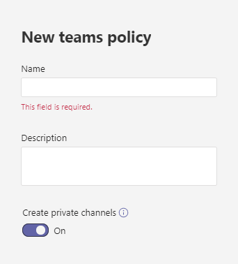

# Manage teams policies in Microsoft Teams

As an admin, you can use teams policies in Microsoft Teams to control what users in your organization can do in teams and channels. For example, you can set whether users are allowed to discover private teams in search results and in the team gallery and whether users are allowed to create private channels.

You manage teams policies by going to **Teams** > **Teams policies** in the Microsoft Teams admin center. You can use the global (Org-wide default) policy or create and assign custom policies. Users in your organization will automatically get the global policy unless you create and assign a custom policy.

You can edit the global policy or create and assign a custom policy. After you edit the global policy or assign a policy, it can take a few hours for changes to take effect.

## Create a custom teams policy

1. In the left navigation of the Microsoft Teams admin center, go to **Teams** > **Teams policies**.
2. Click **Add**.
3. Enter a name and description for the policy.

    
4. Choose the settings that you want:

- **Discover private teams**: Turn on this setting to allow users to discover private teams in search results and in the team gallery.
- **Create private channels**: Turn on this setting to allow users to create private channels.

5. Click **Save**.

## Edit a teams policy

You can edit the global policy or any custom policies that you create.

1. In the left navigation of the Microsoft Teams admin center, go to **Teams** > **Teams policies**.
2. Select the policy by clicking to the left of the policy name, and then click **Edit**.
3. Turn on or turn off the settings that you want, and then click **Save**.

## Assign a custom teams policy to users

[!INCLUDE [assign-policy](includes/assign-policy.md)]

## Related topics

[Manage discovery of private teams in Teams](manage-discovery-of-private-teams.md)

[Private channels in Teams](private-channels.md)

[Assign policies to your users in Teams](assign-policies.md)
