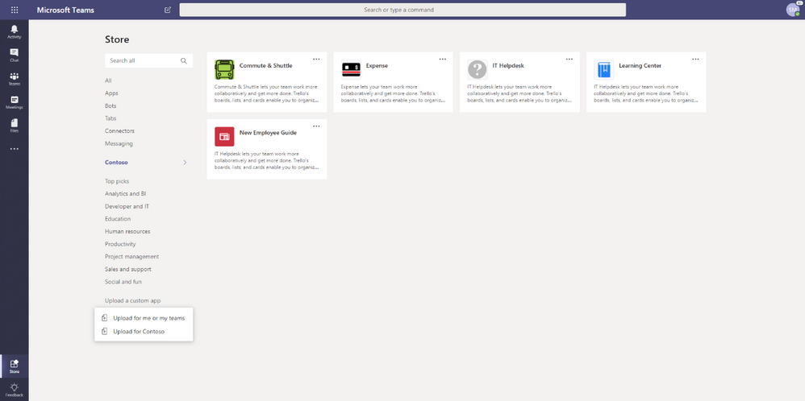

Publish apps in the Microsoft Teams tenant app catalog
=======================================================

You can use the Microsoft Teams tenant app catalog to test and distribute line-of-business applications to your organization.

The Teams tenant app catalog lets you distribute line-of-business applications that were built specifically for your organization and that you rely on to complete critical business functions.

To publish apps for your organization, sign in to the Teams client using an account with either the global admin or teams service admin role and then follow the steps below.

## Publish an app in the tenant app catalog from the Teams client

> [!NOTE]
> These steps describe how to publish an app by using the Teams client. You can also publish an app on the **Manage apps** page in the Microsoft Teams admin center. To learn more, see [Manage apps in Teams](manage-apps.md).

### Get a Teams app package

A Teams app package is created by using [Teams App Studio](https://docs.microsoft.com/microsoftteams/platform/get-started/get-started-app-studio). Once you have the app package, you can add it to the tenant app catalog. While all users in your organization can view the app catalog, only global admins and teams service admins have the ability to publish and manage it.

### Go to the tenant app catalog

Start Teams and sign in using your global or teams service admin credentials. Select **Apps** on the left side of the app, and then select the new section named for your specific organization (in this example, Contoso). Users in your organization can view apps in the catalog and install them for teams of which they are a member.

### Add an app to the tenant app catalog

1. On the **Apps** page, select **Upload a custom app** > **Upload for Contoso**.

    

    (You can also choose **Upload for me or my teams**, which is called *sideloading*. Sideloading makes the app available only to your teams or to teams you select.)

2. Navigate to the app package and select it, and then click **Open**.

    

When you go back to your tenant app catalog, the new enterprise app will be there. Remember, only you and members of your organization have access to this app catalog.

### Update an app in the tenant app catalog

1. From your tenant app catalog, select “**…**” on the top right of the app you want to update.

2. Navigate to the updated app package and select it, and then click **Open**.

    

The app will be revised to version 2.0. You can also delete the app for your entire company from this menu.
