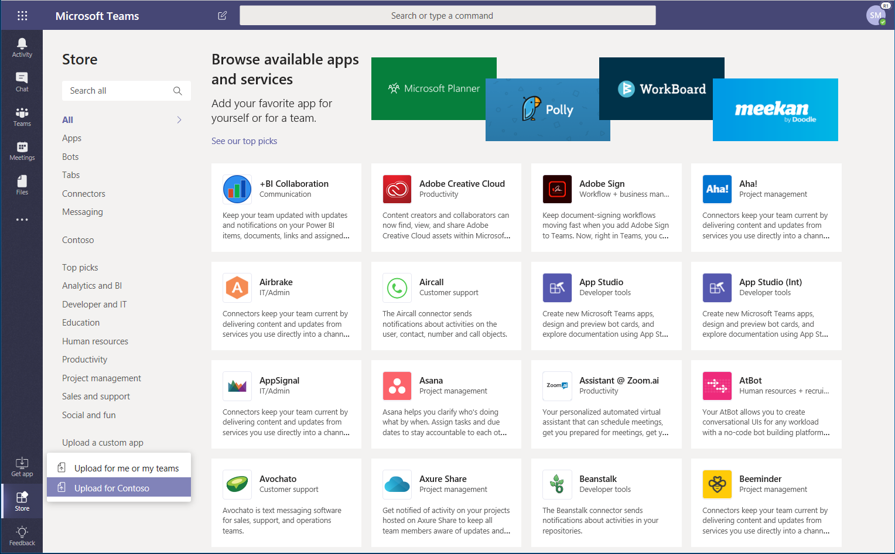
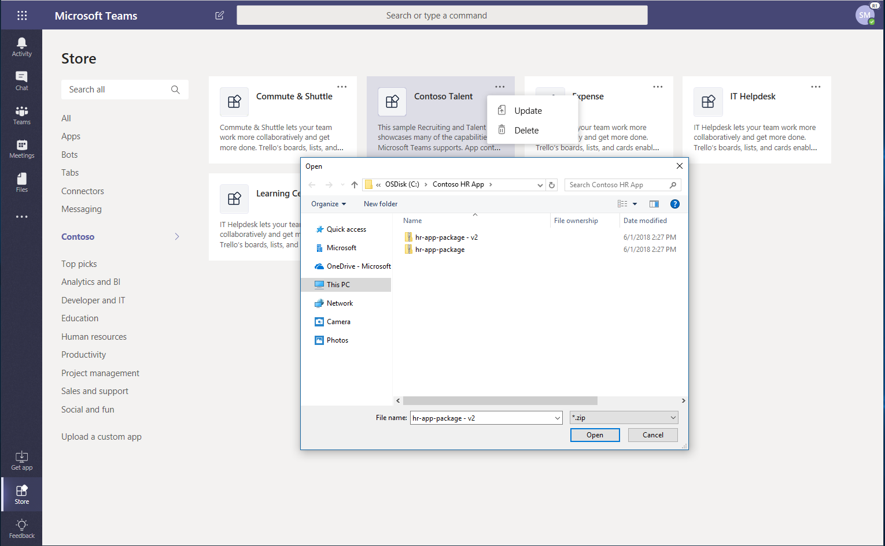

Publish apps to the Microsoft Teams Tenant Apps Catalog
=======================================================

You can use the Microsoft Teams Tenant Apps Catalog to test and distribute line-of-business applications to your organization. 

The Teams Tenant Apps Catalog lets you distribute your line-of-business applications that were built specifically for your organization and that you rely on to complete critical business functions to your users. 
 
You can publish apps to the Teams Tenant Apps Catalog directly from the Teams client.

## Publish an app to the Tenant Apps Catalog from the Teams client

### Get a Teams app package

A Teams app package is created by using [Teams App Studio](https://docs.microsoft.com/en-us/microsoftteams/platform/get-started/get-started-app-studio). 
Once you have the app package, you can add it to enterprise app catalog. While all users in the tenant can view the app catalog, only admins have the ability to manage it.

### Go to the Tenant Apps Catalog

From the Microsoft Teams Store, select the new section named for your specific organization (in this example, Contoso). Users in your organization can view apps in the catalog and install them to teams of which they are a member. 

### Add an app to the Tenant Apps Catalog

From the Store, select **Upload a custom app** > **Upload for Contoso**.

(You can also choose **Upload for me or my teams**, which is called sideloading, that makes the app available only to your or your selected teams.) 

Navigate to the app package and select it.

When you go back to your Tenant Apps Catalog, the new enterprise app will be there. Remember, only you and members of your organization have access to this app catalog.

### Update an app in the Tenant Apps Catalog

1. From your Tenant Apps Catalog, select “**…**” on top right of the app you want to update.
2. Navigate to the updated app package and select it.

The app will be revised to version 2.0. You also delete the app for your entire company from this menu.

## Use the Office 365 admin portal to manage the Tenant Apps Catalog

If you have apps that need bug fixes, you can temporarily disable apps through the Office 365 admin portal. In addition to previous settings, there is now a section dedicated to your company's apps. You can choose which apps you want to enable or disable.

This blocks users from interacting with the app, without deleting the app entirely. These controls give admins additional flexibility and control when governance of apps in your enterprise. 

