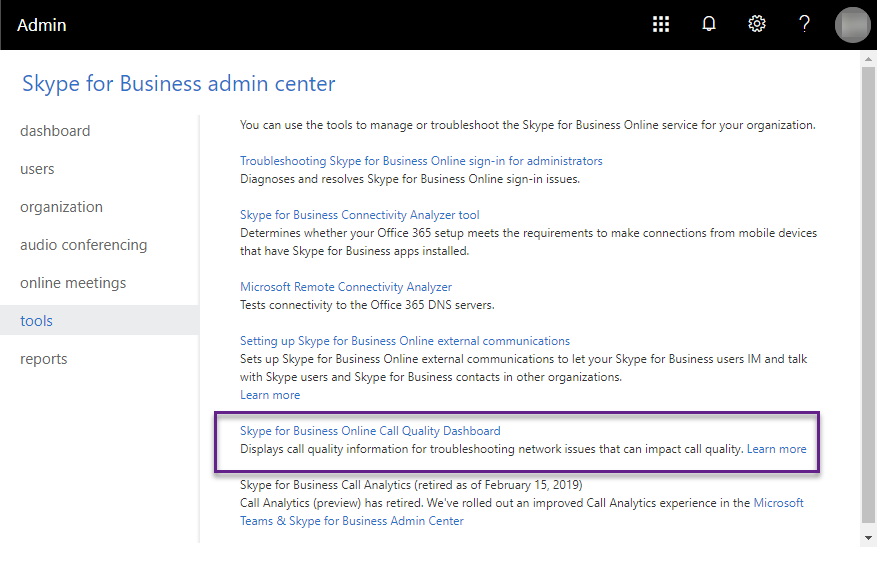
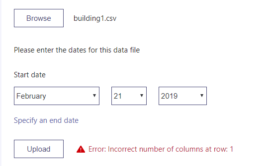
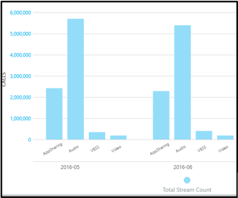

# Turning on and using Call Quality Dashboard for Microsoft Teams and Skype for Business Online

Learn how to configure your Office 365 organization to use the Call Quality Dashboard to monitor call quality.
  
The Call Quality Dashboard (CQD) for Microsoft Teams and Skype for Business Online allows you to gain insights into the quality of calls made using Microsoft Teams and Skype for Business services. This topic describes the steps you'll need to complete to start collecting data.
  
  
## Latest changes and updates

The most recent changes to CQD are as follows:
  
- Includes Microsoft Teams data in addition to Skype for Business Online data.
    
- Summary reports include a product filter to select all data, Microsoft Teams data, or Skype for Business Online data.

- Video and VBSS stream quality classification logic has been updated. Refer to [Stream Classification in Call Quality Dashboard](stream-classification-in-call-quality-dashboard.md) for the latest classifier definitions.

Refer to this article for a list of [Dimensions and measures available in Call Quality Dashboard](dimensions-and-measures-available-in-call-quality-dashboard.md).
  
> [!NOTE]
> Information about updates and changes to the dashboard can be found by clicking the link in the **Good news!** banner when it is displayed on the dashboard.
  
## Activate Microsoft Call Quality Dashboard (CQD) Summary Reports

Before you can start using the CQD, you'll need to activate it for your Office 365 organization.

 **Using the Microsoft Teams admin center**
 
1. Sign in to your Office 365 organization using Microsoft Teams service admin account, and then select the **Admin** tile to open the Admin center.
    
2. In the left pane, under **Admin centers**, select **Microsoft Teams** to open the Microsoft Teams admin center.
    
3. In the Microsoft Teams admin center, select **Call quality dashboard** in the left pane.
    
  
4. On the page that opens, sign in with your Global Administrator account or Microsoft Teams Service Admin account, and then provide the credentials for the account when prompted.
    
     
  
After you sign in, once activated, the CQD will begin collecting and processing data.  
> [!NOTE]
> It may take a couple of hours to process enough data to display meaningful results in the reports. 

 **Using the Skype for Business admin center**
 
1. Sign in to your Office 365 organization using an admin account, and then select the **Admin** tile to open the Admin center.
    
2. In the left pane, under **Admin centers**, select **Skype for Business** to open the Skype for Business admin center.
    
3. In the Skype for Business admin center, select **Tools** in the left pane, and then select **Skype for Business Online Call Quality Dashboard**.
    
     
  
4. On the page that opens, sign in with your Global Administrator account, and then provide the credentials for the account when prompted.
    
     
  
After you sign in, once activated, the CQD will begin collecting and processing data.

  
## Features of the Call Quality Dashboard for Microsoft Teams and Skype for Business Online 

CQD Summary Reports provide a subset of the features planned for Detailed Reports. The differences between the two editions are summarized here:
  
|**Feature**|**Summary Reports**|**Detailed Reports**|
|:-----|:-----|:-----|
|Application sharing metric    |No    |Yes    |
|Customer building information support    |Yes    |Yes    |
|Customer endpoint information support    |Only in cqd.teams.microsoft.com    |Only in cqd.teams.microsoft.com    |
|Drill-down analysis support    |No    |Yes    |
|Media reliability metrics    |No    |Yes    |
|Out-of-the-box reports    |Yes    |Yes    |
|Overview reports    |Yes    |Yes    |
|Per-user report set    |No    |Yes    |
|Report set customization (add, delete, modify reports)    |No    |Yes    |
|Video-based screen sharing metrics    |No    |Yes    |
|Video metrics    |No    |Yes    |
|Amount of data available    |Last 6 months    |Last 6 months    |
|Microsoft Teams data    |Yes    |Yes    |
   
### Out-of-the-box reports

Both editions of CQD provide an out-of-the-box experience, giving you call quality metrics without the need to create any new reports. Once data is processed in the back-end, you can start seeing call quality data in the reports.
  
### Overview reports

Both editions of the CQD provide a high-level entry point to the overall call quality information, but the way information is presented in Summary Reports is different from that of Detailed Reports.
  
Summary Reports provide a simplified tabbed page report view that enables users to quickly browse and understand the overall call quality status and trends.
  
The four tabs include:
  
- **Overall Call Quality** - provides information about all streams, which is an aggregation of Server-Client streams and Client-Client streams, as well as separate Server-Client and Client-Client streams, in the form of monthly and daily trends.
    
- **Server - Client** - provides additional details for the streams between Server and Client endpoints.
    
- **Client - Client** - provides additional details for the streams between two Client endpoints.
    
- **Voice Quality SLA** - provides information about calls that are included in the Skype for Business Online Voice Quality SLA.
    
### Overall Call Quality tab

Use the data on this tab to evaluate call quality status and trends by looking at the stream counts and poor percentages. The legend in the upper-right corner shows which color and visual elements represent these metrics.
  

  
Streams are classified in three groups: Good, Poor, and Unclassified. There are also calculated  *Poor %*  values that give you the ratio of streams classified as *Poor*  to the total classified stream count. Since *Poor % = Poor streams/ (Poor streams+ Good streams) * 100*  , this makes the *Poor %*  unaffected by the presence with multiple *Unclassified*  streams. For what is used for classifying a stream as poor or good, refer to [Stream Classification in Call Quality Dashboard](stream-classification-in-call-quality-dashboard.md).
  
Use the scale on the left to measure the stream count values.
  

  
Use the scale on the right to measure the Poor % values.
  

  
You can also obtain the actual numerical values by hovering the mouse over a bar.
  
> [!NOTE]
> The following example is from a very small sample data set, and the values aren't realistic for an actual deployment. 
  

  
The overall stream volume is an important factor in determining how relevant the calculated Poor percentages are. The smaller the volume of overall streams, the less reliable the reported Poor percentage values are.
  
### Server-Client tab and Client-Client tabs

These two tabs provide additional details for the streams that took place in their endpoint-to-endpoint scenarios. Both tabs have four collapsible sections, representing four scenarios under which media streams would flow.
  
- Wired Inside
    
- Wired Outside
    
- Wifi Inside
    
- Wifi Outside
    
#### Inside Test

During processing, the CQD back-end classifies a stream as  *Inside*  or *Outside*  using Building information, if it exists. Endpoints of each stream are associated with a subnet address. If the subnet is in the list of the subnets marked InsideCorp in the uploaded Building information, then it is considered *Inside*. If Building information has not yet been uploaded, then Inside Test will always classify the streams as *Outside*. Please note that Inside Test for Server-Client scenario only considers the client endpoint. Because servers are always outside from a user's perspective, this isn't accounted for in the test.
  
#### Wired vs. wifi

As the names indicate, this is a classification criteria based on the type of client connections. Again, server is always wired and it isn't included in the calculation.
  
> [!NOTE]
> Given a stream, if one of the two endpoints is connected to a Wifi network, then it is classified as Wifi in CQD. 
  
## Selecting product data to see in reports

In the Summary and Location Enhanced Reports, you can use the **Product Filter** drop-down to show all product data, only Microsoft Teams data, or only Skype for Business Online data.
  

  
In Detailed reports, you can use the **Is Teams** dimension to filter the data to Microsoft Teams or Skype for Business Online data as part of defining the report.
  
## Upload Tenant Data information

The CQD Summary Reports dashboard includes a **Tenant Data Upload** page, accessed by selecting **Tenant Data Upload** from the settings menu in the top-right corner. This page is used for admins to upload their own information, such as mapping of IP address and geographical information, mapping each wireless AP and its MAC address, mapping of Endpoint to Endpoint Make/Model/Type, etc.
  

  
1. On the **Tenant Data Upload** page, use the drop-down menu to choose a data file type for uploading. The file data type denotes the content of the file (for example, "Building" refers to mapping of IP address and building as well as other geographical information, “Endpoint” refers to mapping of Endpoint Name to Endpoint Make/Model/Type…information). Currently we support upload “Building” and “Endpoint” data types for cqd.teams.microsoft.com(in preview stage and not officially available yet), cqd.lync.com only supports upload "Building" data type. A few more data types will be added with subsequent releases.
    
2. After selecting the file data type, click **Browse** to choose a data file.
    
   - The data file must be a .tsv (Tab-separated values) file or a .csv (Comma-separated value) file. If using a .csv file, any field that contains a comma must be surrounded by quotes or have the comma removed. For example, if your building name is NY,NY, in the .csv file it should be entered as "NY,NY".
    
   - The data file must be no larger than 50MB in size.

   - File uploaded to cqd.teams.microsoft.com has expanded row limit of 1,000,000 to speed up query performance. We may impose that limit on cqd.lync.com as well.
    
   - For each data file, each column in the file must match a predefined data type, discussed later in this topic.
    
3. After selecting a data file, specify **Start date** and, optionally, **Specify an end date**.
    
4. After selecting **Start date**, select **Upload** to upload the file to the CQD server.
    
    Before the file is uploaded, it is first validated. Once validated, it is stored in an Azure blob. If validation fails or the file fails to be stored in an Azure blob, an error message is displayed requesting a correction to the file. The following image shows an error occurring when the number of columns in the data file is incorrect.
    
     
  
5. If no errors occur during validation, the file upload will succeed. You can then see the uploaded data file in the **My uploads** table, which shows the full list of all uploaded files for the current tenant at the bottom of that page.
    
    Each record shows one uploaded tenant data file, with file type, last update time, time period, description, a remove icon, and a download icon. To remove a file, select the trash bin icon in the table. To download a file, select the download icon in the **Download** column of the table.
    
     
  
### Tenant data file format and structure

### Building data file
CQD uses Building data file by first derive Subnet column from expanding Network+NetworkRange column, then joining Subnet column to the call record’s First Subnet/Second Subnet column to show Building/City/Country/Region… information. The format of the data file you upload must meet the following to pass the validation check before uploading.
  
- The file must be either a .tsv file, which means, in each row, columns are separated by a TAB, or a .csv file with each column separated by a comma.
    
- The content of the data file doesn't include table headers. That means the first line of the data file should be real data, not headers like "Network," etc.
    
- For each column, the data type can only be String, Number, or Bool. If it is Number, the value must be a numeric value; if it is Bool, the value must be either 0 or 1.
    
- For each column, if the data type is string, the data can be empty (but still must be separated by an appropriate delimiter (i.e., a tab or comma). This just assigns that field an empty string value.
    
- There must be 14 columns for each row, each column must have the following data type, and the columns must be in the order listed in the following table:
    
|**Column Name**|**Data type**|**Example**|
|:-----|:-----|:-----|
|Network    |String    |192.168.1.0    |
|NetworkName    |String    |USA/Seattle/SEATTLE-SEA-1    |
|NetworkRange    |Number    |26    |
|BuildingName    |String    |SEATTLE-SEA-1    |
|OwnershipType    |String    |Contoso    |
|BuildingType    |String    |IT Termination    |
|BuildingOfficeType    |String    |Engineering    |
|City    |String    |Seattle    |
|ZipCode    |String    |98001    |
|Country    |String    |US    |
|State    |String    |WA    |
|Region    |String    |MSUS    |
|InsideCorp    |Bool    |1    |
|ExpressRoute    |Bool    |0    |
   
> [!IMPORTANT]
> The network range can be used to represent a supernet (combination of several subnets with a single routing prefix). All new building uploads will be checked for any overlapping ranges. If you have previously uploaded a building file, you should download the current file and re-upload it to identify any overlaps and fix the issue before uploading again. Any overlap in previously uploaded files may result in the wrong mappings of subnets to buildings in the reports. Certain VPN implementations do not accurately report the subnet information. It is recommended that when adding a VPN subnet to the building file, instead of one entry for the subnet, separate entries are added for each address in the VPN subnet as a separate 32-bit network. Each row can have the same building metadata. For example, instead of one row for 172.16.18.0/24, you should have 256 rows, with one row for each address between 172.16.18.0/32 and 172.16.18.255/32, inclusive. 

### Endpoint data file
CQD uses Endpoint data file by joining its EndpointName column to the call record’s First Client Endpoint Name/Second Client Endpoint Name column to show Endpoint Make/Model/Type information. The format of the data file you upload must meet the following to pass the validation check before uploading.

- The file must be either a .tsv file, which means, in each row, columns are separated by a TAB, or a .csv file with each column separated by a comma.

- The content of the data file doesn't include table headers. That means the first line of the data file should be real data, not headers like "EndpointName," etc.

- For each column, the data type can only be String and it should have no more than 64 chars, which is maximum allowed length.

- For each column, the data can be empty (but still must be separated by an appropriate delimiter (i.e., a tab or comma). This just assigns that field an empty string value.

- There must be 7 columns for each row and the columns must be in the order listed in the following table.

- EndpointName must be unique otherwise upload will fail due to duplicate row as it will cause incorrect joining.

-  EndpointLabel1, EndpointLabel2, EndpointLable3 are user customizable labels, they can be empty strings or value users prefer such as “IT Department designated 2018 Laptop”, “Asset Tag 5678” …etc.

|**Column Name**|**Data type**|**Example**|
|:-----|:-----|:-----|
|EndpointName    |String    |1409W3534    |
|EndpointMake    |String    |Fabrikam Inc    |
|EndpointModel    |String    |Fabrikam Model 123    |
|EndpointType     |String    |Laptop    |
|EndpointLabel1    |String    |IT designated 2018 Laptop    |
|EndpointLabel2    |String    |Asset Tag 5678    |
|EndpointLabel3    |String    |Purchase 2018     |

## Selecting media type in detailed reports

The detailed reports support looking at quality and media reliability for audio, video, application sharing, and video-based screen-sharing media types. Dimensions, measures, and filters that are specific to a single media type have "Audio", "Video", "AppSharing", or "VBSS" as a prefix.
  

  
If you want to view the dimensions and measures for a single media type, the new MediaType dimension and filter may be required. For example, to have a report that shows the total session counts across different media types, include the MediaType dimension.
  

## Related topics
[Set up Skype for Business Call Analytics](set-up-call-analytics.md)

[Use Call Analytics to troubleshoot poor  call quality](use-call-analytics-to-troubleshoot-poor-call-quality.md)

[Call Analytics and Call Quality Dashboard](difference-between-call-analytics-and-call-quality-dashboard.md)

  
 
